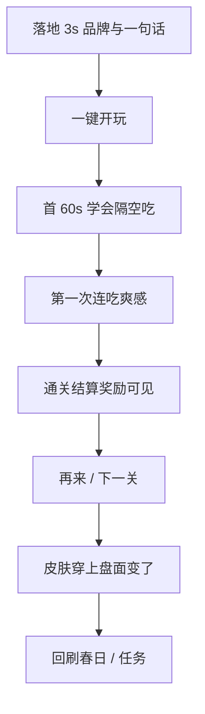

# 商业级体验标准：深度审计 + 文档计划

## 你的深层次意图（写入文档最开头）

你要的不是「指出一个修一个」，而是把我当成**产品合伙人**：

1. **目标是商业成功 + 玩家爱玩**，不是「规则测通即可」。  
2. 用**全球主流成功游戏的经验**定高标准（Poki/CrazyGames 上架级棋类/闯关休闲；Chess/Checkers/Fox&Geese 类节奏；三消/轻策略的 juice 反馈）。  
3. **先立可检验的体验标准与缺口地图**，再成批施工；避免消防式修点。  
4. 节奏、反馈、首 30 秒、身份感（皮肤）、付费/广告不伤爽——都是产品核心，不是「有空再抛光」。

一句话：**核心规则完成 ≠ 可上架；可上架 ≠ 玩家爱玩。我们要冲第三层。**

---

## 对标：主流成功经验 → 本品必须达标

参考对象（模式借鉴，不抄素材）：Poki/CrazyGames 头部 HTML5 棋盘与益智；国际跳棋/Chess.com 移动端节奏；轻策略闯关的「首关教学 + 短局 + 结算爽」；收集类皮肤的「穿上立刻看见」。

| 成功共性 | 玩家感受 | 本品现状 | 达标线 |
|----------|----------|----------|--------|
| **Instant clarity** | 3 秒知道我是谁、点哪 | 色圆棋子、首页无品牌英雄 | 狼/羊剪影 1 秒可辨；首页 Fangrush + 棋盘主视觉 |
| **First 30s win** | 首关必会吃、必有爽感 | 无引导；隔空吃易误解；瞬切无反馈 | 春日 1：强制教会一次隔空吃 + 连吃闪光 |
| **Readable board** | 盘面是「游戏」不是表格 | 线框 + 色点 | SVG 棋子 + 主题底；岩石可读 |
| **Turn rhythm** | 感觉在和「对手」下棋 | AI 微任务瞬移 | 思考窗 + 走子反馈（见下表） |
| **Juice on payoff** | 吃子/连吃有快感 | 瞬删羊 | 吃子停顿/冲刺感 + 连吃叠层反馈（轻震动/闪/音可选） |
| **Fair AI feel** | 输得起、不秒杀感 | hard 未校准；无思考感 | 思考延迟 + 难度章节一致；避免「闪一下就死」 |
| **Identity loop** | 皮肤是我 | 只换颜色 | 对局真换 SVG；图鉴所见即所得 |
| **Session fit** | 2–4 分钟一局可再来 | 节奏对，壳劝退 | 结算强「再来」；广告失败不挡爽 |
| **Portal ready** | 像上架页不是 MVP | 页脚 MVP、Wolf & Sheep | 去 MVP；品牌/slug 一致 Fangrush |
| **Monetize without hate** | 广告在自然缝 | 对局中部推双倍偏吵 | 激励放结算/关卡缝；失败可跳过 |

---

## 玩家漏斗（用这个审，不只审单页）

当前断点：**land（弱）→ teach（无）→ juice（弱）→ skin（假）**；规则通了但漏斗中间全断。

---

## 时序标准（商业棋类默认，写入 12）

目标：像「有思考的对手」，又不拖垮 H5 短局。

| 节点 | 默认 | 对标理由 |
|------|------|----------|
| 玩家落子/隔空吃反馈 | **200ms** 位移或冲刺感 | 吃子必须「看见发生了」 |
| 连吃之间 | **玩家节奏**；每次吃仍 200ms 反馈 | 连吃是核心爽点，不人为限速 |
| 狼回合结束 → 羊落子 | **600ms** 思考态 + 遮罩挡误点 | Chess/Checkers 移动端常见「思考」信任感 |
| 羊落子反馈 | **200ms** 再交还操作 | 回合边界清晰 |
| 章节难度微调（二期） | easy 750 / normal 600 / hard 450 | 难关略快，避免拖 |

禁止：`queueMicrotask` 同步落子当作「思考」。

---

## 缺口分层（写入 12，成批做）

### S0 · 不上架就劝退（商业阻断）

- 对局接真 SVG 狼/羊（+ 可选棋盘底）  
- 图鉴 = 对局同一套资源  
- 对局时序（上表）+ AI 遮罩  
- 吃子/连吃最低 juice（路径闪 + 羊消失停顿）  
- 首页：Fangrush、去 MVP、棋盘英雄、单主 CTA「开始冒险/继续」  
- 春日 1：可跳过的短引导（移动 + 隔空吃一次成功）

### S1 · 爱玩与留存

- 音效 + 静音真生效（走/吃/连吃/胜负）  
- 重置二次确认；对局底栏：重置｜静音｜退出  
- 章节四季视觉差；关卡文案去「AI easy」  
- 展示字体（有气质的衬线/标题字体，非系统 Times）  
- 结算强调碎片获得 + 再来；激励广告挪到结算缝  
- 连吃 HUD 更打眼（x/5 + 短闪）

### S2 · 商业放大（上线后可跟）

- 真 AdSense/门户、部署、域名  
- 难度校准与合围 fixture  
- 棋盘纹理精修、更多皮肤深度  
- 每日轻目标/任务可见进度条  

---

## 文档执行（你确认本计划后）

新建 [`docs/MVP任务清单/12-上线体验标准与缺口.md`](docs/MVP任务清单/12-上线体验标准与缺口.md)：

1. **文首**：深层次意图 +「冲第三层：玩家爱玩」  
2. **对标表** + **漏斗** + **时序默认**  
3. **S0/S1/S2 缺口 ID 清单**（待办）  
4. 明确：体验施工以 12 为验收；[`11`](docs/MVP任务清单/11-一期非核心需求池.md) 条目与 12 对齐，11 文首声明「体验以 12 为准」  

轻改 [`00-任务状态总表`](docs/MVP任务清单/00-任务状态总表.md)：核心规则完成 ≠ 可上架体验。

**本阶段只写文档，不改代码。**

---

## 确认后的施工顺序（预告）

1. 时序引擎（一切反馈的地基）  
2. SVG 棋子 + 图鉴（第一眼像游戏）  
3. 首页品牌与首关引导（漏斗前 60s）  
4. Juice + 音效 + 底栏信任感  
5. 章节视觉与结算广告缝  

---

## 一句话

用**全球上架级休闲棋**的标准审本品：现在是「能玩的原型」。先把「爱玩标准 + 漏斗缺口」写进 **12**；你点头后按 S0→S1 成批做，目标是 Poki 上架也不丢人、玩家愿意再开一局。
