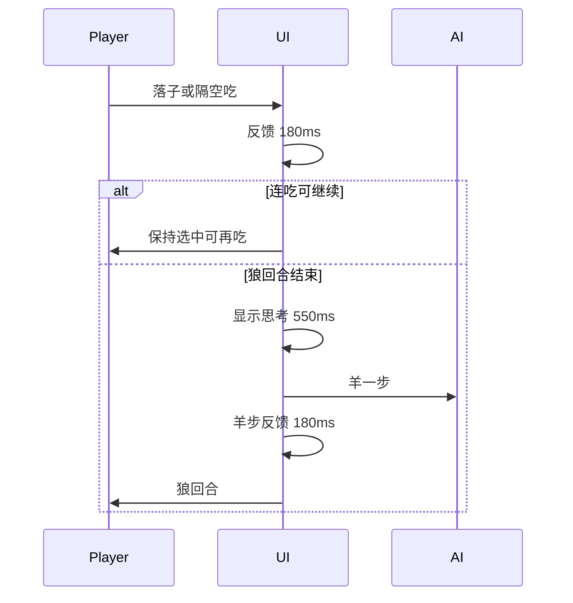

# 上线体验审计：理解 + 文档计划

## 你的深层次意图（将写入文档开头）

不是「你指出一个改一个」，而是：

1. **以普通玩家上线标准**审视整包体验（首屏、棋盘可信度、皮肤、节奏、反馈），而不是以「核心规则已通」自满。  
2. **先立标准与缺口清单**，再成批施工；避免消防式修点。  
3. **节奏与反馈是产品一部分**：人走完羊何时动、有无「思考感」、吃子有无停顿——这些要有明确默认值，不是随便。  
4. 品牌/文案/视觉与玩法口径一致（Fangrush、隔空吃），壳层不能仍写 MVP / Wolf & Sheep。

---

## 体验结论（玩家视角）

**能通关，但不像可上架休闲棋——更像内部 demo。**

### P0 · 上线阻断感（劝退）

| 问题 | 现状 |
|------|------|
| 棋子不可辨 | [`BoardSvg`](apps/web/src/components/BoardSvg.tsx) 仅色圆；`public/skins` 有 SVG 未接对局 |
| 皮肤像假的 | 对局/图鉴只换 fill；穿戴几乎无感 |
| 对局瞬切 | 羊 AI：`aiThinking` + `queueMicrotask` 同步落子，**无思考窗**；「羊群思考中…」几乎看不见 |
| 无走子/吃子反馈 | 棋子瞬移；吃子无停顿/动画 |
| 首页未产品化 | [`page.tsx`](apps/web/src/app/page.tsx)：Wolf & Sheep、无 Fangrush、无棋盘英雄、页脚「MVP」 |

### P1 · 节奏与信任感（像「真人/AI 在下棋」）

建议写入标准的**默认时序**（确认后实现）：

| 节点 | 默认 |
|------|------|
| 玩家落子/吃子后视觉反馈 | ~180ms（短移或闪，再切状态） |
| 狼回合结束 → 羊落子前 | **强制 ≥550ms**「羊群思考中…」+ 半透明挡误点 |
| 羊落子后 → 可操作狼 | ~180ms 反馈后再 `playing` |
| 连吃中玩家操作 | **不强制间隔**（玩家节奏）；每次吃仍有 ~180ms 反馈 |
| 难度可调（后做） | easy 略长 / hard 略短，首版统一 550ms |

### P1 · 壳与反馈缺口

- 静音摆设；对局底栏缺规格中的静音/退出结构  
- 重置无二次确认  
- 无春日 1 引导（隔空吃易误解）  
- 章节/关卡露出「AI easy」等开发词；四季无视觉差  
- `font-serif` 无正式展示字体；系统 UI 字体偏公文站  

### P2 · 可后置

- 真广告/部署、美术精修棋盘纹理、碎片展示抛光、portal 剥 admin  

---

## 文档怎么维护（执行时）

新建 **[`docs/MVP任务清单/12-上线体验标准与缺口.md`](docs/MVP任务清单/12-上线体验标准与缺口.md)**：

1. **文首**：上述「深层次意图」+ 上线标准（视觉可信 / 节奏可信 / 品牌一致 / 反馈完整）  
2. **时序默认表**（上表）  
3. **缺口清单**（带 ID，状态待办）  
4. 链到 [`11-一期非核心需求池.md`](docs/MVP任务清单/11-一期非核心需求池.md)：11 文首加一句「体验类以 12 为标准；池内条目与 12 对齐」  

同步轻改：[`00-任务状态总表`](docs/MVP任务清单/00-任务状态总表.md) 链到 12；注明「核心规则完成 ≠ 上线体验完成」。

**本阶段只写文档与标准，不改游戏代码**（你确认标准与优先级后再开施工波次）。

---

## 确认后的施工波次（预告，不在本次动代码）

1. **时序**：`play-store` 用 `await delay` / `setTimeout` 保证先 paint 再 AI；遮罩  
2. **棋子 SVG**：BoardSvg + 图鉴接 `assets`  
3. **首页品牌**：Fangrush、去 MVP、一主 CTA + 棋盘视觉锚  
4. **引导 / 静音 / 重置确认**  

---

## 一句话

你要的是 **「上线级玩家体验标准 + 成体系缺口」**，不是点修。先落文档 12 定调与时序默认；你点头后再按 P0→P1 施工。
