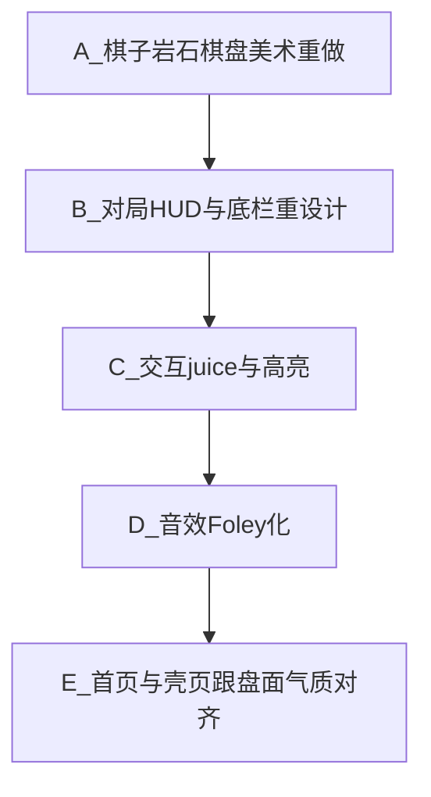

# 对局与官网体验品质跃升（批判后施工）

## 0. 先认账：上次「资源完成」验收不合格

你截图里的问题不是「差一点」，而是**身份环失败**：

| 维度 | 现状（批判） | 玩家感受 |
|------|--------------|----------|
| 狼/羊 SVG | 椭圆+圆点眼，缩到棋盘上像**色块贴纸** | 不像狼羊，像 demo |
| 岩石 | 棕色圆角方块 | 像 UI 占位，不像石头 |
| 棋盘 | 浅灰绿细线网格 | 像表格，不像猎场 |
| 色彩 | 全局低饱和浅绿叠浅绿 | 发灰、无焦点、无季节体温 |
| 字体层级 | 顶栏/说明/按钮同重量 | 无「游戏 HUD」感 |
| 底栏 | 三枚描边空心大按钮 | 像后台表单，不像对局工具 |
| 音效 | 程序蜂鸣 / 短 wav 仍偏电子 | 无「落子/吞吃」肉体感 |
| 官网 vs 对局 | 首页稍作官网，对局仍开发壳 | 进局后品牌崩塌 |

**结论**：功能可玩 ≠ 可上架爱玩。L2「像成品」**尚未达到**；不能再靠 check:skins 文件存在判定「美术完成」。

---

## 1. 真正好的「单机游戏官网 + 对局」长什么样

对标对象不是企业 SaaS，而是：**一款能在 Poki / 独立站站住的休闲棋盘站**（清晰、秒开玩、盘面即海报）。

### 1.1 官网（落地 3 秒）

- **一张情绪图**：首屏几乎全是「盘面/猎场」视觉，品牌字叠在氛围上，而不是浅色卡片里塞三个小 SVG。  
- **一个主动作**：Play 按钮是页面上最重的色块；次入口（Skins/Quests）安静。  
- **规则可扫**：How-to 短、图标化或微盘示意，不是说明书段落墙。  
- **信任极轻**：本地存档一句即可；页脚安静。

### 1.2 对局界面（你截图该变成的样子）

```
目标构图（移动竖屏）
┌─────────────────────────┐
│ ←   春日·双石      ···  │  极薄顶栏，非大标题抢戏
│ 吃 0/8  · 羊15 · 狼回合  │  胶囊「数字」加粗；回合用色点/徽章
├─────────────────────────┤
│                         │
│     【棋盘占 ≥70% 高】    │  木纹/草地质感底板 + 清晰交点
│     狼羊有剪影+阴影+选中  │  岩为石头，不是色块
│                         │
├─────────────────────────┤
│ （必要时一行微提示，可关） │  新手关才显眼；老玩家不刷存在感
│  重置     静音     退出   │  图标按钮或实心弱按钮，等高紧凑
└─────────────────────────┘
```

**硬标准（验收用眼睛，不用文件名）**

1. **1 秒可辨**：缩略到 36px，路人仍能分出狼 / 羊 / 岩。  
2. **选中有仪式**：选中狼 = 光环/抬起阴影/轻微放大，不是只靠逻辑高亮点。  
3. **吃子有事件**：隔空吃路径扫过 + 羊消失 scale/fade + 短冲击音；连吃 HUD 变色加重。  
4. **棋盘是地方**：有边缘、纹理、四季色温差；线是「路径」不是 Excel。  
5. **对比够**：主文字与背景对比达标；状态条不要融进背景。  
6. **按钮像游戏**：按下态、触控热区 ≥44px，但视觉重量低于棋盘。  
7. **声景克制**：落子「笃」、吃「嗖+轻咔」、胜负短乐句；默认音量温和，静音真静。

---

## 2. 全方位提升：按层施工（定稿顺序）



### A. 美术（最高优先级 · 否决「几何皮」）

改 [`apps/web/public/skins/`](apps/web/public/skins/) 与岩石绘制（[`BoardSvg.tsx`](apps/web/src/components/BoardSvg.tsx)）：

- **狼**：侧脸或 3/4 剪影，耳、吻、肩可读；深色皮毛 + 少量高光；**禁止**再交「圆头+三角耳」敷衍稿。  
- **羊**：蓬松体块 + 深色脸/腿对比；成套与狼同一笔触。  
- **岩石**：不规则多边形 + 裂纹/暗面，颜色随季节微调。  
- **棋盘底板**：草地质感（SVG pattern 或轻 PNG），交点加「钉」或柔和圆垫；春夏秋冬 **色温可辨**（嫩绿 / 暖麦 / 琥珀 / 霜蓝），但线色保证对比。  
- 生成手段：**先用 GenerateImage 出定妆参考 → 描成干净 SVG（或高清 WebP 棋子）入仓**；目视过关才算完成（写进验收：手机宽度截图对照）。

### B. 对局铬层（PlayScreen）

改 [`PlayScreen.tsx`](apps/web/src/components/PlayScreen.tsx) + [`globals.css`](apps/web/src/app/globals.css)：

- 顶栏瘦身：关卡名缩小；状态条用 **卡片浮起** 或深一档底，数字用 display 字重。  
- 回合态：狼回合 / 羊回合用不同强调色（非整条同绿）。  
- 底栏：图标 + 短词，或实心 `muted` 按钮；去掉「三块空心大框」表单感。  
- 说明文案：默认淡化；仅春日一关/首次引导强化（已有 guide，避免局内常驻说明书抢注意力）。  
- 字体：保留 Literata/Nunito 作英/展示；中文明确 fallback 栈；HUD 数字可 `tabular-nums`。

### C. 交互与 juice

在 [`BoardSvg.tsx`](apps/web/src/components/BoardSvg.tsx) / play-store 既有 juice 上加强：

- 可走点：柔光圆，不要脏网点。  
- 可吃：羊位明确环 + through 点闪。  
- 选中狼：外环 + drop-shadow。  
- 落子/吃：200ms 位移或冲刺线（对齐创意时序文档）；吃子粒子或短 scale。  
- 按下反馈：`:active` 缩放 0.97；禁用态在羊回合明确（棋盘 `pointer-events` 已有则加强视觉）。

### D. 音效

替换 [`public/sfx/`](apps/web/public/sfx/) + [`sfx.ts`](apps/web/src/lib/sfx.ts)：

- 不用「电话按键感」蜂鸣当主声；用更短的噪声+滤波模拟木质落子 / 谁osh 吃子。  
- 连吃音高递进；胜/负与对局内分离度更高。  
- 验收：戴耳机默认音量不刺耳；静音后零声。

### E. 官网跟盘对齐

改 [`app/page.tsx`](apps/web/src/app/page.tsx)：

- Hero 主视觉改为 **对局盘面截图式构图**（用新棋子），不是三枚散落 icon。  
- 主 CTA 用与「选中狼/强调色」同一套 accent，形成跨页记忆。  
- 次入口降对比；FAQ/How-to 保持可扫，不压过主视觉。

---

## 3. 明确不做（防再次糊弄范围）

- 不上 3D/Spine/骨骼动画  
- 不新开十套皮肤；先把 **default + frost + 四季板 + 岩** 做到过关  
- 不重做规则/AI  
- 不把「文件已替换」当作完成；**以截图观感验收**

---

## 4. 验收（你怎么判我这次没坑）

1. 你手机截图：狼羊岩 **不用猜** 是什么。  
2. 选中狼、隔空吃、连吃，有「发生了事件」的感觉。  
3. 对局页不再像后台表单；棋盘是绝对主角。  
4. 首页与对局同一套气质。  
5. 音效闭嘴键有效，开声音不廉价电子蜂鸣主导。  

文档：在 [`docs/任务/0715任务/`](docs/任务/0715任务/) 增补一篇短「体验品质验收」或回写审计表第 4 节为 **重开 P0**，避免再出现「R 全勾但截图像 demo」。
