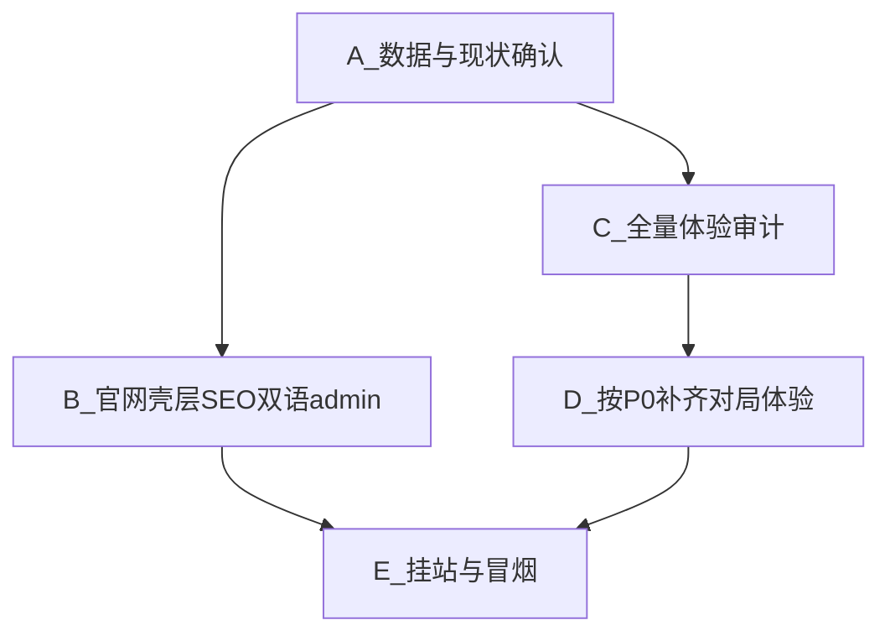

# 独立站商业上线包 · 执行计划（需求 0715）

> 对应需求原文：[docs/任务/需求0715.md](docs/任务/需求0715.md)  
> 深意图：从「能玩的 MVP」切到「独立站像正经游戏产品」。

---

## 0. 先回答你的数据确认（不做云存档）

**结论（计划执行时会对照代码再验一次并写进审计结论）**：

- 进度/关卡/碎片/皮肤/任务/静音等：**已设计为浏览器 `localStorage`**，键名 `wolf-sheep-save-v1`（见 [docs/技术设计/04-关卡存档与皮肤.md](docs/技术设计/04-关卡存档与皮肤.md)、`packages/game-core` + `apps/web/src/lib/save-store.ts`）。
- **无登录、无云端**——符合你「先不实现登录和数据保存（指云）」的边界；清站点数据即丢进度，隐私页需说清楚。
- 关卡配置本身是**仓库内只读配置**（非用户存档）；用户侧存的是通关与进度状态。

本计划**不新增**账号/云存档。

---

## 1. 工作怎么拆（三块，按序）

| 块 | 目标 | 产出 |
|----|------|------|
| **A** | 确认 local 存档链路可信 | 审计文档一节「数据」：读写键、失败回退、刷新保留 |
| **B** | 独立站官网体验 + SEO + 中英 + 隐蔽 admin | 改 `apps/web` 首页/全站页脚/文案/metadata |
| **C** | 对照策划+商业成功，主动扫全站 | [docs/任务/体验审计-0715.md](docs/任务/体验审计-0715.md)（新建） |
| **D** | 只修审计标成 **P0** 的体验洞 | 代码改动；其余进 [未完成.md](docs/任务/未完成.md) |
| **E** | 与现有 P-DEPLOY 对齐 | env/隐私/首页可分享 |

---

## 2. 块 B · 官网怎么做（对标主流单游戏站）

### 2.1 对标结论 → 我们定稿的首页结构

主流浏览器单机站共性：**首屏秒懂 + 一键开玩**；下方才是规则/卖点/信任信息。我们不是门户聚合站，不做「相关游戏推荐墙」。

**首页（`/`）定稿板块（自上而下）**：

1. **Hero（首屏）**：品牌 Fangrush + 中文名「三狼连猎」；一句卖点；主 CTA「开始 / Play」→ `/chapters`；次 CTA「继续」→ 最近关（已有逻辑保留）。  
2. **How to play（可扫读 4–6 步）**：隔空吃、连吃≤5、吃满 8、四季难度——文案对齐品牌档，不写开发词。  
3. **Seasons 四季一瞥**：春夏秋冬各一句 + 链到 `/chapters`（强化内容深度，利 SEO）。  
4. **Progress trust**：本机保存说明（无账号预期）。  
5. **FAQ（短）**：要不要下载？进度丢了怎么办？手机能玩吗？  
6. **页脚**（见下）。

次入口（图鉴/任务/设置）保留，但降为 Hero 下或页脚旁的次级入口，**不抢主 CTA**。

### 2.2 全站要维护的页面与链接

| 页面 | 路径 | 职责 |
|------|------|------|
| 首页 | `/` | 营销+开玩漏斗（上表） |
| 章节 | `/chapters` | 进游主路径 |
| 关卡列表 | `/levels/[chapterId]` | 选关 |
| 对局 | `/play/[levelId]` | 核心玩 |
| 图鉴 | `/skins` | 身份环 |
| 任务 | `/quests` | 留存环 |
| 设置 | `/settings` | 静音、链到隐私 |
| 隐私 | `/privacy` | 合规（页脚常驻） |
| Admin | `/admin*` | 不进主导航；仅隐蔽入口 |

**本波不做**：独立博客、Terms 长页、商店外链墙、账号页。

### 2.3 全站页脚（新建共享组件，如 `SiteFooter.tsx`）

固定链接：

- 隐私 `/privacy`
- 设置 `/settings`
- 语言切换（中 / EN）
- **Admin**：极小字号、低对比文字（如 `·` 或 `ops`）→ `/admin`（门控与密钥逻辑已有，只补发现入口）
- 一行版权：`© Fangrush`

挂在玩家布局（非对局沉浸时可显；对局页可用更简底栏，避免干扰——**对局内不放大页脚**，仅非 `/play/*` 页面挂完整页脚；对局外所有壳页统一）。

### 2.4 SEO（独立站）

改 [apps/web/src/app/layout.tsx](apps/web/src/app/layout.tsx) 及首页 metadata：

- `title` / `description` 中英各一套（随语言或默认中+英 description 组合）
- 补 `openGraph` + `twitter`（标题、描述、`og:image`——先用一张静态分享图放 `public/og.png`，可用现有棋盘/狼羊构图导出）
- 补 `robots.txt` + `sitemap.xml`（Next `app/sitemap.ts` / `app/robots.ts`）：收录 `/`、`/chapters`、`/privacy`、`/skins` 等公开页；**排除** `/admin*`
- 首页加简短可见文案（利于爬虫），避免「纯 SPA 空壳」

### 2.5 中英双语（定稿方案）

**不做**完整路由前缀 `/en/...`（本波成本高、易打乱现有路径）。

定稿：

- `apps/web/src/i18n/messages/zh.ts` + `en.ts` 文案字典（首页、页脚、设置、隐私要点、主 CTA、How-to、FAQ）
- `cookie` 或 `localStorage` 键记住语言；页脚切换立即生效
- `html lang` 随语言切换
- 对局内 HUD 短词一并进字典（「羊回合」「已吃」等），避免半中半英
- 品牌固定词：**Fangrush** 不翻译；中文名「三狼连猎」在 EN 界面可副标或仅用 Fangrush（对齐 [游戏品牌/01](docs/游戏创意/游戏品牌/01-产品定位与模式边界.md)）

文案来源优先品牌档定稿句，不新编冲突卖点。

### 2.6 隐蔽 Admin（需求第 3 点）

- 页脚最右侧或版权旁：`Admin` 弱样式链接 → `/admin`
- 不进首页主 CTA、不加图标、不加「后台」大字
- 现有 `ADMIN_ENABLED` + `ADMIN_ACCESS_KEY` + gate **保持不变**

---

## 3. 块 C · 游戏体验全量审计（你要求：不要你点哪里查哪里）

新建文档 **[docs/任务/体验审计-0715.md](docs/任务/体验审计-0715.md)**，对照：

- 创意 07 / 08 / 09  
- [产品定位和商业成功](docs/游戏创意/产品定位和商业成功/00-索引.md)  
- 品牌档  
- 真机点验 `apps/web` 路由与对局

**审计表结构（每项：现状 / 对照标准 / 评级 P0|P1|P2|OK|二期）**：

1. 落地 3 秒（品牌、卖点、开玩）  
2. 首 60 秒教学（春日一关隔空吃）  
3. 对局 juice / 时序（吃子、连吃 HUD、羊回合）  
4. 音效品质（现状 Web Audio beep vs「成品感」）  
5. 皮肤身份环（图鉴→穿戴→盘面；霜狼；羊成套）  
6. 任务/碎片可见性与留存  
7. 广告缝与失败不卡死（Mock 路径）  
8. 设置/隐私/无账号预期  
9. 移动端首屏与棋盘可点性  
10. 与「能商业成功」相关的诚实结论段（L2/L3 是否达到）

**已知基线（审计会核实，不代替审计）**：皮肤目录与换装骨架已有；音效是占位 beep；任务页有但可见性弱；真广告未接；美术精修未做。

---

## 4. 块 D · 审计后怎么改代码（纪律）

- 审计文档写完后，**只自动开工 P0**（阻塞「像上架成品站 / 首局不劝退」的项）。  
- P1/P2 写入 [docs/任务/未完成.md](docs/任务/未完成.md)，不一次做爆。  
- 预期很可能进本波 P0 的（待审计确认）：首页改版、页脚+admin、双语壳、OG/sitemap、隐私页脚常驻；对局侧若审计打 P0 再动（例如任务入口可见性、明显教学断点）。  
- **本波默认不承诺**：真 AdSense、换商业级音效包、全套精修立绘（除非你审计后把某一条升为 P0）。

---

## 5. 文档与任务表同步

执行时同步改：

- [docs/任务/需求0715.md](docs/任务/需求0715.md)：顶部加「已拆解 → 本计划 / 体验审计」链接  
- [docs/任务/未完成.md](docs/任务/未完成.md)：增加「0715 官网/SEO/双语/admin」条目；P-DEPLOY 与官网改版挂钩  
- 不把流水账写进 [docs/技术设计/](docs/技术设计/)（官网 IA 若需长期留存，可在创意 08 或品牌档补短节，技术设计不扩）

---

## 6. 验收标准（你怎么判断做完）

1. 打开 `/`：像游戏官网首页，**3 秒内能点到开玩**；有 How-to / 四季 / FAQ / 页脚。  
2. 页脚可切中英；主路径文案不混语。  
3. 页脚弱入口能进 `/admin`，无钥则 gate。  
4. 刷新后进度仍在（localStorage）；隐私说明无账号。  
5. 分享链接有合理 OG 预览；`/admin` 不进 sitemap。  
6. 存在体验审计文档，且 P0 项已关闭或标明不做原因。

---

## 7. 明确不做（防范围膨胀）

- 登录 / 云存档 / 付费去广告  
- 完整 `/en` 路由树、博客、多游戏聚合  
- 本波强制上真广告 SDK（仍属「待有号」）  
- 把技术设计目录写成官网文案库  
