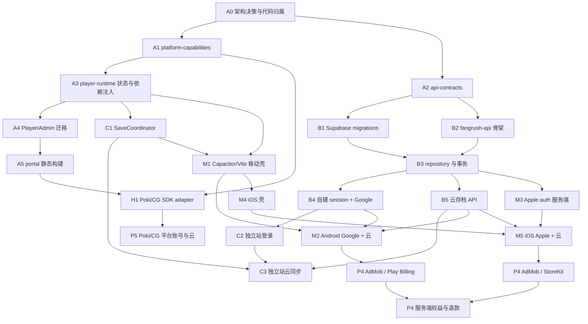

# Fangrush 多终端详细任务清单与依赖执行计划

> 状态：待执行基线  
> 本文按“底座先行、可并行但不抢公共文件、每批有退出门槛”组织后续代码开发。

## 1. 优先级定义

| 级别 | 含义 | 规则 |
|---|---|---|
| P0 | 架构前置 | 未完成时不得进入依赖它的渠道正式实现 |
| P1 | 首个可复用闭环 | 独立站账号云存档；H5 广告可并行 |
| P2 | Android 基础版 | 不含正式商业化也可内测 |
| P3 | iOS 基础版 | 复用稳定公共能力 |
| P4 | App 广告/IAP | 壳、账号、云和监控稳定后实施 |
| P5 | 门户账号/云增强 | 平台权限与数据价值成立后实施 |

任务依赖是硬约束。标记“可并行”只表示代码所有权不冲突，不表示可以绕过共同验收。

## 2. 总依赖图



## 3. 关键路径

### App 主线关键路径

```text
平台契约
  -> player-runtime 抽取
  -> SaveCoordinator
  -> API contract + Supabase schema + API transaction
  -> 独立站 Google/云存档验证
  -> Capacitor 移动壳
  -> Android Google/云
  -> iOS Apple/云
  -> App 广告/IAP/权益
```

### H5 门户并行路径

```text
平台契约
  -> portal 静态构建
  -> Poki/CG lifecycle + ads adapter
  -> Inspector/Portal 验证
  -> 平台账号/云（后置）
```

H5 广告不依赖 Fangrush API，但依赖 P0 的能力契约和静态产物。独立站广告始终为空实现，不在关键路径。

## 4. P0：架构底座任务

### 4.1 契约与 package

| ID | 任务 | 前置 | 代码位置 | 交付与验收 |
|---|---|---|---|---|
| ARC-001 | 冻结目标架构与代码归属 | 无 | 本文、`06`、工程边界总览 | 文档评审完成；后续任务不再自创目录 |
| CAP-001 | 建 `platform-capabilities` package | ARC-001 | `packages/platform-capabilities` | identity/local/cloud/ads/purchase/lifecycle/navigation/target 类型可 build |
| CAP-002 | 定义统一错误和 availability | CAP-001 | 同上 | cancelled/unavailable/unfilled/cooldown/offline/conflict 等契约测试 |
| CAP-003 | 建 memory/noop/testing adapters | CAP-001 | `src/noop`, `src/testing` | unit tests；Noop 不抛异常、不产生副作用 |
| CAP-004 | 冻结 target capability matrix | CAP-001 | `src/target.ts` | 五个发布 target + admin；非法组合测试失败 |
| CAP-005 | 独立站 `NoopAdsAdapter` | CAP-003 | package noop + standalone composition | `isAvailable=false`；无 SDK/网络；普通流程通过 |
| API-CON-001 | 建 `api-contracts` package | ARC-001 | `packages/api-contracts` | zod common/auth/save/entitlement/purchase/privacy schema |
| API-CON-002 | 统一错误码和版本 | API-CON-001 | 同上 | Web/Mobile/API typecheck 共享；错误码 snapshot |

### 4.2 `player-runtime` 抽取

| ID | 任务 | 前置 | 代码位置 | 交付与验收 |
|---|---|---|---|---|
| MIG-001 | 冻结 Player/Admin 迁移基线 | ARC-001 | tests、截图、fixtures、构建报告 | 当前 unit/build/24 关 smoke；续局/胜负/奖励/语言/AdminMode 特征测试与截图归档 |
| RUN-001 | 建 package 和 runtime composition 类型 | CAP-001, MIG-001 | `packages/player-runtime` | React/Zustand package 独立 build/test |
| MIG-002 | 冻结 runtime public API 和依赖预算 | RUN-001 | package exports、boundary test | 只导出消费者需要的入口；禁止 Next/Capacitor/SDK/应用源码依赖 |
| RUN-002 | 抽 `active-game`、play store、反馈纯逻辑 | MIG-002 | `src/gameplay` | Player 原测试迁移并通过，行为不变 |
| RUN-003 | 抽 SaveStore factory | MIG-002 | `src/progression` | 不再直接 import browser storage；memory adapter 测试 |
| RUN-004 | 抽音频/指标/复现协议 | MIG-002 | `src/audio`, `src/metrics` | 无 Next 依赖；测试通过 |
| RUN-005 | 抽 BoardSvg | RUN-002 | `src/gameplay/BoardSvg.tsx` | 文案/locale 注入；Player/Admin 视觉 smoke |
| MIG-003 | 拆分 PlayScreen 职责 | RUN-002~005 | gameplay controller/hooks、view、overlays | 副作用编排与展示分离；不做视觉重设计；特征测试继续通过 |
| RUN-006 | 迁移 PlayScreen | MIG-003 | `src/gameplay/PlayScreen.tsx` | 不 import `next/*`、`@/lib/*`、具体 SDK |
| RUN-007 | 建 PlayerRuntimeProvider | RUN-003~006, CAP-004 | `src/runtime` | 每个必需 adapter 显式注入；缺失时启动测试失败 |
| MIG-004 | 建迁移期 compatibility facade 与回退点 | RUN-007 | `apps/player-web` 临时 re-export | 旧入口与 package 指向同一实现；标注删除条件；Player/Admin 可独立回退 |
| RUN-008 | Player 改消费 runtime package | MIG-004 | `apps/player-web` | 玩家测试/构建/24 关 smoke 无回归 |
| RUN-009 | Admin 改消费 runtime package | RUN-008 | `apps/admin` | AdminMode、AI/关卡台正常；删除对应 source aliases |
| RUN-010 | 强化 source boundary | RUN-009 | `scripts/check-app-source-boundaries.mjs` | 任意 `apps/A -> apps/B` 源码 import 使 CI 失败 |
| MIG-005 | 删除 compatibility facade | RUN-010 | `apps/player-web` | 无旧入口引用；Player/Admin build、截图和特征测试通过 |
| MIG-006 | P0 架构债务审计 | MIG-005, BUILD-006, SAVE-005 | audit report | exports/循环依赖/runtime bundle/target 条件/AdminMode/静态产物全部达标 |

执行约束：MIG-001 到 MIG-006 与 RUN-001 到 RUN-010 按依赖逐项提交并保持绿灯，不把十余个 alias 一次性删除后集中修错。迁移期间冻结玩法、关卡数值和视觉改版；兼容 facade 必须由 MIG-005 删除，不能成为永久双入口。

### 4.3 SaveGame 与同步底座

| ID | 任务 | 前置 | 代码位置 | 交付与验收 |
|---|---|---|---|---|
| SAVE-001 | 审计 SaveGame v1 字段和付费边界 | ARC-001 | `game-core/src/content/save.ts` | 字段分类表；entitlement 明确排除 |
| SAVE-002 | 建逐版本 migration chain | SAVE-001 | `game-core/src/content/save-migrations.ts` | v1/未知/损坏 fixture；未知版本不返回可上传默认值 |
| SAVE-003 | 建 `mergeSaveGames` | SAVE-001 | `game-core/src/content/merge-save.ts` | 交换/幂等/单调字段/任务周期/碎片测试 |
| SAVE-004 | 定义 CloudSaveEnvelope | API-CON-001, SAVE-002 | `api-contracts/src/save.ts` | revision/baseRevision/requestId/checksum schema |
| SAVE-005 | 建 SaveCoordinator | RUN-003, SAVE-003, SAVE-004 | `player-runtime/src/progression` | local first、dirty、debounce、409 merge、retry、flush 测试 |

### 4.4 构建底座

| ID | 任务 | 前置 | 代码位置 | 交付与验收 |
|---|---|---|---|---|
| BUILD-001 | 重构 target composition | CAP-004, RUN-008 | `apps/player-web/platform` | standalone/poki/cg 各有唯一 composition root |
| BUILD-002 | target manifest 扩展 | BUILD-001 | build script/report | 记录 capabilities、output、revision、schema/API version |
| BUILD-003 | Next portal 静态导出样机 | RUN-008, BUILD-001 | `apps/player-web/next.config.ts`, build script | 英文首页、24 hunt/play、资源可由纯静态服务器访问 |
| BUILD-004 | 静态方案决策门 | BUILD-003 | ADR | 成功则保留；失败且需大量复制时批准 `apps/portal-web` Vite 壳 |
| BUILD-005 | portal artifact audit | BUILD-003/004 | `scripts/audit-portal-artifact.mjs` | 无 `.next/server`、Admin、auth、密钥、错误 SDK、绝对本地域名 |
| BUILD-006 | standalone Noop ads audit | CAP-005, BUILD-001 | artifact audit | 无 Poki/CG/AdMob host 和 SDK 字符串 |

### 4.5 P0 退出门槛

P0 只有同时满足以下条件才完成：

1. Player/Admin 不再通过 alias 共享应用源码。
2. runtime 无 Next/Capacitor/平台 SDK 依赖。
3. standalone 明确使用 Noop ads。
4. Poki/CG 有可上传方向的纯静态产物。
5. SaveGame migration/merge 和 SaveCoordinator 测试通过。
6. API/DB contract 已冻结，H5 和服务端可以并行开发。
7. MIG-006 技术债务审计通过，不存在未设删除任务的迁移兼容层。

## 5. P1A：Supabase 与 Fangrush API

### 5.1 数据库

| ID | 任务 | 前置 | 代码位置 | 交付与验收 |
|---|---|---|---|---|
| DB-001 | `supabase init` 与环境约定 | ARC-001 | `supabase/config.toml` | local 可启动；Auth/Storage 不进入运行依赖 |
| DB-002 | 初始 `fangrush` schema migration | API-CON-001 | `supabase/migrations` | users/identities/sessions/saves/revisions/entitlements/purchases/privacy/audit |
| DB-003 | 权限与非暴露 migration | DB-002 | 同上 | schema 不授权 anon/authenticated；public 无玩家表 |
| DB-004 | 约束/index/trigger | DB-002 | 同上 | provider subject、refresh hash、save request、transaction 唯一 |
| DB-005 | local seed 和 migration CI | DB-002~004 | `supabase/seed.sql`, CI | 空库 reset、重复 reset、schema test 通过 |
| DB-006 | staging/production 项目与备份 | DB-005 | 运维配置/distribution evidence | 环境隔离、connection、dump/restore 证据 |

### 5.2 API 基础

| ID | 任务 | 前置 | 代码位置 | 交付与验收 |
|---|---|---|---|---|
| API-001 | 建独立 API app | API-CON-001 | `apps/fangrush-api` | `/health/live`、Node runtime、独立 build |
| API-002 | config/env 启动校验 | API-001 | `src/config` | 缺 DB/key/provider 时对应模块明确失败 |
| API-003 | `pg` pool 与 transaction helper | API-001, DB-002 | `src/db` | local/staging query；rollback 测试 |
| API-004 | repository 基础与统一错误 | API-002~003 | `src/db`, `src/http` | route 无散落 SQL；错误不泄漏内部信息 |
| API-005 | request ID、日志、CORS、限流、body limit | API-001 | middleware/lib | 安全测试和脱敏 snapshot |
| API-006 | API build/secret artifact gate | API-001 | root scripts/CI | public bundle 无 env 值；server artifact 边界通过 |

### 5.3 自建认证

| ID | 任务 | 前置 | 代码位置 | 交付与验收 |
|---|---|---|---|---|
| AUTH-001 | users/identity repositories | API-003~004, DB-004 | `src/modules/auth` | provider subject 并发唯一；不按 email 合并 |
| AUTH-002 | access JWT signer/verifier | API-002 | `src/auth/access-token.ts` | iss/aud/sub/sid/exp；过期/错误 key 测试 |
| AUTH-003 | opaque refresh + rotation family | AUTH-001~002 | `src/auth/sessions.ts` | hash、轮换、重放撤销、登出测试 |
| AUTH-004 | Google ID token exchange | AUTH-001~003 | `/v1/auth/google/exchange` | Web/Android audience、错误 issuer/exp/sub 测试 |
| AUTH-005 | refresh/logout/me | AUTH-003 | auth routes | Web cookie/mobile body 两种安全 transport |
| AUTH-006 | identity link/unlink | AUTH-001~005 | me routes | 显式绑定、重复幂等、他人占用冲突 |

### 5.4 云存档 API

| ID | 任务 | 前置 | 代码位置 | 交付与验收 |
|---|---|---|---|---|
| CLOUD-001 | save repositories | API-003~004, DB-004 | `src/modules/saves` | envelope read、历史 read、校验 |
| CLOUD-002 | GET `/v1/save` | CLOUD-001, AUTH-002 | route | 无存档 null；不接受客户端 userId |
| CLOUD-003 | PUT revision transaction | CLOUD-001, SAVE-004 | route/service | initial、update、409、requestId 幂等并发测试 |
| CLOUD-004 | schema/size/checksum 保护 | CLOUD-003 | save service | 超限、未知 schema、损坏拒绝且不覆盖 |
| CLOUD-005 | revision retention/restore | CLOUD-003 | job/support service | 清理策略、support restore 审计 |

### 5.5 隐私和运维

| ID | 任务 | 前置 | 代码位置 | 交付与验收 |
|---|---|---|---|---|
| PRIV-001 | export service | AUTH-005, DB-002 | `src/modules/privacy` | 可导出身份/存档/权益最小数据 |
| PRIV-002 | delete service | AUTH-005, CLOUD-001 | 同上 | 再认证、撤销全部 session、删除/匿名化事务 |
| OPS-001 | structured monitoring | API-005 | API/部署 | auth/save 关键错误告警；无敏感数据 |
| OPS-002 | backup restore drill | DB-006 | 运维证据 | 隔离恢复后完整性检查通过 |

## 6. P1B：独立站账号与云存档

| ID | 任务 | 前置 | 代码位置 | 交付与验收 |
|---|---|---|---|---|
| WEB-001 | Standalone API client | API-CON-002, AUTH-005 | `apps/player-web/platform/standalone` | typed client、401 refresh single-flight、错误映射 |
| WEB-002 | Google Identity UI | AUTH-004, WEB-001 | standalone account UI | 游客不受阻；成功/取消/失败/重复登录 |
| WEB-003 | Web session storage | AUTH-003~005 | standalone session adapter | access 内存、refresh HttpOnly cookie、登出清理 |
| WEB-004 | Fangrush Cloud adapter | CLOUD-002~004, SAVE-005 | standalone cloud adapter | load/save/409/offline/timeout contract tests |
| WEB-005 | 游客首次登录合并 | WEB-002~004 | runtime/account flow | local-only/cloud-only/both/未知 schema 测试 |
| WEB-006 | 同步状态 UI | WEB-004~005 | settings/account UI | synced/dirty/offline/conflict/update-required |
| WEB-007 | 删除/导出 UI | PRIV-001~002 | settings/privacy | App 审核可复用的公开 Web 删除页 |
| WEB-008 | 独立站广告空实现回归 | CAP-005, BUILD-006 | standalone | 无广告入口/网络；基础奖励不受影响 |
| WEB-009 | 跨浏览器 E2E | WEB-001~008 | e2e | A 上传、B 恢复、双端冲突、登出、删除 |

P1A 与 P1B 的完成标志是“独立站真实闭环”，不是只有 API 单测或一个 Google 按钮。

## 7. P1 并行：Poki / CrazyGames 广告

### 公共协调规则

- H5 广告执行线在 CAP-001~004 合并前只做调研/原型，不修改公共接口。
- 合并后只修改 `apps/player-web/platform/poki|crazygames`、target 配置和平台测试。
- 如需改变公共错误码/生命周期，先提交 contract change 与测试，再改两个 adapter。

| ID | 任务 | 前置 | 代码位置 | 交付与验收 |
|---|---|---|---|---|
| POKI-001 | SDK loader/init | CAP-004, BUILD-003/004 | `platform/poki` | init 成功/失败均可启动 |
| POKI-002 | lifecycle adapter | POKI-001, RUN-007 | 同上 | loading/gameplay 事件幂等 |
| POKI-003 | ads adapter | POKI-001, CAP-002 | 同上 | commercial/rewarded/取消/失败/恢复 |
| POKI-004 | mute/input/AdBlock | POKI-002~003 | runtime integration | Inspector 路径通过，核心可玩 |
| POKI-005 | Inspector/静态包证据 | POKI-001~004, BUILD-005 | distribution/poki | 版本化报告和产物 |
| CG-001 | SDK loader/init + Basic 降级 | CAP-004, BUILD-003/004 | `platform/crazygames` | Basic ads disabled 不误报故障 |
| CG-002 | loading/gameplay/mute adapter | CG-001, RUN-007 | 同上 | current SDK 事件和设置变化通过 |
| CG-003 | midgame/rewarded ads | CG-001, CAP-002 | 同上 | finished/error/unfilled/cooldown/AdBlock |
| CG-004 | completion context | CG-002 | 同上 | 24 关进度映射 0~100，敏感数据不上传 |
| CG-005 | Portal/静态包证据 | CG-001~004, BUILD-005 | distribution/crazygames | Basic/Full 分阶段验证 |

## 8. P2：Android 基础版

| ID | 任务 | 前置 | 代码位置 | 交付与验收 |
|---|---|---|---|---|
| MOB-001 | 建 Vite React + Capacitor app | RUN-007 | `apps/mobile` | consume player-runtime；无 Next 运行依赖 |
| MOB-002 | Capacitor Android/iOS 工程初始化 | MOB-001 | `android`, `ios` | 两端 debug 启动静态 runtime |
| MOB-003 | native local save adapter | SAVE-005, MOB-002 | mobile common/plugin | 重启、杀进程、升级、损坏恢复 |
| MOB-004 | secure session adapter | AUTH-005, MOB-002 | mobile common/plugin | Keychain/Keystore；JS 无长期明文凭证 |
| MOB-005 | lifecycle/navigation/audio | MOB-002, RUN-007 | common + native | 后台、恢复、音频中断、返回/安全区 |
| MOB-006 | mobile build manifest/gates | MOB-001~005 | scripts/CI | web revision、native build、target、API env |
| AND-001 | Android application ID/signing flavors | MOB-002 | `apps/mobile/android` | debug/internal/prod；密钥不入 Git |
| AND-002 | Google Credential Manager | AUTH-004, MOB-004 | android adapter | 与独立站同 provider subject/user |
| AND-003 | Fangrush Cloud | AND-002, WEB-004, MOB-003 | mobile cloud adapter | Android/浏览器双端恢复和冲突 |
| AND-004 | crash/analytics minimum | MOB-005 | android/native | 原生+JS revision、脱敏日志 |
| AND-005 | Play internal testing | AND-001~004 | distribution/google-play | AAB、Data safety 草案、真机证据 |

P2 不要求正式 AdMob/IAP，可以继续绑定 Noop ads/purchase，先证明 App 壳、账号和云。

## 9. P3：iOS 基础版

| ID | 任务 | 前置 | 代码位置 | 交付与验收 |
|---|---|---|---|---|
| IOS-AUTH-001 | Apple token verifier | AUTH-001~003 | API auth module | JWKS/iss/aud/exp/nonce/sub 测试 |
| IOS-AUTH-002 | Apple exchange/link/delete revoke | IOS-AUTH-001, PRIV-002 | API routes | 隐藏邮箱、重复登录、撤销 |
| IOS-001 | bundle ID/signing/entitlements | MOB-002 | `apps/mobile/ios` | dev/TestFlight/prod 配置 |
| IOS-002 | Sign in with Apple native adapter | IOS-AUTH-002, MOB-004 | ios adapter | 游客、登录、取消、失败 |
| IOS-003 | Fangrush Cloud | IOS-002, MOB-003 | mobile cloud adapter | iOS/Web/Android 恢复与显式 identity linking |
| IOS-004 | lifecycle/safe area/privacy manifest | MOB-005 | ios/native | 背景、音频、iPad/手机、SDK 清单 |
| IOS-005 | TestFlight | IOS-001~004 | distribution/app-store | build、App Privacy 草案、审核路径 |

## 10. P4：App 广告、IAP 与权益

### 广告

| ID | 任务 | 前置 | 代码位置 | 交付与验收 |
|---|---|---|---|---|
| ADS-001 | AdMob adapter contract implementation | AND-005, IOS-005 | mobile common/native | rewarded/interstitial lifecycle |
| ADS-002 | UMP Android/iOS | ADS-001 | native | consent required/not required/error/settings re-open |
| ADS-003 | iOS ATT | ADS-002 | ios | allow/deny/notDetermined；拒绝仍可玩 |
| ADS-004 | frequency/placement config | ADS-001 | runtime config | 首局/教学/连续失败禁用；完整对局断点 |
| ADS-005 | ad idempotency/production audit | ADS-001~004 | tests/scripts | 重复 callback 不重复发奖；无测试 ID/Mock |

### 购买与权益

| ID | 任务 | 前置 | 代码位置 | 交付与验收 |
|---|---|---|---|---|
| ENT-001 | entitlement repository/API | DB-002, API-004 | API module | active/revoked/effective query |
| BUY-001 | purchase transaction schema/service | ENT-001 | API purchase module | transaction 唯一、状态机 |
| BUY-002 | Google Play verify/notification | BUY-001, AND-005 | API + Android | success/pending/refund/revoke |
| BUY-003 | StoreKit verify/notification | BUY-001, IOS-005 | API + iOS | success/pending/refund/revoke |
| BUY-004 | Play Billing adapter | BUY-002 | Android | purchase/restore/finish sandbox |
| BUY-005 | StoreKit adapter | BUY-003 | iOS | purchase/restore/finish sandbox |
| BUY-006 | 去广告和皮肤 UI | BUY-004~005, ADS-005 | runtime/mobile shell | entitlement 投影，不写 SaveGame |
| BUY-007 | 未登录购买与登录绑定 | BUY-002~005 | API/mobile | 原商店恢复；安全 attach 用户 |

## 11. P5：门户账号和云存档

| ID | 任务 | 启动条件 | 前置 | 交付与验收 |
|---|---|---|---|---|
| POKI-USER-001 | User Accounts | 平台能力/API key 已开放 | POKI-005 | 用户点击登录、刷新后恢复、拒绝降级 |
| POKI-SAVE-001 | Cloud Gamesaves | User Accounts 可用 | POKI-USER-001, SAVE-002 | 存档体积/键/换设备 Inspector |
| CG-DATA-001 | Data adapter | Full/Progress Save 已开放 | CG-005, SAVE-002 | 游客/登录/登出/迁移/1MB |
| PORTAL-LINK-001 | 平台 token 映射 Fangrush | 明确跨端业务价值并获批准 | 对应 User + API 安全设计 | 单独 ADR、隐私更新、唯一 primary cloud |

`PORTAL-LINK-001` 不因“API 已经存在”自动启动。平台闭环云存档对当前单机游戏已经足够。

## 12. 工作线与文件所有权

| 工作线 | 可以修改 | 不应直接修改 |
|---|---|---|
| 架构/运行时 | `packages/platform-capabilities`, `player-runtime`, build gates | 具体 Poki/CG SDK、API DB 业务 |
| H5 平台 | `apps/player-web/platform/poki|crazygames`, distribution | game-core、runtime 私自改 contract |
| 服务端/DB | `apps/fangrush-api`, `supabase`, `api-contracts` | Player UI、portal SDK |
| 独立站账号 | standalone adapter/account UI | Supabase 直连、portal target |
| Mobile | `apps/mobile`, mobile distribution | player-web 内部源码、portal SDK |
| 核心游戏 | `packages/game-core` save migration/merge | 账号、数据库、原生 SDK |

公共 package 有接口变更时，变更提交必须包含：类型、contract test、迁移说明和受影响 adapter 列表。

## 13. 推荐提交/PR 粒度

- 一个任务 ID 一个主提交或一组紧密提交。
- P0 抽取任务必须是“搬迁 + import 更新 + 测试”，不顺手改 UI/玩法。
- DB migration 与使用它的 repository 可以同 PR，但 migration 必须可独立从空库重放。
- provider SDK adapter 与公共 contract 修改分开。
- Android/iOS 原生配置分开提交，公共 mobile shell 可共同提交。
- 禁止把 P0 runtime 抽取、API、Google 登录和 App 壳塞进一个无法审查的大 PR。

## 14. CI 门禁扩展顺序

| 批次 | 新增门禁 |
|---|---|
| P0.1 | platform-capabilities/api-contracts/player-runtime typecheck + tests |
| P0.2 | Player/Admin 迁移特征测试、截图 smoke、app-to-app import 禁止、standalone Noop ads audit |
| P0.3 | portal static artifact + pure static smoke + MIG-006 架构债务审计 |
| P1A | Supabase migration reset/schema tests、API build/repository integration |
| P1B | Google/session/cloud browser E2E |
| P2 | Capacitor web build、Android debug/internal build |
| P3 | iOS build 由 macOS CI 或受控人工证据补充 |
| P4 | ad test matrix、store sandbox 和 production secret/test-ID audit |

慢速平台测试可分 job，但不能从 release candidate 放行条件中删除。

## 15. 每批执行方法

每个批次严格执行：

1. 读取任务 ID、前置条件和目标代码位置。
2. 先运行当前基线门禁，确认失败不是已有工作区变化。
3. 只实现本任务，不提前创建后续空壳。
4. 补 unit/contract/integration/E2E 中与风险匹配的测试。
5. 更新 target manifest、distribution 证据或 migration 状态。
6. 运行本任务门禁和受影响的完整门禁。
7. 记录决策变化；若改变架构冻结项，先更新 ADR/文档再继续。

## 16. 第一批建议实际执行顺序

后续代码开发建议从下面 12 项开始：

1. `CAP-001` 建平台契约 package。
2. `CAP-002` 冻结错误和 availability。
3. `CAP-003/CAP-005` 建通用 Noop 与独立站空广告。
4. `API-CON-001` 建 API contract package。
5. `MIG-001` 固化 Player/Admin 行为、截图、存档和构建基线。
6. `RUN-001/MIG-002/RUN-002` 抽 runtime 骨架和 play store，并冻结 public API/依赖预算。
7. `SAVE-001~004` 完成存档审计、migration、merge 和云存档 envelope。
8. `RUN-003~005/MIG-003/RUN-006~007/SAVE-005` 先拆 PlayScreen 职责，再迁移 UI、建立 provider 和 SaveCoordinator。
9. `MIG-004/RUN-008~010/MIG-005` 通过临时 facade 依次迁移 Player/Admin，封死 app-to-app import 后删除 facade。
10. `BUILD-001~006` 完成 target composition、portal 静态决策门和产物审计。
11. 并行启动 `DB-001~005` 与 `API-001~005`。
12. `MIG-006` 审计通过并完成 P0 退出评审后，H5 广告线与独立站账号云线正式并行。

不要先做 Google 登录按钮。若 SaveCoordinator、session rotation、数据库唯一约束和静态运行时还没有，先做按钮只会制造返工。

## 17. 阶段完成判断

| 阶段 | 真正完成的证据 |
|---|---|
| P0 | 三个 package、runtime migration、静态 portal、Noop ads、MIG-006 债务审计、全门禁 |
| P1A | DB/API/auth/save/删除/备份恢复测试 |
| P1B | 两浏览器真实 Google 登录与冲突同步 E2E |
| H5 Ads | Inspector/CG Portal 对应 target 构建证据 |
| P2 | Android 真机 + 内部测试 + Web/Android 跨端恢复 |
| P3 | iOS 真机 + TestFlight + 三端恢复/绑定 |
| P4 | 广告故障矩阵 + 两店购买/恢复/退款沙盒 |
| P5 | 平台账号/云权限、登录/换设备和体积限制证据 |

## 18. 计划变更规则

- 新任务必须写清前置依赖、代码位置和验收，不接受“接一下 SDK”这类描述。
- 若某任务发现新阻塞，先判断能否在同一模块解决；跨模块时新增依赖边，不私自改别人的公共代码。
- 平台政策、SDK 方法名和商店要求在执行前重新核官方资料；本文不锁具体 SDK 版本。
- 核心玩法新增需求不混入本计划，回到产品需求池单独评估。
