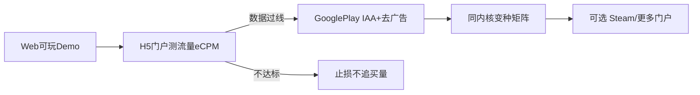
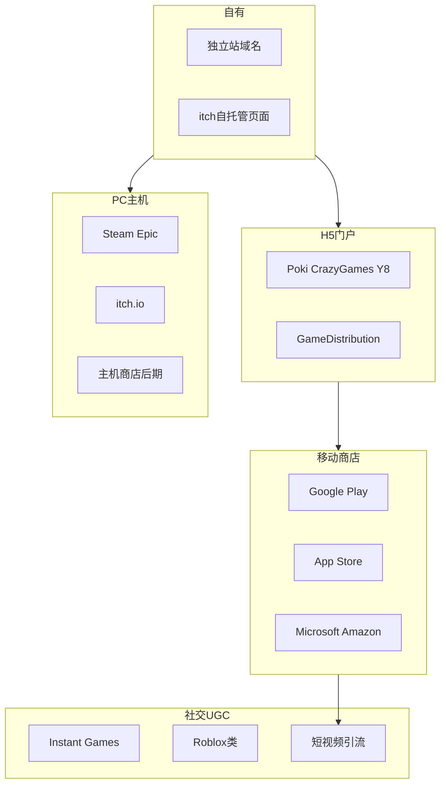

# 全球游戏平台和游戏开发赚钱模式

> 读者：一人公司 + AI 快速做基础游戏、面向海外。  
> 本文 = 渠道 / 赚钱模式 / 技术栈 / 一人×AI 适配度总览。  
> 单品「3打15」是否值得做 → 见 [商业评估.md](./商业评估.md)。

**独立站算自有渠道（Owned）**：域名、流量、收款、广告位归你控；没有 Steam / Poki 这类平台自带的发现流量，获客要自己解决。

---

## 0. 读前结论（适合你的 3 条路）

**评级标准**：AI 能否扛大部分美术与代码；是否要持续运营产能；是否要大规模买量；规则/回合是否清晰短平。

1. **主路（高适配）**：轻规则 Web/H5 → Poki / CrazyGames 等门户分成或自有站广告 → 验证后打包 Google Play，**IAA + 去广告**。
2. **副路（中适配）**：同内核多变种做矩阵；itch.io 验证口碑；内容够厚再上 Steam 买断。
3. **慎选（低适配）**：重度 live ops / 订阅内容机 / 主机首发 / 纯靠买量起盘 / 强多人实时竞技。

---

## 1. 赚钱模式全景（谁付钱）+ 一人×AI 评级

| 模式 | 说明 | 典型品类 | 启动成本 | 一人×AI | 失败主因 |
|------|------|----------|----------|---------|----------|
| H5 门户 Rev-share | 门户放你的游戏，广告收入分成 | 休闲、棋类、超轻玩法 | 低（有可玩链接即可申请） | ★★★★★ | 过不了质量/留存门槛；分成比例谈不拢 |
| 移动 IAA（广告） | AdMob / ironSource / AppLovin 等 | 休闲、超休闲、工具壳 | 中（打包+合规+广告 SDK） | ★★★★★ | 没量；eCPM 地区差；违规下架 |
| 去广告 / 轻 IAP | 小额买断去广告、皮肤 | 与 IAA 游戏搭配 | 低 | ★★★★☆ | 付费率极低仍属正常；别指望当主收入 |
| 独立站广告/打赏 | AdSense + Stripe 打赏/买断 | SEO 可搜品类、合集站 | 低～中（站+内容） | ★★★★☆ | **流量起不来**；SEO 慢 |
| itch 自由定价/买断 | PWYW 或定价卖 | Demo、小品、实验作 | 低 | ★★★★☆ | 曝光靠社群/偶然；营收通常薄 |
| Steam 买断/DLC | 愿望单 + 评测驱动 | 有深度的独立作 | 中～高（内容+页面+宣发） | ★★★☆☆ | 内容厚度不够；零愿望单上架；AI 帮开发不帮营销 |
| Playable Ads 供稿 | 给买量方做可玩广告素材 | 超休闲玩法片段 | 低（接单） | ★★★☆☆ | 偏劳务、非产品资产；单价与档期不稳定 |
| Meta Instant Games | 社交内轻游 + 广告 | 轻社交、回合制 | 中 | ★★★☆☆ | 审核/政策变动；发现位难抢 |
| 众筹 Kickstarter | 预售换资金 | 有人设叙事的独立作 | 高（视频/页/履约） | ★★☆☆☆ | 众筹失败或履约炸掉；一人声誉风险大 |
| Patreon/订阅内容 | 持续更新换月费 | 系列内容、工具+社区 | 中（持续产能） | ★★☆☆☆ | 期待管理与更新节奏压垮一人 |
| UGC 平台分成（Roblox 等） | 平台内消费分成 | 平台原生玩法/体验 | 中（另学生态） | ★★☆☆☆ | 另一套技能与算法；品类迁移成本高 |
| Battle Pass / Live ops | 赛季制内容机 | 中重度、竞技、收集 | 高 | ★☆☆☆☆ | 一人做不起内容供给 |
| 主机首发买断 | Switch 等商店买断 | 移植成熟精品 | 高（认证/移植/QA） | ★☆☆☆☆ | 时间与现金门槛；档期不可控 |
| B2B 授权/白标 | 卖源码、OEM、玩法授权 | 已验证的内核/合集 | 低～中（交付） | ★★☆☆☆ | 偶发；靠关系与交付可信度 |

**对你最现实的组合**：门户 Rev-share（冷启动流量）→ 移动 IAA（规模化变现）→ 去广告作补充 → 独立站作自有资产沉淀。不要把 Steam 买断或订阅当作第一目标。

---

## 2. 分发平台地图（5 层渠道）

每条摘要：**适合 / 怎么进 / 怎么挣钱 / 一人风险 / 星级**。

### L1 自有渠道

**独立站（你的域名）** ★★★★☆  
- 适合：产品矩阵首页、SEO（规则名/文化名可搜）、合集、邮件列表落地。  
- 怎么进：买域名 + 静态托管（Vercel/Cloudflare 等）挂 H5；收款 Stripe；广告 AdSense。  
- 怎么挣钱：广告、买断下载、打赏、导流到商店。  
- 一人风险：没有平台推荐流；SEO/内容获客慢。算「自己的」，但不替代商店发现力。

**itch 页面自托管** ★★★★☆  
- 适合：快速挂 Web 或下载包做验证。  
- 怎么进：注册开发者，上传即有页面。  
- 怎么挣钱：定价 / PWYW；也可作 Demo 跳转正式站。  
- 一人风险：站内发现弱，需外链引流。

### L2 HTML5 门户

**Poki / CrazyGames** ★★★★★  
- 适合：轻策略、棋类、超轻玩法、即开即玩。  
- 怎么进：开发者投稿 / 合作申请，过质量与性能审核。  
- 怎么挣钱：广告 Rev-share（主流）。  
- 一人风险：审核严格；不合格即没量；合同与分成因合作而异（易变，签约时核对）。

**Y8 / GameDistribution / Kongregate / Newgrounds** ★★★★☆  
- 适合：同类 H5；GD 常作多门户分发中间层。  
- 怎么进：上传或经分发网络接入。  
- 怎么挣钱：分成或门户内广告。  
- 一人风险：流量与 eCPM 参差；注意独家条款是否绑死你。

### L3 移动商店

**Google Play** ★★★★★  
- 适合：IAA 休闲、棋类合集；海外主安卓场。  
- 怎么进：开发者账号 + 合规隐私政策 + 商店页 ASO。  
- 怎么挣钱：IAA 为主，轻 IAP（去广告）为辅。  
- 一人风险：无微信裂变；政策/儿童向审核；买量贵，优先自然量与交叉推广。

**Apple App Store** ★★★★☆  
- 适合：同款 iOS；Tier-1 用户价值高。  
- 怎么进：Apple Developer；审核更挑。  
- 怎么挣钱：同 IAA + 轻 IAP；注意 ATT 对广告 ID 的影响。  
- 一人风险：审核拒绝成本；证书与上架流程比 Play 碎。

**Microsoft Store / Amazon Appstore** ★★☆☆☆  
- 适合：已有包顺便铺量。  
- 怎么进：各商店开发者后台。  
- 怎么挣钱：多为广告/内购；量通常远小于双大商店。  
- 一人风险：投入产出比偏低，非优先。

### L4 PC / 主机

**itch.io** ★★★★☆  
- 适合：Demo、小品、社区向买断。  
- 怎么进：上传即可。  
- 怎么挣钱：你自定抽成比例内的销售收入。  
- 一人风险：爆款靠传播，不可当作稳定流水。

**Steam** ★★★☆☆  
- 适合：有内容厚度与差异化的独立作。  
- 怎么进：Steam Direct 费用 + 商店页 + 愿望单养护。  
- 怎么挣钱：买断、DLC；平台抽成常见约 30% 档（以官网为准）。  
- 一人风险：宣发与愿望单是硬课；薄内容休闲棋类买断难度大（见商业评估）。

**Epic Games Store / GOG** ★★☆☆☆  
- 适合：已有一定体量或洽谈发行后的补充渠道。  
- 一人风险：曝光不一定优于 Steam；一人冷启动优先级低于 Steam。

**主机商店（Switch / PlayStation / Xbox）** ★☆☆☆☆  
- 适合：已验证的移植后期。  
- 怎么进：认证、Dev kit、多轮 QA。  
- 一人风险：时间与现金门槛高；不作为起步目标。

### L5 社交与发现（不全是「商店」）

**Meta Instant Games** ★★★☆☆  
- 适合：社交场景里的轻游。  
- 怎么进：Meta 应用审核与 Instant 规范。  
- 怎么挣钱：平台内广告等。  
- 一人风险：政策与流量规则变动；发现位竞争。

**Roblox 等 UGC** ★★☆☆☆  
- 适合：平台原生体验，非传统「下载一个 App」。  
- 怎么进：学平台工具与经济体系。  
- 怎么挣钱：平台货币/分成。  
- 一人风险：**另一赛道**，技能与获客逻辑不与 H5/Steam 通用；勿与棋类 App 混为一谈。

**TikTok / YouTube Shorts / Reddit / Discord** ★★★★☆（引流层）  
- 适合：所有需要曝光的产品。  
- 怎么进：内容账号或社区帖；短视频强演示「3 秒看懂玩法」。  
- 怎么挣钱：不直接结算，导流到门户/商店/独立站。  
- 一人风险：内容产能；算法不稳定；勿无转化地追粉。

### 广告基础设施（挣钱零件，不是商店）

| 工具 | 用途 | 备注 |
|------|------|------|
| AdMob | 移动 IAA 常用入口 | 与 Firebase 生态近 |
| AppLovin MAX / ironSource | 聚合 mediation，抬 eCPM | 中后期再上不迟 |
| Unity Ads | Unity 项目常见 | 非 Unity 也可用其网络，按文档 |
| AdSense | 独立站网页广告 | 站点质量与政策合规 |

---

## 3. 游戏框架 / 技术栈（按一人+AI 出货速度）

排序写死，避免「都可以」：

| 优先级 | 技术 | 输出 | 一人×AI 说明 |
|--------|------|------|----------------|
| 1 首选 | Phaser / PixiJS（2D）；必要时 Three.js | 纯 Web/H5 | 与门户、独立站最贴；AI 写规则与 UI 效率高 |
| 1 并列 | Godot 4 导出 Web | H5 + 可再导出移动 | 一引擎多端；2D/棋盘类很合适 |
| 2 跨端 | Godot 4 或 Unity 2D | H5 + APK/IPA | 验证 Web 后再打包商店，减少返工 |
| 3 超轻原型 | Twine / Bitsy | 叙事/小品 | 验证故事向创意；变现能力通常弱 |
| 4 慎选 | Unreal、重 3D、自建强联网服 | 主机/3A 向 | 一人+AI 时间沉没风险大 |

**AI 增效边界**

- **AI 强**：规则引擎、棋盘状态、关卡表、UI 壳、多语言文案、重复变种脚手架。  
- **仍靠人**：玩法手感与难度曲线、长期留存设计、平台关系、买量与素材迭代、品牌与社区信任。

**品类 → 框架 → 分发（速查）**

- 棋类 / 轻策略 → Phaser 或 Godot → Poki / 独立站 → Google Play  
- 超轻点击类 → Phaser → H5 门户规模化  
- 短解谜小品 → Godot / Unity → itch →（够厚）Steam  

---

## 4. 品类 × 赚钱模式 × 平台

| 品类 | 推荐模式 | 推荐平台路径 | 一人×AI |
|------|----------|--------------|---------|
| 棋类 / 围猎 / 轻策略 | IAA + 门户分成 | Poki/CrazyGames → Google Play | ★★★★★ |
| 超轻点击 / 放置壳 | IAA 规模化 | H5 门户矩阵 | ★★★★☆ |
| 短解谜 / 小品 | 买断或 PWYW | itch → Steam | ★★★★☆ |
| 中度独立精品 | Steam 买断 | Steam + 愿望单 + 短视频 | ★★★☆☆ |
| 赛季制 / 强社交 | 订阅 / Pass | 自有 + 商店 | ★☆☆☆☆ |

与「3打15」最贴的是第一行：免费 + 广告，门户冷启动，再上移动 IAA。

---

## 5. 一人+AI 推荐行动路径（默认主路径）

1. 用 **Phaser 或 Godot** 做出 Web 可玩版（先单变种，规则正确、可端到端玩完）。  
2. 挂到 **独立站或 itch**，同时申请 **Poki / CrazyGames**（及可选 GD 分发）测流量与广告 eCPM。  
3. **数据过线**后再打 Google Play（必要时再 App Store）：IAA + 去广告卡。  
4. 同一内核扩变种 / 关卡 / AI 难度，再考虑更多门户或 Steam（仅当内容厚度与差异化够）。

**关先验指标（与商业评估一致）**：次日/7 日留存、单局时长、激励广告观看率、Tier-1 eCPM。

**失败标准**：留存与广告观看率不达标 → **低成本止损，不追买量**。价值在包装、内容量（关卡/变种）与分发，不在「规则本身不可抄」。

---

## 6. 出海硬门槛速查（中国一人公司）

只作检查清单，不构成法律/税务意见。

- **主体与收款**：个人/个体/公司主体能否开 Google Play、Ads、Stripe、门户结算账户；外汇与申报提前想清楚。  
- **税务意识**：平台 1099/账单、国内纳税义务；不要假设「海外收款 = 不用报」。  
- **隐私合规**：GDPR（欧）、CCPA（加州）、商店隐私标签；广告 SDK 与同意弹窗。  
- **儿童向**：涉 COPPA / 面向儿童设计则广告与数据限制极严——棋类若偏儿童包装要格外谨慎。  
- **平台抽成**：Steam / 移动商店常见约 15%～30% 档；门户为广告分成（签约核对）。费率会变，以签约与官网为准。  
- **账号安全**：开发者账号、2FA、商务邮箱；被封等于断现金流。

---

## 7. 与「3打15」文档的分工

| 文档 | 回答的问题 |
|------|------------|
| **本文** | 全球有哪些平台与赚钱模式；一人+AI 适合走哪条 |
| [商业评估.md](./商业评估.md) | 「3打15」这品类海外值不值得做、怎么验证 |
| [原始需求.md](./原始需求.md) | 规则与棋盘定义 |

一句话对齐：本品类更适合 **免费+广告 + H5 门户冷启动**，不适合作为买断主产品——原因与路径细节见商业评估。

---

## 附录：刻意不深挖（避免过期注水）

主机送审细节、买量出价与素材测试、具体合同分成数字、国内安卓渠道——需要时另开专项笔记。
