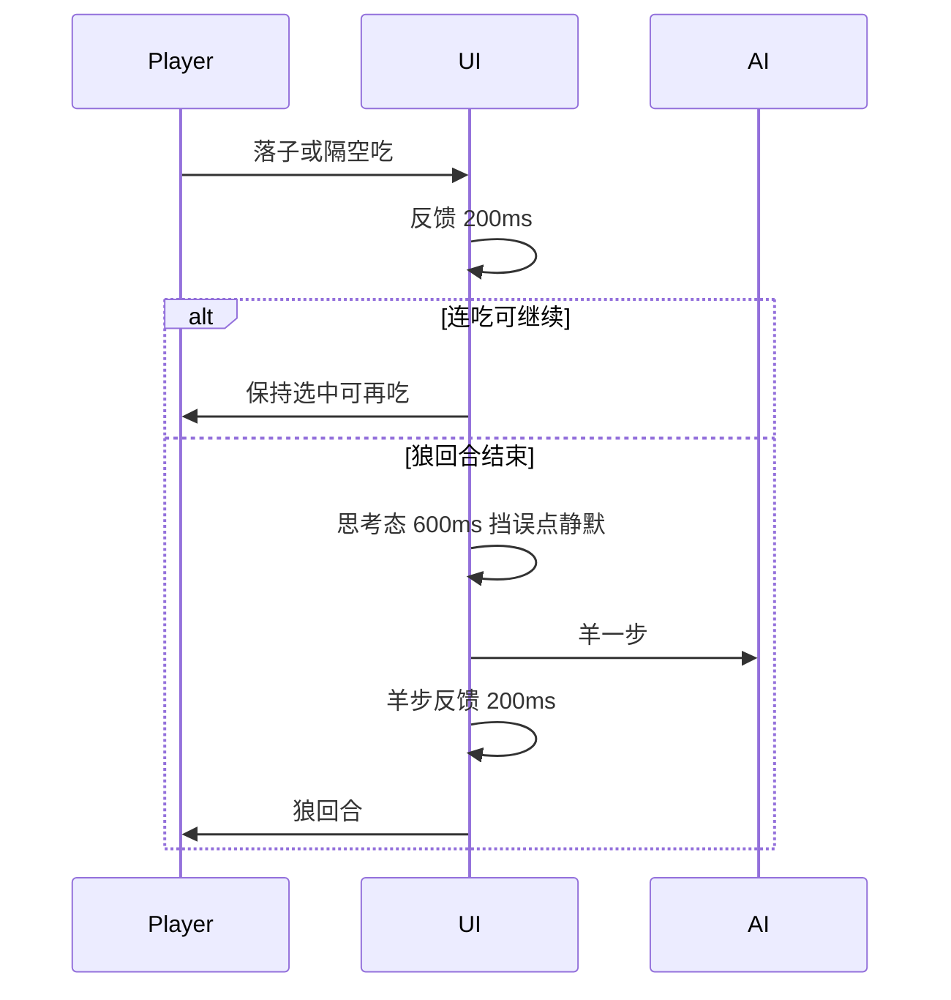

# 03 · 对局时序与反馈标准

> 目标：像「有思考的对手」，又不拖垮 H5 2～4 分钟短局。  
> 实现时禁止用 `queueMicrotask` 同步落子冒充「思考」。

## 默认时序（现行统一）

| 节点 | 默认 | 对标理由 |
|------|------|----------|
| 玩家落子 / 隔空吃反馈 | **200ms** 位移或冲刺感 | 吃子必须「看见发生了」 |
| 连吃之间 | **玩家节奏**；每次吃仍 200ms 反馈 | 连吃是核心爽点，不人为限速 |
| 狼回合结束 → 羊落子 | **600ms** 思考态：挡误点、无转圈/无加载弹层；顶栏静默「羊回合」 | 信任感靠停顿 + 随后羊步 juice，不靠 spinner |
| 羊落子反馈 | **200ms** 再交还狼操作 | 回合边界清晰 |

按章节微调思考时长（若要做）见任务 `P-AI-PACING`。

## 回合时序示意

## Juice 最低标准（与时序一起验收）

| 事件 | 最低反馈 |
|------|----------|
| 走一格 | 短位移或落点闪 |
| 隔空吃 | 路径强调 + 羊消失有停顿（计入 200ms） |
| 连吃 | HUD「连吃 k/5」打眼；可选短闪 |
| 胜/负 | 结算前状态可读，不瞬切无提示 |

音效为 S1（见缺口清单）；有音效时静音必须真生效。
