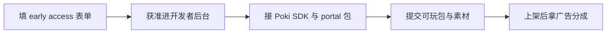

# Poki 早期准入申请 · 说明与填表口径

> **表单地址：** [Request early access](https://developers.poki.com/share)（`developers.poki.com/share`）
> **本文是填表 SSOT。** 只覆盖开发者后台准入，**不是**上传游戏包、签分成合同、过审上架。
> **姓名 / 邮箱 / 国家** 必须用你本人真实信息；下文产品口径可直接照抄。
> 获准后的阶段事项 → [双H5门户上架计划](../双H5门户上架计划/00-总览与共用阶段.md) S2+；工程清单 → [`distribution/poki/README.md`](../../../../distribution/poki/README.md)。

---

## 这页在干什么

[developers.poki.com/share](https://developers.poki.com/share) 是 **Request early access（申请早期准入）**：

- **目的：** 让 Poki 知道你们是谁、做过什么、想上什么类型的 Web 游戏，从而决定是否开放 **Poki for Developers** 后台。
- **不是：** 上传游戏、签分成合同、过审上线。
- **通过后：** 才会进入对接 SDK、上传构建、平台预览、正式提交（任务 `T-017`）。



---

## 提交前检查

- [ ] 已用真实姓名、长期邮箱、所在国家填写
- [ ] Studio 填 `Fangrush Studio`（勿写内部代号「狼与绵羊」）
- [ ] 作品链接含可玩 Demo：`https://fangrush.com`（若暂不可达，改用 itch / 录屏并说明）
- [ ] 引擎写 HTML5 / Web / Custom，**不要**写 Unity
- [ ] 第一次发游戏：平台履历选 None / Not yet，勿编造
- [ ] 已在官网表单点击 Submit

---

## 字段对照（定稿口径）

| 字段 | 什么意思 | 填什么 |
|------|----------|--------|
| What's your name? | 联系人真名 | （你本人英文名或拼音全名） |
| What's your email? | 商务联系邮箱 | （长期会查、以后能收合同的邮箱） |
| What's the name of your studio or team? | 工作室/团队对外名 | `Fangrush Studio`（一人也可） |
| In which country are you based? | 团队所在国家 | `China`（或实际常驻国英文名） |
| How would you describe your studio or team? | 团队类型（多选） | Indie / Solo developer / Small indie studio；有 First-time 类也勾；勿装大厂 |
| If you've previously released games, which platform… | 以前发过哪些平台 | None / Not yet（首次则勿勾假平台） |
| Can you provide us with links to those games? | 作品链接（必填） | 见下方「作品链接栏」粘贴块 |
| Which genres do you typically work on? | 常做品类 | `Strategy, Puzzle, Board game, HTML5 casual` |
| Which engines do you typically work with? | 常用引擎 | `HTML5 / TypeScript / Next.js (custom board-game engine)`；下拉优先 HTML5 / Custom / Web；**不要写 Unity** |
| What are you looking to gain from working with Poki? | 期望从 Poki 得到什么 | Distribution / Reach players；Monetization / Ads revenue share；Publishing support（有 Analytics / Growth 也可勾） |

---

## 作品链接栏（可直接粘贴）

```text
First web game release. Playable demo of Fangrush (HTML5 strategy board game, 3 wolves vs 15 sheep, seasonal levels): https://fangrush.com
Studio: Fangrush Studio. Looking to publish on Poki with platform ads and reach global web players.
```

## 品类备注（可选）

```text
Strategy / puzzle board game for short sessions; seasonal level progression.
```

---

## 填写注意

1. **诚实优于包装**：有可玩 Web Demo 比假履历更重要。
2. **引擎写 Web/自定义**：对齐 `game-core` + Next.js，便于后续技术预期。
3. **表单通过 ≠ 游戏上架**：仍要 portal 构建、SDK、封面与检查清单。

---

## 提交后

1. 等待 Poki 邮件 / 后台邀请；可能较久、也可能无回复。
2. 获准后若决定启动真实接入，再从需求池迁出 SDK、portal 包与正式提交任务；工程参考见 [`distribution/poki/README.md`](../../../../distribution/poki/README.md)，阶段参考见 [双H5计划 · Poki](../双H5门户上架计划/01-Poki分阶段事项.md)。
3. 通过准入 ≠ 游戏已上架。

平台总览仍见 [海外平台接入小白指南 · E2](../../海外平台接入小白指南.md)。
