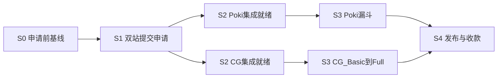

# 双 H5 门户上架计划 · 总览与共用阶段

> **本夹职责：** 写清 Poki + CrazyGames **并行推进时，每个阶段要完成哪些事**。  
> **只写需求 / 事项与完成标准**，不写如何接 SDK、如何改代码。  
> **不维护**勾选进度（进度见 `distribution/*/compliance.yaml` 或任务清单）。  
> 规则为什么重要 → [门户上架要点](../门户上架要点/00-索引与怎么读.md)；细则 → 各站双语整理。

---

## 一句话地图

| 阶段 | 一句话 | 独立站「基本可玩」够不够 |
|------|--------|--------------------------|
| **S0** | 申请前把 Demo 与填表材料备齐 | **够做 S0；也够启动 S1** |
| **S1** | 两站都把申请/游戏提交出去，且不签死独家 | 用 S0 的 Demo 链接即可交 |
| **S2** | 各站「能过平台技术/素材门槛」的就绪（分站，见 01/02） | **不够**，要门户向就绪 |
| **S3** | 各站测试漏斗（Fit / Basic→Full） | 靠 S2 产物 + 数据迭代 |
| **S4** | 签约/变现后的更新与收款 | 运营事项 |

**战略定稿（与渠道路线一致）：** 双门户并行验证广告分成；独立站长期作 Demo / SEO，冷启动不靠它赚钱；**先不签死网页独家**。

---

## 「申请」一词的固定含义

| 说法 | 含义 | 不是 |
|------|------|------|
| **Poki S1** | 提交 early access / 开发者准入（拿 P4D） | 不是全球上架、不是已有分成 |
| **CrazyGames S1** | 注册并提交游戏进入审核队列（随后 Initial QA → Basic） | 不是 Full 变现 |
| **上架赚钱** | 各站进入 **S4**（Poki 签约发布后；CG Full 开启变现后） | — |

---

## 并行规则

- S0 完成后，**S1 两站可同一周并行提交**。  
- S1 已交、等回复期间，**允许并行准备 S2**（素材、平台就绪），不必干等。  
- S3 必须等该站 S2 对应门槛满足（Poki：有后台 + 集成就绪；CG Basic：S2a；CG Full：S2b）。  
- **不要求**两站同一天过线；任一站先进 S4 都可以先收款运营。

---

## 阅读顺序

1. 本文（共用 S0 / S1 / S4）  
2. [01-Poki分阶段事项](./01-Poki分阶段事项.md)  
3. [02-CrazyGames分阶段事项](./02-CrazyGames分阶段事项.md)  
4. 需要规则口径 → [门户上架要点](../门户上架要点/00-索引与怎么读.md)  
5. 需要规格对照 → [Poki 双语](../Poki官方文档双语整理/00-索引与阅读边界.md) / [CrazyGames 双语](../CrazyGames官方文档双语整理/00-索引与阅读边界.md)  

---

## 与其他文档的边界

| 文档 | 关系 |
|------|------|
| [渠道发展路线](../渠道发展路线.md) | 战略一句定稿；本夹拆成阶段事项 |
| [门户上架要点](../门户上架要点/00-索引与怎么读.md) | 为什么重要 / 专属口径；本夹不重写 |
| [海外平台接入小白指南](../海外平台接入小白指南.md) | 填表与没量时操作注意 |
| `distribution/poki`、`distribution/crazygames` | 工程勾选与证据；本夹不维护进度 |

---

## S0 · 提交申请前要准备什么

### 独立站可玩是否够？

**结论：独立站游戏「基本可玩、质量过关」——对交申请通常够；对过审变现不够。**

### 申请前必须有

- 完成一条**稳定可玩的公开链接**（独立站 Demo 即可；审的人能点开玩几分钟）  
- 完成**核心循环可玩通**：少崩、少卡死；桌面可用；手机最好也能玩一轮  
- 完成**英语界面可玩**（菜单/关键提示可读；不必已做全 EFIGS）  
- 达到**成品观感**：非明显克隆/未打磨原型；主题健康向  
- 准备**填表材料**：英文游戏名、一两句玩法说明、工作室/联系人、所在国家（如 China）  

### 申请前不必有（放到 S2 及以后）

- 平台 SDK / 广告接好  
- 门户专用打包、画布/包体压到平台硬标  
- 三封面/预览视频/Poki 缩略图全部定稿（有更好，非填表硬门槛）  
- Billing / Tipalti 配完（**尽早准备**；CG 侧有时影响提交）  
- 独家商务谈妥  

### 质量「过关」的最低杠（仅申请向，不是 Fit / Full 向）

- 陌生人打开链接能在**几分钟内弄懂并下完几步棋**，不因 Bug/白屏流失  
- 无成人向 / 明显低质翻版观感  
- Demo **不要**默认露出 Admin、调试层、半截功能墙  

### 两站差异（申请前）

- **Poki**：early access 看「值不值得给后台」——可玩 Demo + 英文简介是主材料；获准后才强制 SDK / Requirements。  
- **CrazyGames**：也可凭可玩质量进审；**Basic** 甚至可不接 SDK；但 Initial QA 仍会拒「太糙」的稿。  

### S0 完成标准

**有可公开试玩的英语 Demo，质量达到「愿意给陌生人玩」；材料够填两站申请表。**

细则口径见 [门户上架要点 · 01 多平台通用](../门户上架要点/01-多平台通用质量事项.md)。

---

## S1 · 双站提交与商务红线

### 要做的事

- 完成 **Poki** early access / 开发者准入提交（现行入口以官网为准；填表口径见 [Poki早期准入申请/说明与填表口径.md](../Poki早期准入申请/说明与填表口径.md)）
- 完成 **CrazyGames** 账号与游戏提交，进入审核队列（填表口径见 [CrazyGames游戏提交申请/说明与填表口径.md](../CrazyGames游戏提交申请/说明与填表口径.md)）
- 遵守商务红线：**不签死网页独家**（保证双门户可并行）  
- 开始准备收款主体信息（PayPal / 电汇或 Tipalti 所需资料；**不必** S1 当天配完）  

### S1 完成标准

**两站申请都已发出；商务未锁死独家。**

---

## S2 / S3 · 分站推进（摘要）

| 站 | S2 | S3 | 详文 |
|----|----|----|------|
| Poki | 获准后：集成与素材就绪、Inspector | Playtesting → Player Fit → Web Fit → Final Review | [01](./01-Poki分阶段事项.md) |
| CrazyGames | S2a 服务 Basic；S2b 服务 Full | Initial QA → Basic → Full QA | [02](./02-CrazyGames分阶段事项.md) |

---

## S4 · 运营共用原则

（分站收款方式与发布名见 01 / 02；此处为双站共同纪律。）

### 要做的事

- 完成各站 **Billing / 收款配置**（有收入前配好，避免卡提现或卡提交）  
- 建立**更新习惯**：修 Bug、加内容、加语言通过各站后台提交新版本  
- 用后台数据（时长、转化、留存、广告等）决定迭代优先级  
- 若任一站提出**独家 / 排他**条款变更：停下来重审双门户战略与合同，再签字  

### S4 完成标准（共用层面）

**至少一站已进入可更新、可对账的正式运营状态；收款通道已打通或明确卡点。**

---

## 素材与商务共用备忘（并入本文，不另开篇）

| 类型 | Poki（要点） | CrazyGames（要点） | 何时必须 |
|------|--------------|--------------------|----------|
| 静图 | 方形缩略图等 | 横/竖/方三封面 | 进该站 S2/S3 硬门槛前 |
| 动态 | 动画缩略图（全球发布向） | 横+竖无声预览视频 | 见各站 01/02 |
| 文案 | 英文名、描述、分类建议 | 英文名、描述、玩法/操作说明 | 提交构建时 |
| 收款 | PayPal 或电汇（P4D Billing） | Tipalti（常见最低约 €100） | S4 前配齐；CG 宜更早 |

规格细节见各站 [门户上架要点](../门户上架要点/00-索引与怎么读.md) 与双语整理，本夹不展开实现。
