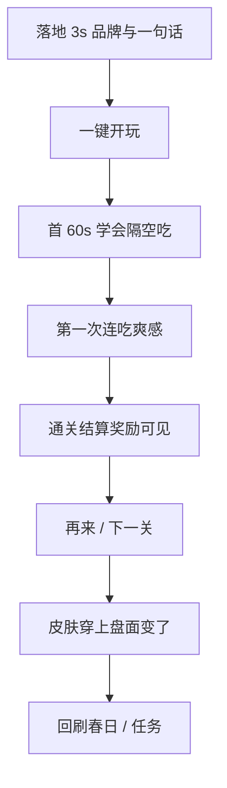
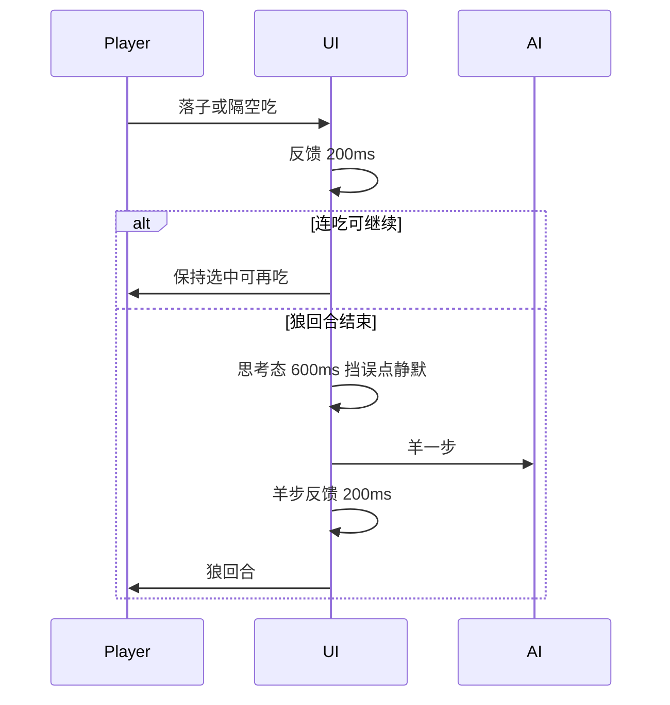

# 商业成功标准

## 深层次意图

把 AI / 开发当成**产品合伙人**，而不是「指出一个改一个」的消防队：

1. **目标是商业成功 + 玩家爱玩**，不是「规则测通即可」。
2. 用**全球主流成功游戏的经验**定高标准（Poki / CrazyGames 上架级棋类与闯关休闲；Chess / Checkers / Fox & Geese 类回合节奏；三消与轻策略的 juice 反馈）。
3. **先立可检验的体验标准与缺口地图**，再成批施工；避免消防式修点。
4. **节奏、反馈、首 30 秒、身份感（皮肤）、广告不伤爽**——都是产品核心，不是「有空再抛光」。

## 三层目标

| 层 | 含义 | 现状（2026-07-15） |
|----|------|-------------------|
| L1 规则通 | 能下完、胜负正确、进度可存 | **已达到** |
| L2 可上架 | 像成品游戏：棋子可辨、品牌完整、无 MVP 字样、门户可挂 | **未达到** |
| L3 玩家爱玩 | 愿再开一局、愿看激励、愿换皮；漏斗不断 | **未达到 · 冲刺目标** |

**一句话：核心规则完成 ≠ 可上架；可上架 ≠ 玩家爱玩。我们要冲第三层。**

## 全球对标 → 达标线

模式借鉴，不抄素材。对标对象：Poki / CrazyGames 头部 HTML5 棋盘与益智；国际跳棋与 Chess 移动端节奏；轻策略闯关的「首关教学 + 短局 + 结算爽」；收集类皮肤的「穿上立刻看见」。

| 成功共性 | 玩家感受 | 本品现状 | 达标线 |
|----------|----------|----------|--------|
| Instant clarity | 3 秒知道我是谁、点哪 | 色圆棋子；首页无 Fangrush 英雄 | 狼/羊剪影 1 秒可辨；首页品牌 + 棋盘主视觉 |
| First 30s win | 首关必会吃、必有爽感 | 无引导；隔空吃易误解；瞬切无反馈 | 春日 1：教会一次隔空吃 + 连吃可见反馈 |
| Readable board | 盘面是「游戏」不是表格 | 线框 + 色点 | 对局真 SVG 棋子 + 主题底；岩石可读 |
| Turn rhythm | 感觉在和「对手」下棋 | AI 微任务瞬移 | 思考窗（狼回合结束→羊落子约 600ms）+ 走子反馈（约 200ms） |
| Juice on payoff | 吃子/连吃有快感 | 瞬删羊 | 吃子停顿/冲刺感 + 连吃叠层反馈 |
| Fair AI feel | 输得起、不秒杀感 | 无思考感；hard 待校准 | 思考延迟；难度与章节一致 |
| Identity loop | 皮肤是我 | 只换颜色 | 对局真换 SVG；图鉴所见即所得 |
| Session fit | 2–4 分钟一局可再来 | 局长时间合；壳劝退 | 结算强「再来」；广告失败不挡爽 |
| Portal ready | 像上架页不是 MVP | 页脚 MVP；Wolf & Sheep | 去 MVP；Fangrush 一致 |
| Monetize without hate | 广告在自然缝 | 对局中推双倍偏吵 | 激励放结算/关卡缝；失败可跳过 |

## 玩家漏斗

用这个审产品，不只审单页：

## 对局时序与反馈

目标：像「有思考的对手」，又不拖垮 H5 2～4 分钟短局。  
实现时禁止用 `queueMicrotask` 同步落子冒充「思考」。

### 默认时序（现行统一）

| 节点 | 默认 | 对标理由 |
|------|------|----------|
| 玩家落子 / 隔空吃反馈 | **200ms** 位移或冲刺感 | 吃子必须「看见发生了」 |
| 连吃之间 | **玩家节奏**；每次吃仍 200ms 反馈 | 连吃是核心爽点，不人为限速 |
| 狼回合结束 → 羊落子 | **600ms** 思考态：挡误点、无转圈/无加载弹层；顶栏静默「羊回合」 | 信任感靠停顿 + 随后羊步 juice，不靠 spinner |
| 羊落子反馈 | **200ms** 再交还狼操作 | 回合边界清晰 |

### 回合时序示意

### Juice 最低标准（与时序一起验收）

| 事件 | 最低反馈 |
|------|----------|
| 走一格 | 短位移或落点闪 |
| 隔空吃 | 路径强调 + 羊消失有停顿（计入 200ms） |
| 连吃 | HUD「连吃 k/5」打眼；可选短闪 |
| 胜/负 | 结算前状态可读，不瞬切无提示 |

有音效时静音必须真生效。
