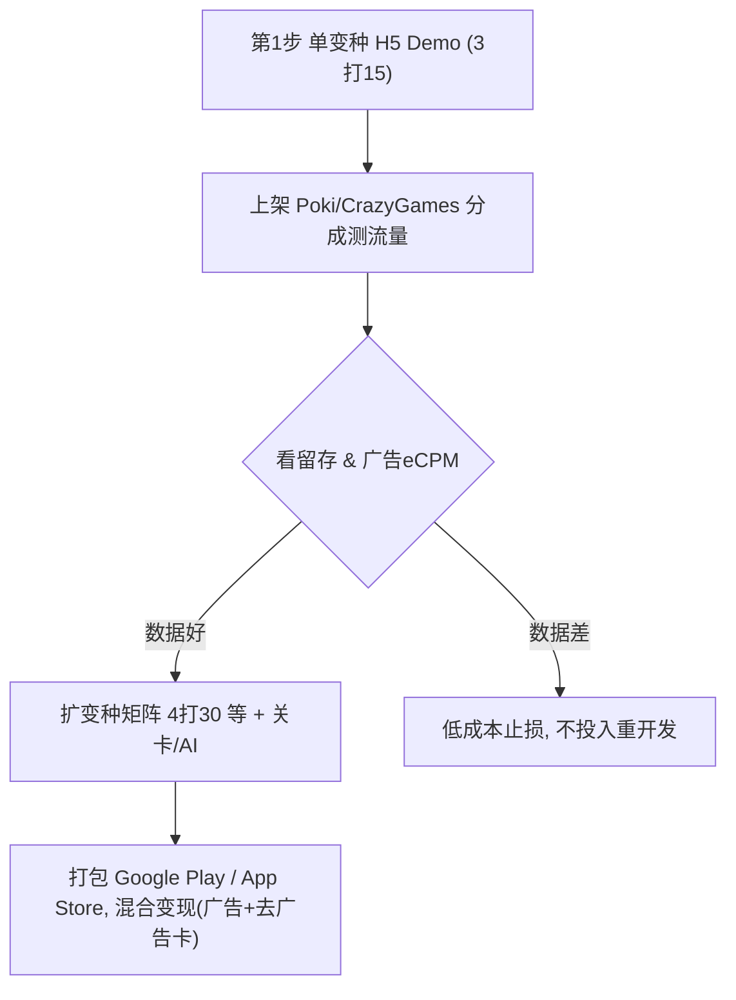

# 「3打15」海外商业可行性评估

> 本品**阶段定稿**（门户 → 商店、变现主次）见 [渠道发展路线.md](./渠道发展路线.md)。

## 一、我对你真实意图的理解

你要判断的不是规则对错，而是**这门生意值不值得做、怎么做**：

- 身份：中国开发者，**产品面向海外**（非国内微信生态）。
- 品类：非对称"围猎棋"（3打15，及 4打30 等变种），做成网页 / APP。
- 诉求：客观了解海外用户的**真实需求**和**付费意愿**，以及是否值得投入、以何种形态切入。
- 已有想法：用"一个玩法内核 + 多变种"构建产品矩阵。

## 二、客观评估（不粉饰）

### 1. 直接付费意愿：低（全球普遍如此）

- 同类海外游戏（Fox and Geese、Bagh-Chal / Tiger vs Goat）在 Google Play **清一色免费+广告**，无成功买断案例。Bagh-Chal 类有 120 万+下载仍免费；不少 Fox and Geese 实现历史营收不足 5000 美元。
- 玩法轻、单局短、学习成本低，海外用户同样默认"这类游戏应免费"，买断/内购门槛极高。

### 2. 但海外对本品类反而比国内更友好的两点

- **广告 eCPM 高**：Tier-1 国家（美/英/加/澳/西欧）休闲游戏激励/插屏 eCPM 通常是国内数倍，"靠广告跑量"的单用户价值更高。
- **HTML5 门户分发**：Poki、CrazyGames、Y8 等门户天然吃"轻策略/棋类"，可用**分成（rev-share）**模式获得免费流量，绕开高昂买量，非常适合低预算出海冷启动。

### 3. 品类需求：小众但长青、可辨识

- 非对称围猎棋在全球有文化根基（Fox and Geese/Halatafl、Bagh-Chal、狼与羊等多国变体），**认知门槛低、搜索有自然流量**。
- 但正因为经典，**免费克隆已泛滥**，规则不可专利、极易被抄，**靠玩法内核没有壁垒**。

### 4. 中国开发者出海的特有考量

- 分发平台为 **Google Play + App Store + Web(H5)**，无微信裂变红利；付费用户获取靠自然量/门户/低价买量更现实。
- 变现工具：AdMob / ironSource / AppLovin（IAA 为主）；结算、税务、隐私合规（GDPR/CCPA、儿童向 COPPA）需注意。
- 语言与本地化门槛低（棋类 UI 文本少），利于多市场铺开。

### 5. 一句话结论

- 作为**买断/重内购产品：基本不成立**。
- 作为**免费 + 广告的 H5/休闲 App，靠"合集 + 关卡 + AI 难度 + 在线对战 + 门户分发"跑量**：属于低门槛、低客单、可小成本验证的方向，海外 eCPM 与门户渠道是主要利好，竞争激烈是主要风险。
- 真正价值不在"规则"，而在**包装、内容量（关卡/变种矩阵）与分发**。

## 三、建议验证路径（先验证，再放大）

- 变种矩阵评估（初判）：`3打15` 作为入门款；`4打30` 提升策略深度、留存潜力更高；建议以"闯关式关卡 + AI 难度梯度"扩内容量，而非只堆变种。
- 关先验指标：次日/7日留存、单局时长、激励广告观看率、Tier-1 eCPM。

---

## 相关文档

- 全球渠道、赚钱模式、技术栈与一人×AI 适配度总览 → [全球游戏平台和游戏开发赚钱模式.md](./全球游戏平台和游戏开发赚钱模式.md)

