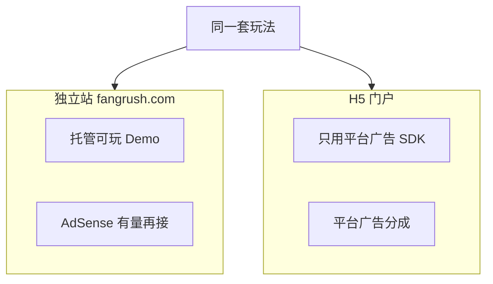
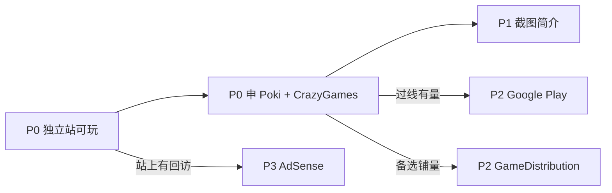

# 海外平台接入小白指南

> 读者：中国个人 / 一人开发者，英语一般，游戏几乎还没自有流量。  
> 产品：Fangrush（三狼连猎）H5 棋盘闯关，海外向。  
> 分成比例、独家条款、政策以**签约时合同与官网**为准；链接可能变更。  
> **本品阶段定稿**（先门户再商店、广告+去广告+皮肤）见 [渠道发展路线.md](./渠道发展路线.md)。  
> 战略总览见 [全球游戏平台和游戏开发赚钱模式.md](./全球游戏平台和游戏开发赚钱模式.md)；值不值得做见 [商业评估.md](./商业评估.md)。

---

## 0. 先看懂你们的实际情况

你们现在大概是：

- 有（或即将有）可玩 Demo / 独立站 `fangrush.com`
- **几乎没有自然量**（搜索、社群、买量都还没起来）
- 想靠广告赚钱，但还没签任何海外门户

在这个阶段：

| 想法 | 现实 |
|------|------|
| 先接 Google AdSense 赚钱 | **很难当成主收入**；没量 ≈ 几乎没钱；纯游戏站还容易审不过 |
| 先把独立站当「赚钱主战场」 | 独立站现在更适合当 **Demo 托管 + 给门户看的链接**，不是印钞机 |
| 先投 Poki / CrazyGames | **更对症**：平台自带玩家，广告也是他们的；你们交可玩包 + SDK |

**结论一句话**：没量时，**先上门户拿流量和分成**；独立站先做稳可玩；AdSense **有量再认真接**。

---

## A. 广告怎么选：独立站 vs H5 门户

### 独立站适合接什么

| 方案 | 什么时候考虑 | 备注 |
|------|--------------|------|
| **先不接广告 / Mock** | 现在 | 不影响门户送审；避免空站硬塞广告被拒 |
| **Google AdSense** | 有一定日活、站点有说明页/隐私页、内容不只是一个空壳 iframe | 见下一节「能不能接」 |
| Google Ad Manager | 量大、要精细控广告位时 | 一人冷启动别碰 |
| 门户 SDK（Poki 等） | **不要**塞进独立站主站 | 那是嵌入门户用的 |

### H5 门户适合接什么

| 方案 | 说明 |
|------|------|
| **只接该平台 SDK** | 插屏 / 激励等；收益多为 Rev-share |
| AdSense / 第二家广告网 | **禁止**混进门户包 |
| 工程对应 | `NEXT_PUBLIC_ADS_PROVIDER=portal_sdk` → `PortalAds`；独立站才是 `adsense` |

---

## A2. Google AdSense：我们这种能不能接？

**能申请，但不该排在赚钱第一位。**

### 为什么「没量」时 AdSense 不优先

1. **没流量就几乎没收入**：广告按展示/点击计价，日 UV 个位数时，月入可忽略。  
2. **审核看站点质量**：隐私政策、联系方式、原创内容；**只有一个游戏 Canvas、几乎没有文字页**的站，拒审或反复打回很常见。  
3. **游戏站政策更敏感**：误触、误导点击、诱导点广告都会违规；冷启动时精力应放在玩法与门户，而不是抠广告位。  
4. **和门户不冲突的正确顺序**：门户先帮你验证「有没有人愿意玩」；独立站以后若有品牌搜索/SEO，再开 AdSense 才有意义。

### 什么时候再认真接 AdSense

同时接近下面几条再投入时间：

- 独立站周活已经不是「只有自己和朋友在点」
- 有英文隐私页、简短关于页、可玩页稳定
- 门户或社群已经带来少量外链/回访
- 工程上 `AdsenseAds` 已能切换，失败可跳过不影响主路径；有量后再认真接（见渠道发展路线）

**在那之前**：独立站广告保持 Mock / 关闭即可；**不要把「接上 AdSense」当成冷启动 KPI**。

---

## B. 平台与渠道优先级（按你们现状重排）

| 优先 | 渠道 | 对你们的意义 | 为什么排这里 |
|------|------|--------------|--------------|
| **P0** | 独立站可玩 Demo（`fangrush.com`） | 给自己测、给门户审、留自有域名 | **不靠它现在赚钱**；靠它「有东西可交」 |
| **P0** | **Poki** | H5 头部流量 + 平台广告分成 | 冷启动最需要「别人的量」 |
| **P0** | **CrazyGames** | 同级；可与 Poki 并行试投（先别签死独家） | 审核路径清晰，HTML5 友好 |
| **P1** | 上架材料（截图、中英简介） | 所有门户/商店共用 | 没有材料无法认真提交 |
| **P1** | itch.io | 低门槛挂 Demo、备份曝光 | 几乎不赚钱，但链接好用 |
| **P2** | GameDistribution | 长尾聚合分发 | **不是**进 Poki 的跳板；多一层通常更薄 |
| **P2** | Google Play（IAA） | 门户数据过线后再打包 | 没验证前不要当主战场 |
| **P3** | 独立站 **AdSense** | 自有站变现 | **有量再上**；见 A2 |
| **P3** | Steam | 买断向 | 内容厚度与愿望单不够时先别押宝 |
| **P3** | Apple App Store | 年费 + 审核 | 后置 |
| **暂缓** | 微信小游戏 / 国内安卓商店 | 与现行海外定位不符 | — |

---

## C. 中国开发者通用准备

### 英语材料（各平台反复要用）

- 游戏英文名 + 一句话卖点（1～2 句）
- 3～5 张竖/横截图（棋盘清晰、UI 可读）
- 可选：30～60 秒无旁白试玩 GIF/视频
- 英文隐私页链接（独立站必做；门户常会问）

### 收款常见路径（表）

| 方式 | 常见场景 | 注意 |
|------|----------|------|
| PayPal | 不少门户/海外合作 | 个人账号可用；提现到国内卡有手续费与限额 |
| Wise 等 | 收美元/欧元再转到国内 | 核对平台是否支持；保留流水 |
| 平台自有打款 / 银行电汇 | 签约后后台选 | 问清最低起付额、税表（如 W-8BEN） |
| 对公账户 | 若你已有公司 | 合同主体要一致 |

税务：海外收入可能需自行申报；本文不构成税务意见，有疑问问会计师。

### 独家（Exclusive）白话

- **非独家**：可同时上多家网页门户；分成通常较低。  
- **Web Exclusive**：只给这一家网页门户（或合同写明的范围）；分成通常更高，但会限制你再上竞品门户。  
- **建议**：第一轮提交先走非独家 / 先别急着签死；等有数据再谈。

---

## D. 纯 H5：能不能把游戏数据发到自己服务器？

现行边界见 [工程边界总览](../普通文档ing/技术设计/00-索引.md)：**门户默认零自建远程遥测**。

| 能力 | 独立站 | H5 门户包 |
|------|--------|-----------|
| 进度存在浏览器 localStorage | 可以 | 通常可以（你们现行方案） |
| 自建 API 云存档 / 账号 | 可以（见 [`P-ACCOUNT`](../任务/独立站专属需求/P-ACCOUNT.md)） | **多数不允许或需书面批准**；独家更严 |
| 自建 GA4 / 自己的分析 SDK | 可以 | **默认不要**；乱接易拒审/违约 |
| 棋谱、对局明细 POST 到自有服务器 | 可以（注意隐私） | **默认不要** |
| 广告 | 有量后再 AdSense 等 | **仅平台 SDK** |

**写给小白的结论**

1. 门户版按「单机网页」做：玩法 + 本地存档。  
2. 需要账号/云存档 → 做在**独立站**；门户另打瘦包（无 `/admin`、无自建遥测）。  
3. 签约前问清：是否 Web Exclusive、能否导流到自有域名、能否第三方分析。

---

## E. 各平台卡片

### E1. 独立站（fangrush.com）

| 项 | 内容 |
|----|------|
| 官网 | 你们自己的域名 |
| 适合谁 | 所有阶段；现在当 Demo 与品牌页 |
| 怎么挣钱 | **现在不指望**；以后 AdSense / 去广告 / 导流 |
| 申请 | 无「上架审核」；把 HTTPS、隐私页、可玩页做好 |
| 技术 | 可含 `/admin`；广告先 Mock，有量再 `adsense` |
| 收款 | 与 AdSense / Stripe 等绑定，有收入才有 |
| 坑 | 没量硬接广告；把独立站当唯一获客渠道 |
| 现在能否开始 | **能且必须**：稳定可玩链接是门户入场券 |

### E2. Poki

| 项 | 内容 |
|----|------|
| 玩家站 | https://poki.com/ |
| 开发者 / 提交 | https://developers.poki.com/share |
| SDK 文档 | https://sdk.poki.com/ |
| 适合谁 | 高质量 Web 游戏；人工策展，拒得多 |
| 怎么挣钱 | 平台广告分成（合同为准）；可能谈独家 |
| 申请流程 | 1）准备可玩链接/包与英文简介 2）填 [early access 表](https://developers.poki.com/share) 3）若被选中再按指引接 PokiSDK、过测试与 Final Review |
| 技术 | 必须用 Poki SDK；你们工程对应 `PortalAds`；**禁止**再塞 AdSense |
| 收款 | 签约后按后台/合同（常见 PayPal 或电汇一类） |
| 坑 | 审核严、可能长时间无回复；Web Exclusive 限制别的网页门户；英语材料马虎易挂 |
| 现在能否开始 | **能**：先有稳定 Demo 再提交；不必先全球正式发行 |
| 照抄填写 | [`Poki早期准入申请/说明与填表口径.md`](./Poki早期准入申请/说明与填表口径.md) |
| 中英细则 | [`Poki官方文档双语整理`](./Poki官方文档双语整理/00-索引与阅读边界.md) |
| 合规矩阵 | [`distribution/poki/compliance.yaml`](../../distribution/poki/compliance.yaml) |

#### E2.1 Early access 表单

[developers.poki.com/share](https://developers.poki.com/share) 是 **Request early access**：申请 **Poki for Developers 后台准入**，不是上传包、签约或上架。字段说明、粘贴块与提交检查见独立文档：

→ **[`Poki早期准入申请/说明与填表口径.md`](./Poki早期准入申请/说明与填表口径.md)**

### E3. CrazyGames

| 项 | 内容 |
|----|------|
| 玩家站 | https://www.crazygames.com/ |
| 开发者门户 | https://developer.crazygames.com/ |
| 提交向导 | https://developer.crazygames.com/submit |
| 文档 | https://docs.crazygames.com/ |
| 适合谁 | HTML5 / Unity Web；流程相对透明 |
| 怎么挣钱 | 广告分成；可选更高分成的独家 |
| 申请流程 | 1）注册 Developer Portal 2）上传 Web 包并用 QA/Preview 自测 3）提交审核 4）常有 Basic Launch → 指标过了再 Full Launch（接满 SDK/广告） |
| 技术 | CrazyGames SDK；与独立站 AdSense **分包装** |
| 收款 | 门户后台配置；看清最低打款与税表 |
| 坑 | Basic 阶段流量有限；指标不过可能到不了 Full；独家条款要细读 |
| 现在能否开始 | **能**：与 Poki 并行提交（先非独家） |
| 照抄填写 | [`CrazyGames游戏提交申请/说明与填表口径.md`](./CrazyGames游戏提交申请/说明与填表口径.md) |

#### E3.1 Submit 向导

[developer.crazygames.com/submit](https://developer.crazygames.com/submit) 是 **Submit Your Game**：上传构建并走 Basic/Full 审核。首交选 **Basic**；字段怎么勾、四步怎么填见：

→ **[`CrazyGames游戏提交申请/说明与填表口径.md`](./CrazyGames游戏提交申请/说明与填表口径.md)**

### E4. GameDistribution

| 项 | 内容 |
|----|------|
| 入口 | https://gamedistribution.com/ （以官网 Developers 入口为准） |
| 适合谁 | 想多站点铺量的 H5 |
| 怎么挣钱 | 聚合分发 + 广告分成；中间商层更多，单次通常更薄 |
| 注意 | **不是**「先上 GD 才能进 Poki」；Poki/CrazyGames 请直投 |
| 现在 | 标 P2；头部两家有进展后再补 |

### E5. itch.io

| 项 | 内容 |
|----|------|
| 站 | https://itch.io/ · 开发者说明见站内 Docs |
| 适合谁 | Demo、小品、**备份展台**（详见 H2） |
| 怎么挣钱 | 自由定价 / PWYW，营收通常薄 |
| 引流 | 多在 itch 页内玩；简介可链回官网；**不替代**门户获客 |
| 现在 | P1：挂一个英文页 + 可玩，方便对外丢链接 |

### E6. Google Play

| 项 | 内容 |
|----|------|
| 控制台 | https://play.google.com/console |
| 适合谁 | 门户验证「有人玩」之后 |
| 怎么挣钱 | AdMob 等 IAA + 去广告（产品规则见创意文档） |
| 坑 | **不能直接交一个网页 URL 当 App**；要把 H5 打成安装包（见 H1）；开发者注册费、隐私问卷；没量别买量 |
| 现在 | P2；先 H5 门户 |

### E7. Steam / App Store（后置）

| 平台 | 入口 | 一句话 |
|------|------|--------|
| Steam | https://partner.steamgames.com/ | 内容厚度与愿望单不够先别押；有应用费；**默认不是全平台独家**（见 H4） |
| App Store | https://developer.apple.com/ | 必须原生壳/打包；年费 + 审核；后置 |

---

## F. 需求启动后的执行清单（没量版）

1. **材料**：封面 + 3～5 张图 + 中英短简介。
2. **并行提交**：CrazyGames Developer Portal + Poki submission（先不签死独家）。  
3. **工程准备**：Poki 用 `pnpm build:poki`，CrazyGames 用 `pnpm build:crazygames`（均物理排除 Admin）；真接平台 SDK 等有号/邀约。
4. **不要做的**：**不要**把「本周接上 AdSense」当必须项；没量就先 Mock。  
5. **以后**：门户有数据 → 再考虑 Play；独立站有回访 → 再认真接 AdSense（不单列任务，见渠道发展路线）。

---

## G. 和仓库需求池的对应

| 需求 | 和本指南的关系 |
|------|----------------|
| 渠道与平台接入 | 上架材料，以及接 Poki/CrazyGames 等 SDK（**冷启动变现主路径**） |

当前状态与启动条件见：[需求池](../任务/需求池.md)。

---

## H. 常见问题（补答）

### H1. Google Play / App Store：纯 H5 能直接上吗？

**不能把「一个网页链接」直接当成商店里的 App 上架。**

| 商店 | 你们要交什么 | 和 H5 的关系 |
|------|--------------|--------------|
| **Google Play** | `.aab` / `.apk` 安装包 | 常见做法：用 **Capacitor / Cordova / 自研 WebView 壳** 把现有 H5 包进 App，再接 **AdMob** 等；仓库技术设计里 App 端口已预留 Capacitor |
| **Apple App Store** | iOS App（经 App Store Connect） | 同样要 **原生壳包 WebView**（或重写客户端）；还要苹果开发者年费、审核更严；**不接受「只是打开 Safari 玩网页」当正式游戏上架** |

例外（别当主路径）：Google 有过 **PWA / 即时体验** 一类能力，政策与入口常变，且发现位、变现不如正常 App 清晰——**一人冷启动仍按「打包再上 Play」规划**。

**现在**：继续做 Web/H5 + 门户；Play/App Store 是验证后再做的包装工程，不是「H5 换个链就能上」。

### H2. itch.io 是干什么的？上 Demo 还是正式版？引流到哪？

**itch.io = 独立游戏小商店 / 展板**，门槛低，谁都能开一页挂游戏。

对你们最合适的用法：

| 挂什么 | 目的 |
|--------|------|
| **可玩网页版或下载包（可叫 Demo / Free）** | 多一个**稳定外链**：简历、论坛、推特、申请门户时丢「这里也能玩」 |
| 标价卖完整版 | 可以，但棋类休闲在 itch **很少赚到大钱**，别当主收入 |

**引流到哪里（按优先级想）**

1. **就在 itch 页里玩完**（曝光本身；偶尔有人关注你主页）  
2. **简介里链回 `fangrush.com`**（沉淀到自有站）  
3. **不替代** Poki/CrazyGames：itch **几乎不自带**门户级流量，别指望它替你获客

一句话：itch = **备份展台 + 方便丢链接**，不是冷启动主渠道。

### H3. 独立站短期接不上 AdSense，还能接哪些广告？

诚实结论：**网页游戏独立站、又几乎没量时，没有「换一家就立刻能稳定赚钱」的平替。**

| 选项 | 现实 |
|------|------|
| **继续 Mock / 暂不接广告** | **推荐现状**；精力给门户 |
| 再申请一次 AdSense / 先把隐私页、关于页、可玩页做厚 | 仍是自有站正道；没量收入仍薄 |
| **Ezoic / Mediavine / Raptive** 等 | 通常要 **较高月 PV** 才收；冷启动不够格 |
| **PropellerAds 等弹窗/推送类** | 易毁体验、易被浏览器拦，**棋类站不建议** |
| **直接接 AdMob** | AdMob 主战场是 **App**；浏览器页不是一条舒服的路 |
| **Carbon / 伦理小联盟** 等 | 要申请、量小、品类不一定收游戏 |

**没量阶段更划算的「广告」**：门户里的平台广告（你们不接 AdSense，接 SDK 分成）。独立站广告空着不丢人。

### H4. Steam 经常是独家吗？独家了还能上 App Store？官网还能玩吗？

**Steam 默认不是「全平台独家」。**

- 上 Steam **通常仍可**同时上：自家官网、itch、Epic、主机、**App Store / Google Play**——除非你另外签了 **Launch Exclusive / timed exclusive** 之类合同。  
- 真正要小心「网页独家」的，是 **Poki / CrazyGames 的 Web Exclusive**（限制的是**别的网页门户**，合同怎么写怎么算；一般**不等于**禁止你上手机商店或 Steam）。  
- **官网还能不能玩**：Steam 标准上架**不禁止**你官网继续提供 Web 版；若某份合同写了「不得免费 Web」才要收。一人默认：**官网可玩保留**，商店卖的是客户端/打包版或另有定价策略。

签任何独家前：看清 exclusive 的范围是 **Web only / Store only / timed（限时）**，再决定。
