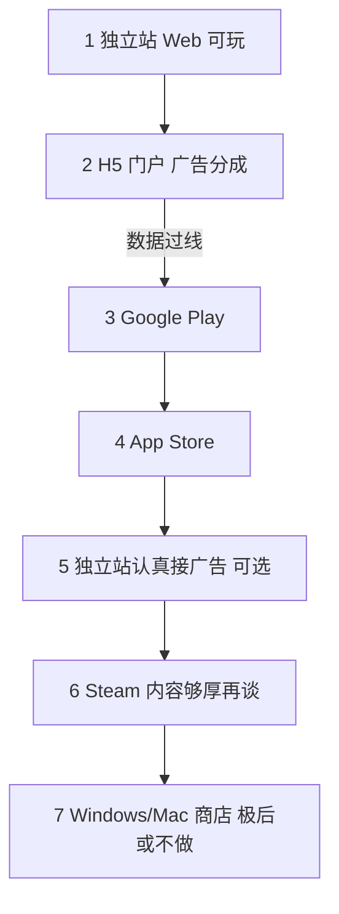

# 渠道发展路线（定稿）

> 本品（Fangrush / 三狼连猎）**先发哪里、怎么挣钱**的阶段定稿。  
> 全球模式地图 → [全球游戏平台和游戏开发赚钱模式.md](./全球游戏平台和游戏开发赚钱模式.md)  
> 没量时怎么申请 / AdSense → [海外平台接入小白指南.md](./海外平台接入小白指南.md)  
> 值不值得做 → [商业评估.md](./商业评估.md)  
> 工程边界 → [工程边界总览](../普通文档ing/技术设计/00-索引.md)

分成比例、商店政策、独家条款以**签约与官网**为准。

---

## 0. 两个词（人话）

| 词 | 意思 |
|----|------|
| **Capacitor** | 给现有网页游戏套一层「手机 App 壳」，才能上 Google Play / App Store。里面仍是 Web，不是用 Unity 重做。 |
| **IAP**（应用内购买） | 在 App 里买数字商品（去广告、皮肤等）。钱走苹果/谷歌收银台，商店抽成。游戏里卖皮肤/去广告，一般**不能**用自建网页支付绕过商店。 |

相关：

- **广告（IAA）**：播广告赚钱（插屏、激励等）。
- **IAP**：玩家付钱买去广告 / 皮肤。

---

## 1. 一句话定稿

**主线**：Poki + CrazyGames双H5门户验证（广告分成）→ 数据达标后再进入Google Play和App Store（原生广告 + 去广告 + 付费皮肤）。

独立站长期保留（官网 / Demo / SEO），冷启动不靠它赚钱。  
Steam 要内容够厚再评估。Windows 商店几乎没量，放最后或不做。

---

## 2. 阶段顺序

| 优先级 | 阶段 | 怎么挣钱 | 技术要点 |
|--------|------|----------|----------|
| 1 | **独立站** | 先几乎不靠它；有量再 AdSense | 现有 Next；广告可 Mock |
| 2 | **Poki + CrazyGames** | **门户广告分成**（主冷启动收入） | 平台独立Adapter、生命周期、广告SDK和平台素材；不混接AdSense |
| 3 | **Google Play** | **广告为主** + 去广告 IAP + 皮肤 IAP | Capacitor 壳 + 手机广告 SDK + 商店内购 |
| 4 | **App Store** | 同上；付费往往更好，审核更严 | 同上（苹果 StoreKit） |
| 5 | 独立站广告 / 品牌 | AdSense 等 | 有回访再认真接 |
| 6 | **Steam** | 买断为主 | 要「买断级」厚度、商店页、愿望单；不是换壳就行 |
| 7 | **Windows 商店** / Mac 商店 | 预期差 | 垫底；Mac 可随 iOS 顺带，勿单独立项 |

失败标准（与商业评估一致）：留存与广告观看率不达标 → **低成本止损，不追买量**。

---

## 3. 商店阶段的变现主次

在 **Google Play / App Store** 内：

| 方式 | 角色 | 说明 |
|------|------|------|
| **广告** | **主收入** | 插屏、激励等 |
| **去广告** | 补充 | 小额 IAP；付的人少但客单价清晰 |
| **付费皮肤** | 补充 | IAP；可与碎片解锁并存 |
| 关卡内购 / 订阅 | 不优先 | 冷启动不必上 live ops |

在 **H5 门户** 内：主要靠平台广告分成，不要混接独立站 AdSense。

---

## 4. 和工程怎么对齐

- **规则 / AI / 关卡逻辑**：留在 `game-core`，渠道之间**不分叉**。
- **差在壳**：独立站 / 门户构建 / 以后 Capacitor；广告与支付走 Adapter。
- **皮肤**：Catalog 与解锁逻辑已在 core；商店「买皮肤」= 支付成功后解锁。
- **发行资料**：公共品牌、法律、截图与各平台封面、视频、检查清单统一进入 [`distribution`](../../distribution/README.md)。

H5阶段只验证基础广告分成和玩家数据。悔棋、账号、专业资源等第五批能力由真实反馈决定；Google Play、App Store、原生广告和IAP属于第六批，不得提前阻塞双H5首发。

工程只维护“共享核心 + 渠道适配层”的总体边界，具体打包参数、环境变量和适配接口以代码为准，见 [工程边界总览](../普通文档ing/技术设计/00-索引.md)。

---

## 5. 文档分工

| 文档 | 回答 |
|------|------|
| **本文** | 本品先发哪、阶段顺序、IAP/Capacitor 人话、商店变现主次 |
| [全球游戏平台和游戏开发赚钱模式.md](./全球游戏平台和游戏开发赚钱模式.md) | 全球有哪些模式与平台（地图） |
| [海外平台接入小白指南.md](./海外平台接入小白指南.md) | 没量时怎么申请、AdSense 时机、各平台操作注意 |
| [商业评估.md](./商业评估.md) | 这品类海外值不值得做 |
| [商业成功标准.md](./商业成功标准.md) | 体验与漏斗成功标准 |
