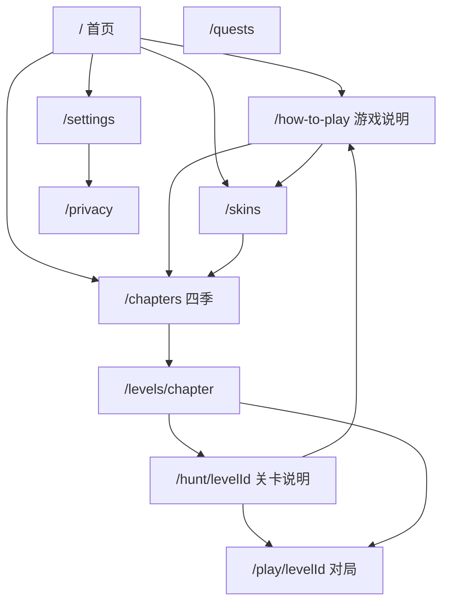

# 06 · 页面地图与 SEO / GEO

> 品牌文案槽：[`游戏品牌/01`](../游戏创意/游戏品牌/01-产品定位与模式边界.md)。  
> 感官资源规格 → [`docs/美术资源和用户体验/`](../美术资源和用户体验/00-索引.md)。

## 0. 语言路由（定稿）

| 规则 | 定稿 |
|------|------|
| 语言 | English + 简体中文 |
| 默认 | **English** |
| 英语 URL | **无前缀**（禁止 `/en`） |
| 中文 URL | **`/zh` 前缀**（as-needed） |
| 自动匹配 | 仅 `Accept-Language` / `navigator.languages` 的 **`zh*` → 中文**；其余 → 英 |
| 记住选择 | Cookie `NEXT_LOCALE`；用户手动选择优先于自动匹配 |
| 切换 UI | 下拉（非「中 \| EN」平铺） |
| SEO | sitemap 含英 + `/zh`；`hreflang`：`en`、`zh`、`x-default`→英 |
| Admin | 固定英文 UI |

实现入口：`apps/web/src/config/locales.ts`、`middleware.ts`、`LocaleSwitcher`。

## 1. 信息架构（定稿）

| 路径 | 职责 | SEO |
|------|------|-----|
| `/` | 品牌 + Play + 短摘要；链 how-to / chapters | **索引** |
| `/how-to-play` | 完整规则说明 | **索引** |
| `/chapters` | 四季入口 + **每季独特短文** | **索引** |
| `/levels/[chapterId]` | 关卡列表 + 章短文；每关链到 hunt | **索引** |
| `/hunt/[levelId]` | **关卡说明**（2～4 句）+ Play CTA | **索引** |
| `/skins` | 图鉴 + 短叙事 | **索引** |
| `/privacy` | 合规 | **索引** |
| `/quests` `/settings` | 个人/工具 | **noindex** |
| `/play/[levelId]` | 对局会话 | **noindex** |
| `/admin*` `/api*` | 运维 | **Disallow** |

不做：博客矩阵、Terms 长页、多游戏聚合站。

## 2. 关卡说明页 `/hunt/[levelId]`

每关一页，可索引。

**页面结构**

1. H1：关卡名 + Fangrush  
2. 2～4 句 **独特** blurb（教学意图 / 岩石感 / 爽点）  
3. 一句季节与难度（勿写 `AI easy`）  
4. 主 CTA → `/play/[levelId]`  
5. 链：本章列表、how-to、上一关/下一关  

**数据约定（已落地）**

`LevelConfig` 已含 `blurbEn` / `blurbZh`、`nameEn` / `nameZh`；页：`/hunt/[levelId]`；Admin 关卡台可预览。

## 3. 四季短文（`/chapters`）

每季一段原创（EN/ZH），对齐创意 05：春学规则、夏承压、秋岩石爽、冬硬仗。链到 `/levels/{id}` 与 how-to。

## 4. `/how-to-play` 大纲

- 目标与胜负（吃满 8 / 三狼无着）  
- 移动与隔空吃（狼—空—羊）  
- 连吃 ≤5、可结束  
- 羊 AI、禁后退  
- 岩石与四季  
- 本地存档说明  
- CTA：去春日 / 去章节  
- FAQ 可并入本页下部（利于 FAQ JSON-LD）

## 5. 页间互链纪律

| 从 | 至少链到 |
|----|----------|
| 首页 | how-to、chapters、skins、privacy |
| how-to | chapters、`/hunt/spring-01`、skins |
| chapters | 各季 levels、how-to |
| levels | 每关 hunt、chapters、how-to |
| hunt | play、本章 levels、how-to、相邻 hunt |
| skins | chapters、how-to |
| 页脚 | privacy、settings、how-to、chapters |

## 6. sitemap / robots / GEO

- sitemap：以 [`apps/web/src/app/sitemap.ts`](../../apps/web/src/app/sitemap.ts) 为准——纳入 `/`、`/how-to-play`、`/chapters`、`/levels/*`、`/hunt/*`、`/skins`、`/privacy` 及 `/zh/...`  
- **排除**：`/play/*`、`/quests`、`/settings`、`/admin*`  
- robots：Disallow `/admin`、`/api/`  
- `llm-full.txt`：英文为主；与 how-to / blurb 口径一致  
- 首页 + how-to：VideoGame/WebApplication + 可选 FAQPage JSON-LD  
- hreflang：en 无前缀；zh = `/zh/...`；x-default → 英

## 7. SEO 词库（EN / ZH）

**纪律**：自然写入 title / H1 / 首段 / blurb；禁止堆砌；主品牌 **Fangrush**；机制用 gap-eat / 隔空吃；「wolf and sheep / 三狼十五羊」仅长尾，不替代主品牌。

### 7.1 英文核心

| 类型 | 词语 |
|------|------|
| 品牌 | Fangrush |
| 品类 | wolf and sheep, wolf vs sheep board game, fox and geese style, asymmetric board hunt |
| 机制 | gap-eat, gap rush, chain eat, chain capture, combo hunt |
| 结构 | 6x6 board, three wolves, fifteen sheep, seasonal hunts, rocks |
| 体验 | play online, free browser game, no download, no account |
| 行动 | how to play Fangrush, play Fangrush online |

长尾句式：`Play Fangrush online — free wolf and sheep board hunt` · `How to gap-eat and chain captures` · `Fangrush level guide: {name}`

### 7.2 中文核心

| 类型 | 词语 |
|------|------|
| 品牌 | Fangrush、三狼连猎 |
| 品类 | 三狼十五羊、狼羊棋、不对称棋盘、网页棋类 |
| 机制 | 隔空吃、隔空连吃、连吃、冲吃、岩石挡点 |
| 结构 | 六乘六交点、三狼、十五羊、四季闯关、四季猎场 |
| 体验 | 免费、浏览器、免下载、无需登录、本地进度 |
| 行动 | 三狼连猎怎么玩、Fangrush 规则、在线玩 |

长尾句式：`三狼连猎（Fangrush）规则：隔空吃与连吃` · `{关卡名} 关卡说明`

### 7.3 分页面用词

| 页 | 主词 | 辅词 |
|----|------|------|
| 首页 | Fangrush / 三狼连猎 + play online | seasonal hunts、gap-eat 一句 |
| how-to | how to play / 怎么玩 + gap-eat / 隔空吃 | chain、rocks、win 8 |
| chapters | seasonal hunts / 四季猎场 | 春学规则、冬硬仗 |
| hunt | `{level name}` + Fangrush | 季节词 + 一句机制 |
| skins | wolf skin / 狼羊皮肤 | identity（勿 pay-to-win） |
