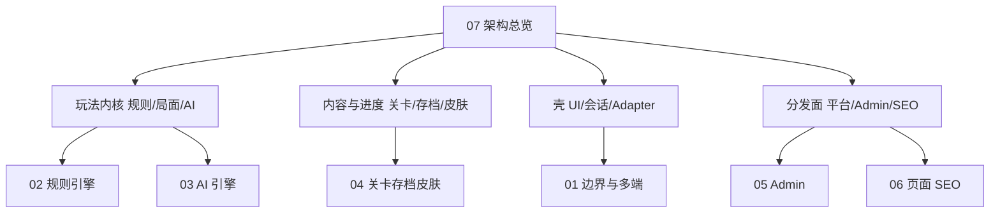
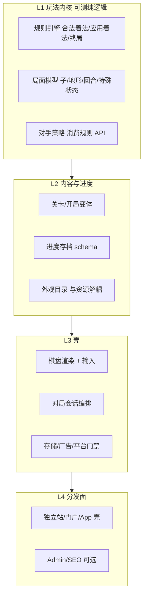
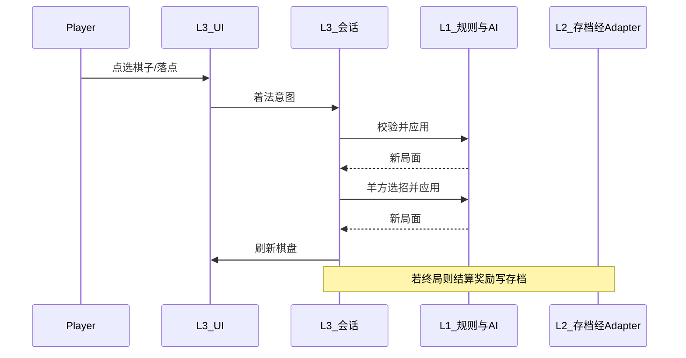

# 07 · 游戏架构总览

> 系统级导读：棋类共性层次 → 本仓库落地 → 运行 / 打包 / 平台 → 若做下一款。  
> 契约细则见 [`01`](./01-系统架构与工程边界.md)–[`06`](./06-页面地图与SEO-GEO.md)；玩法意图见 [`docs/游戏创意/`](../游戏创意/00-文档索引.md)。  
> 发行阶段（门户 → 商店、广告/IAP）见 [`docs/商业成功/渠道发展路线.md`](../商业成功/渠道发展路线.md)。

## 这篇读什么

这是一款**棋盘对抗 + 关卡进度**的 Web 游戏：玩法内核是可测的纯逻辑；壳负责呈现、会话编排与发行。

面向技术专家：要整盘层次与复用边界，不是实现手册。不写函数签名、env 清单、CI 勾选、着法几何细节。

阅读路径：共性层 → 本仓库映射 → 运行 / 打包 / 多渠道防呆 → 若做下一款 → 文档地图。

`01`–`06` 是各层契约细则；本文把它们串成一张总图：



| 共性层 | 本游戏落点 | 细则文档 |
|--------|------------|----------|
| 规则 + 局面状态机 | game-core 规则引擎 | [02](./02-规则引擎与状态机.md) |
| 对手智能 | game-core 羊方 AI | [03](./03-AI引擎.md) |
| 内容与进度 | 关卡 / SaveGame / 皮肤 Catalog | [04](./04-关卡存档与皮肤.md) |
| 工程边界与多端壳 | monorepo、Adapter、shell 开关 | [01](./01-系统架构与工程边界.md) |
| 内容质量驾驶舱 | `/admin` | [05](./05-Admin职责地图.md) |
| 发现与收录面 | 页面 IA / SEO | [06](./06-页面地图与SEO-GEO.md) |

---

## 1. 棋类游戏共性层次

先不提狼羊：做一款棋盘对抗游戏，通常长这样。



### L1 · 玩法内核

| | |
|--|--|
| 职责 | 局面是什么；什么着合法；走一步后局面怎么变；何时胜负；对手怎么选招 |
| 为什么独立 | 可单测；UI 与 Admin 共用；禁止 UI 私写判定 |
| 换游戏时 | 几乎整层替换（规则几何、胜负、AI 目标）；**形态保留**：状态 + 着法列表 + 应用 + 选招 |

### L2 · 内容与进度

| | |
|--|--|
| 职责 | 关卡变体（地形/目标）、解锁与货币、外观 Catalog（id → 资源路径） |
| 为什么独立 | 发版内容与规则代码解耦；存档可迁移 |
| 换游戏时 | 换关卡表与经济字段；Catalog 模式可复用 |

### L3 · 壳（表现 + 会话 + 适配）

| | |
|--|--|
| 职责 | 把局面画出来；把点击变成着法意图；编排「玩家走 → AI 走 → 结算」；读写存档、播广告 |
| 为什么独立 | 平台差异（Web / 门户 / App）不应渗进规则 |
| 换游戏时 | 换棋盘视图与交互手感；Adapter 接口可复用 |

### L4 · 分发面

| | |
|--|--|
| 职责 | 同一套壳用不同构建/环境发到不同渠道；可选 Admin、SEO |
| 为什么独立 | 渠道合规与包体差异是发行问题，不是玩法问题 |
| 换游戏时 | 站点文案与路由改；shell 开关模式可复用 |

### 棋类经验小结

- 规则是真相源；UI 只提交意图、展示结果。
- AI 必须走同一套「合法着法 → 应用」管线，禁止旁路。
- 外观数据（Catalog）与像素文件分离。
- 平台差异进 Adapter / 构建开关，禁止 `if (portal)` 散落规则层。

---

## 2. 本仓库如何落到这些层

### 2.1 包结构

| 共性层 | 本仓库 |
|--------|--------|
| L1 + L2 | `packages/game-core`（`@wolf-sheep/game-core`） |
| L3 + L4 | `apps/web`（Next.js） |
| 皮肤像素 | `apps/web/public/skins/`（Catalog 在 core） |

边界：core **零 DOM**；web **不写吃子/胜负**。细则见 [01](./01-系统架构与工程边界.md)。

### 2.2 本游戏概念词典

| 概念 | 共性层 | 本游戏含义 |
|------|--------|------------|
| 规则引擎 | L1 | 开局、走子、隔空吃、连吃回合、终局 |
| 局面 | L1 | 棋子、岩石、轮到谁、连吃上下文、胜负状态 |
| 对手 AI | L1 | 只控羊；玩家控狼；Admin 同入口 |
| 关卡 | L2 | 岩石布局 + 章节难度档 + 掉落 |
| 存档 | L2 | 通关/解锁/碎片；逻辑在 core，I/O 在壳 |
| 皮肤 | L2 + L3 | Catalog 在 core；SVG 在 web |
| 对局会话 | L3 | 壳内 store：调 core、驱动 AI 回合、结算 |
| 适配器 | L3 | 存储、广告；门户/独立站替换实现 |
| Admin | L4 | 内容质量驾驶舱，不另写 AI |
| 页面 / SEO | L4 | 发现与说明面，不对局逻辑负责 |

没有 Phaser / Unity。「引擎」= L1 的规则状态机 + AI；棋盘用 SVG 渲染。

### 2.3 运行时：一局怎么走



- 本地 `pnpm dev` 只起 Next；core 作为 workspace 依赖编进前端，**不单独起进程**。
- 规则与 AI **在浏览器**跑，不上 Server Route（见 [01](./01-系统架构与工程边界.md)）。
- 存档：core 算「该怎么改进度」；web Adapter 负责 localStorage。

---

## 3. 打包与平台发行

### 3.1 打的是什么

- `pnpm build` → **一个 Next 应用产物**（页面 + 静态资源）。
- `game-core` **被编进该前端包**，不是独立可分发的游戏 runtime / native 引擎包。
- 皮肤等静态文件随站点 `public` 一起走。

### 3.2 渠道差异

同一源码，不同壳配置：

| 渠道 | 产物 | 相对独立站的差异 |
|------|------|------------------|
| 独立站（P0） | 标准 Next 部署（如 Vercel） | 可开 Admin；自有广告 |
| 门户 H5（P2） | `build:portal` 同栈构建 | 关 Admin；广告走门户 SDK；默认零自建遥测 |
| App（预留） | Capacitor 包 Web | 仅留端口，未落地 |

原则：**一套 core + 一套 web**；渠道差在 shell / Adapter / 构建环境，**规则不分叉**。  
阶段优先级与变现主次（门户先于商店、Steam/Windows 靠后）见 [渠道发展路线](../商业成功/渠道发展路线.md)。

### 3.3 多渠道：分支、打包与环境防呆

独立站（含以后登录）、第三方 H5、App 壳，**技术上都能叠在同一套代码上**；怕的不是架构撑不住，而是人肉改 env 打错包。

**分支**：一条主线（如 `main`）即可。不要为 portal / app 各开长期业务分支——规则一改就会三处漂移。短修分支合完即删。

**打包心智**（同一次提交，换命令出不同产物）：

```text
同一份源码 (main)
        │
        ├─ pnpm build              → 独立站 → Vercel 等（可 Admin；以后可登录）
        ├─ pnpm build:portal       → 门户 H5 → 交 Poki / CrazyGames（关 Admin、门户广告）
        └─（以后）Capacitor 包 Web → .aab / .ipa → Play / App Store
```

| 渠道 | 命令 / 做法 | 壳上该开什么 | 不该开什么 |
|------|-------------|--------------|------------|
| 独立站 | `pnpm build` + 部署环境变量 | `APP_SHELL=standalone`；可 `ADMIN_ENABLED`；广告 mock/adsense | 门户 SDK |
| 门户 H5 | `pnpm build:portal`（脚本已写死 portal + 关 Admin） | 门户广告 Adapter | Admin、独立站 AdSense、账号云存档 |
| App（预留） | 以后加 `build:app` / CI；Capacitor 包同一 Web | 商店广告 / IAP Adapter | 门户 SDK；勿当第三条业务分支 |

**登录**：只做独立站（见 [`docs/任务/P-ACCOUNT.md`](../任务/P-ACCOUNT.md)）；门户不做云账号。App 若以后要登录，复用独立站账号能力，不要给门户再开一套。

**变量怎么防呆**（人只选「打哪种包」，每种包的配方由脚本/CI 写死）：

| 做法 | 作用 |
|------|------|
| 构建脚本定稿（已有 `apps/web/scripts/build-portal.mjs`） | 门户强制 `NEXT_PUBLIC_APP_SHELL=portal`、`ADMIN_ENABLED=false` |
| 部署平台绑环境 | Vercel Production 只配独立站；门户产物走另一条上传流水线，不共用同一套 Production env |
| 代码按 shell 分支 | 如 middleware：portal 或未开 Admin → 不进 `/admin`；登录入口仅 standalone 显示 |
| 以后再加 `build:app` + CI 断言 | App 包固定 native/广告/IAP；portal 产物可断言无 admin 路由 |

关键变量类别（完整键名见 `apps/web/.env.example`，细则见 [01](./01-系统架构与工程边界.md)）：

- `NEXT_PUBLIC_APP_SHELL`：`standalone` | `portal` |（以后）`native`
- `ADMIN_ENABLED`
- `NEXT_PUBLIC_ADS_PROVIDER`：`mock` | `adsense` | `portal_sdk` |（以后）`admob`
- 以后再加：登录、IAP——仍跟 shell 绑定，门户包不开

**叠功能时仍守的边界**：

```text
game-core     ← 永远一套
apps/web UI   ← 一套；按 shell 显隐 Admin / 登录 / 部分 SEO
IAds/IStorage ← 换实现：Mock / AdSense / 门户 SDK / AdMob …
（以后）IAuth ← 仅独立站（与可选 App）
（以后）IBilling ← 仅 App 商店 IAP
```

---

## 4. 若继续开发其他棋类游戏

### 保留 / 替换

| 层次 | 做下一款时 | 经验 |
|------|------------|------|
| L1 规则 + 局面 + AI | **整层新写** | 仍保持「合法着法 → 应用 → 选招」；单测先行 |
| L2 关卡 / 存档 / Catalog | **换表换字段**，模式可抄 | Catalog 与资源分离；存档带 schemaVersion |
| L3 UI / 会话 | **换棋盘视图与交互**；会话编排可抄结构 | UI 仍只调 core，不写判定 |
| L3 Adapter | **大多可复用接口** | 存储 / 广告换实现即可 |
| L4 独立站 / 门户 / Admin / SEO | **壳与流程可复用** | 新游戏换文案路由；portal / standalone 开关可留 |

### 工程形态

1. **现状（单游戏 monorepo）**：一个 `game-core` + 一个 `web` —— 适合当前产品。
2. **多游戏演进（可选）**：抽「壳模板 + Adapter」；每个游戏一个 `*-core`；或以后再抽极薄的 board-game kit（仅约定接口，不预装规则）。不定死要拆包。

### 新游戏最小路径

1. 定玩法真相（创意文档）→ 实现 L1 并配 fixture  
2. 定关卡 / 进度 / 外观 → L2  
3. 接现有 web 壳：新对局页 + 棋盘渲染  
4. 接 Adapter；先独立站可玩  
5. 需要时再开 portal 构建 / Admin / SEO  

---

## 5. 文档地图

| 要改什么 | 去哪 |
|----------|------|
| 规则 / 连吃 / 胜负 | [02](./02-规则引擎与状态机.md) |
| 羊方难度或搜索 | [03](./03-AI引擎.md) |
| 关卡、存档字段、皮肤解锁 | [04](./04-关卡存档与皮肤.md) |
| 包边界、Adapter、多端开关 | [01](./01-系统架构与工程边界.md) |
| 多渠道分支 / 打包 / env 防呆 | **本文 §3.3** |
| Admin 台 | [05](./05-Admin职责地图.md) |
| 路由、语言、SEO | [06](./06-页面地图与SEO-GEO.md) |
| 先发哪、怎么挣钱 | [渠道发展路线](../商业成功/渠道发展路线.md) |
| 先建立整盘图 | **本文** |
