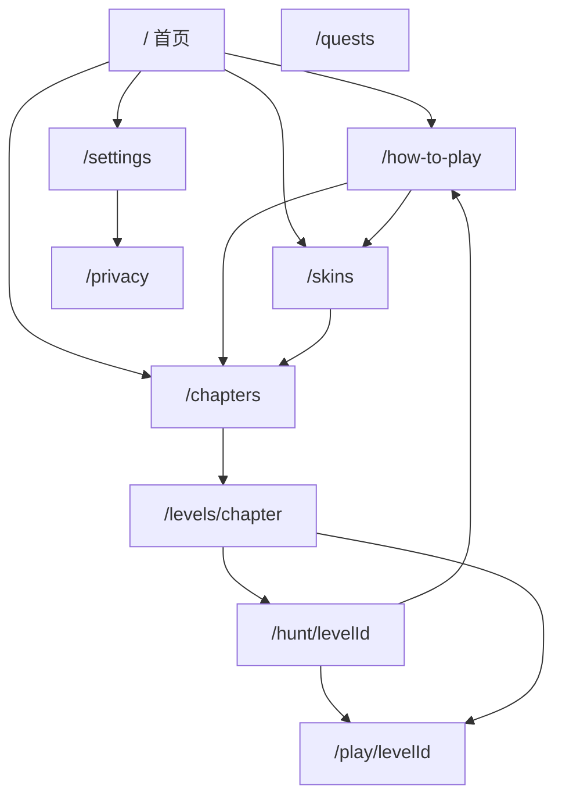

# 06 · 页面地图与 SEO / GEO

> 品牌文案槽：[`游戏品牌/01`](../游戏创意/游戏品牌/01-产品定位与模式边界.md)。  
> 感官资源 → [`美术资源和用户体验/`](../美术资源和用户体验/00-索引.md)。  
> 工程红线 → [`01`](./01-工程契约与红线.md)。实现以 `apps/web` 路由与页面为准。

## 0. 语言路由（定稿）

| 规则 | 定稿 |
|------|------|
| 语言 | English + 简体中文 |
| 默认 | **English** |
| 英语 URL | **无前缀**（禁止 `/en`） |
| 中文 URL | **`/zh` 前缀**（as-needed） |
| 自动匹配 | 仅 `zh*` → 中文；其余 → 英 |
| 记住选择 | Cookie `NEXT_LOCALE`；手动选择优先 |
| 切换 UI | 下拉 |
| SEO | sitemap 含英 + `/zh`；`hreflang`：`en`、`zh`、`x-default`→英 |
| Admin | 固定英文 UI |

实现：`apps/web/src/config/locales.ts`、`middleware.ts`、`LocaleSwitcher`。

## 1. 信息架构与索引

| 路径 | 职责 | SEO |
|------|------|-----|
| `/` | 品牌 + Play + 短摘要 | **索引** |
| `/how-to-play` | 完整规则说明 | **索引** |
| `/chapters` | 四季入口 + 每季短文 | **索引** |
| `/levels/[chapterId]` | 关卡列表 | **索引** |
| `/hunt/[levelId]` | 关卡说明 2～4 句 + Play CTA | **索引** |
| `/skins` | 图鉴 + 短叙事 | **索引** |
| `/privacy` | 合规 | **索引** |
| `/quests` `/settings` | 个人/工具 | **noindex** |
| `/play/[levelId]` | 对局会话 | **noindex** |
| `/admin*` `/api*` | 运维 | **Disallow** |

不做：博客矩阵、Terms 长页、多游戏聚合站。

**硬约束**

- `/hunt`：独特 blurb（`blurbEn` / `blurbZh`），勿写 `AI easy`；主 CTA → play。  
- `/how-to-play`：与 Admin 玩法说明同源；大纲以页面实现为准（胜负、隔空吃、连吃、岩石、四季、本地存档）。  
- `/chapters`：每季原创短文，对齐创意 05。

## 2. 页间互链

| 从 | 至少链到 |
|----|----------|
| 首页 | how-to、chapters、skins、privacy |
| how-to | chapters、`/hunt/spring-01`、skins |
| chapters | 各季 levels、how-to |
| levels | 每关 hunt、chapters、how-to |
| hunt | play、本章 levels、how-to、相邻 hunt |
| skins | chapters、how-to |
| 页脚 | privacy、settings、how-to、chapters |

## 3. sitemap / robots / GEO

- sitemap：以 [`apps/web/src/app/sitemap.ts`](../../apps/web/src/app/sitemap.ts) 为准（含 `/zh/...`）。  
- **排除**：`/play/*`、`/quests`、`/settings`、`/admin*`。  
- robots：Disallow `/admin`、`/api/`。  
- `llm-full.txt`：英文为主，与 how-to / blurb 口径一致。  
- 首页 + how-to：VideoGame/WebApplication + 可选 FAQPage JSON-LD。  
- hreflang：en 无前缀；zh = `/zh/...`；x-default → 英。

## 4. SEO 用词纪律

- 自然写入 title / H1 / 首段 / blurb；禁止堆砌。  
- 主品牌 **Fangrush**（中文可并列「三狼连猎」）。  
- 机制词：gap-eat / 隔空吃；「wolf and sheep / 三狼十五羊」仅长尾，不替代主品牌。  
- 分页面主词与品牌槽文案以 [`游戏品牌/`](../游戏创意/游戏品牌/01-产品定位与模式边界.md) 与页面实现为准，本文不维护词表。
