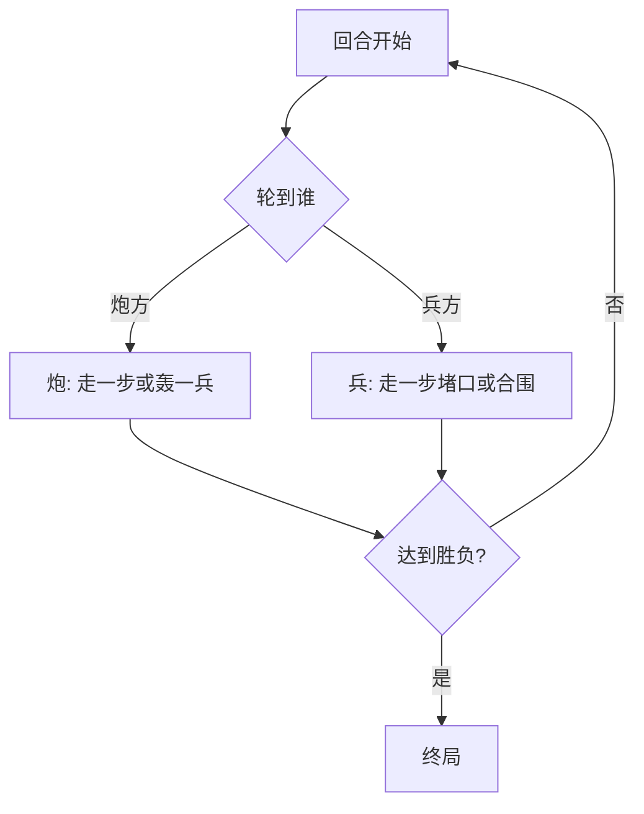

# 01 · 大炮轰小兵

> 返回 [总览](README.md)

## 一句话

大炮隔线轰小兵，小兵用数量堵口、围死大炮——「火力 vs 人海」。

## 类型

非对称轰击 / 围堵棋（不是跳吃围猎，也不是三炮十五兵）。

## 棋盘与棋子（常见基线）

- 棋盘：纵横线交叉点（常见约 5×5～7×7 点阵，地区不同）。
- 炮方：少量「大炮」（常见 1～2 门；有的变体更多）。
- 兵方：大量小兵（常见十余枚）。
- 走法：双方多数只能沿线走到相邻空点；**吃子靠炮的轰击线**，不是跳吃。

与本仓库「三打十五」原始创意的区别：

| | 大炮轰小兵（本文） | 三炮十五兵（已有文档） |
|---|---|---|
| 核心吃法 | 炮在同一直线上「隔子/瞄线」轰兵（民间口径不一） | 炮对空点 **隔空吃**（类似隔一格吃） |
| 戏剧点 | 轰击 + 堵炮口 | 三炮协同捕食兵阵 |
| 产品关系 | Top1 改造候选 | 已演化为 Fangrush 狼羊 |

## 怎么赢

| 方 | 常见胜条件 |
|---|---|
| 炮 | 轰到足够多的兵，或吃到约定数量 / 打散兵阵使兵无法围死 |
| 兵 | 堵住炮的所有合法轰击与走位，使炮 **无棋可走** 或按约定「围死」 |

具体数量与「围死」定义各地不同；改造时应先锁一版基线再做关卡。

## 图例

示意（小盘）：`炮` = 大炮，`兵` = 小兵，`·` = 空点。同一直线上炮与兵之间有空点时，常可构成「轰」的条件（以你锁定的基线为准）。

```text
      0   1   2   3   4
  0   ·---炮---·---兵---·
      |   |   |   |   |
  1   兵--·---·---·---兵
      |   |   |   |   |
  2   兵--兵--·---兵--兵
      |   |   |   |   |
  3   ·---兵--兵--兵---·
      |   |   |   |   |
  4   兵--·---兵---·---兵
```

轰击前后对照（示意：炮轰掉同一行上的一枚兵）：

```text
轰前:  炮 · 兵 · ·     →     轰后:  炮 · · · ·
```

兵方堵口示意（堵住炮前进与瞄线）：

```text
堵前:  · 炮 · 兵 ·     →     堵后:  兵 炮 兵 · ·
              （炮前后被贴身，轰线与逃脱被压缩）
```



## 基础玩法

1. 布置：炮在一侧或中路，兵成阵或分批上场（有的变体兵可先布子）。
2. 炮方回合：移动一门炮，或在合法瞄线上轰掉一枚兵。
3. 兵方回合：移动一枚兵，优先封死炮口、切断直线、压缩炮的活动空间。
4. 重复直至炮被围死或兵被轰至无法完成围堵目标。

## 玩法扩展

- **关卡化**：固定岩石/掩体改变瞄线；「只轰 N 兵即胜」；限回合。
- **非对称关**：玩家固定打炮或固定带兵；AI 控另一方。
- **变体**：多炮协同、兵可「盾兵」抗一炮、迷雾只显示瞄线。
- **系列**：与老虎吃羊、狼羊组成「非对称乡土」合集，机制区分要醒目。

## 全球备注

- 英语暂无统一大名；可自创品牌名，规则简介写 *cannon vs soldiers / artillery siege*。
- 竞品密度低，差异化强；成败在 **30 秒教程 + 平衡**，不在文化符号。
- 改造注意：先写死「轰」的几何条件（隔几子、是否须炮架），再做 AI。
