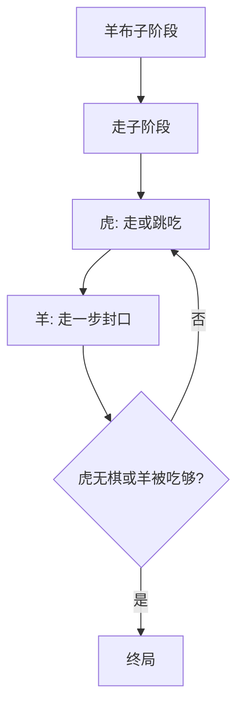

# 02 · 老虎吃羊

> 返回 [总览](README.md)

## 一句话

少数老虎跳吃，多数羊靠布子与合围困死老虎——「利齿 vs 人海织网」。

## 类型

非对称围猎（布子阶段 + 跳吃）。

## 棋盘与棋子（常见基线）

- 棋盘：米字格 / 点线棋盘（常见 5×5 点阵带对角线，即「米字」）。
- 虎：常见 **2～4** 只，已在盘上。
- 羊：常见 **15～20** 只，常先进入 **布子**，再进入走子围困。
- 虎吃法：沿线跳过相邻羊落到空点，吃掉被跳过的羊（可连跳视变体而定）。
- 羊：一般不能吃虎，只走相邻空点，用数量封死虎的落点。

经典平衡感较强的一版民间说法：**四虎二十羊 · 米字格**（羊先布子，布满后再围）。

## 怎么赢

| 方 | 常见胜条件 |
|---|---|
| 虎 | 吃到约定数量的羊，或吃到羊无法围死虎 |
| 羊 | 封死所有虎的走与跳，使虎 **无合法行动** |

## 图例

`虎` = 老虎，`羊` = 羊，`·` = 空点。米字格示意（中心交叉，线含斜向）：

```text
开局示意（虎已就位，羊尚未布完）:

  羊---羊---羊---羊---羊
  | \ | / | \ | / |
  羊---·---虎---·---羊
  | / | \ | / | \ |
  羊---·---·---·---羊
  | \ | / | \ | / |
  ·---虎---·---虎---·
  | / | \ | / | \ |
  ·---·---虎---·---·
```

跳吃前后：

```text
跳前:  虎 羊 ·     →     跳后:  · · 虎
                     （羊被吃掉）
```

羊围死虎（虎四周无落点、无法跳）：

```text
  羊 羊 羊
  羊 虎 羊
  羊 羊 羊
```



## 基础玩法

1. **布子**：羊方轮流把羊放到空点（有的规则虎可在布子期跳吃，风险极高）。
2. **走子**：虎走或跳吃；羊只走不吃，目标是缩小虎的活动网。
3. 虎靠空间与连跳撕口；羊靠密度与「填空」让虎无处落脚。

## 与 Fangrush（狼羊）异同

| | 老虎吃羊 | Fangrush |
|---|---|---|
| 吃法 | 多为跳吃 | 隔空吃 + 连吃 |
| 阶段 | 常有布子 | 固定 15 羊开局，无布子 |
| 盘面 | 米字 / 异形点线 | 6×6 方格 + 岩石关卡 |
| 产品风险 | 与狼羊同属围猎母题，易自我竞争 | 已在研旗舰 |

若做第二款，规则与视觉必须一眼不同（布子、米字盘、虎皮 vs 狼）。

## 玩法扩展

- 关卡：改变可走斜线、预置「栅栏」、虎数量 2/3/4。
- 目标变体：虎吃满 N 只即胜；羊在 T 回合内围死。
- 合集：作为「围猎系列」第二作，强调 Bagh-Chal 国际名。

## 全球备注

- 英语常用关联：**Bagh-Chal**（尼泊尔虎羊棋，几乎同构）。
- 母题全球通用（Fox and Geese 族）；改造重点是教程与平衡，不是科普中国名。
- 注意：民间「狼吃羊 / 老虎吃羊」名称混用，产品名建议独立品牌。
