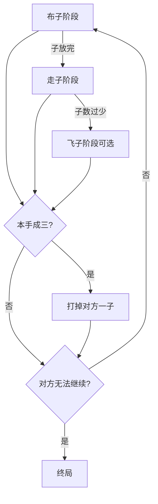

# 03 · 成三棋（三三棋 / 侗棋近亲）

> 返回 [总览](README.md)

## 一句话

先抢点布子，再走子成「三连」打掉对方——阶段清晰的打击型对弈。

## 类型

对称成三吃子（布子 → 走子 → 部分变体有飞子）。

## 棋盘与棋子（常见基线）

- 棋盘：多层方框 + 中点连线（与西方九子棋盘同族，点数常见 24 点）。
- 双方：各约 **9～12** 子（侗族三三棋等变体数量不同）。
- 核心：横/竖（有的含特定斜）**三子连成一线** 即可「成三」，打掉对方一子。
- 阶段：
  1. **布子**：轮流放子到空点，成三可打子；
  2. **走子**：沿线移到相邻空点，成三再打；
  3. **飞子**（可选）：己方剩余很少时，可飞到任意空点。

## 怎么赢

| 常见条件 | 说明 |
|---|---|
| 对方不足成势 | 对方存活子少到无法再成三（常见少于 3） |
| 对方无棋 | 对方所有子被封死不能移动 |

## 图例

`A` / `B` = 双方，`·` = 空点。三层框示意（简化）：

```text
  A---------·---------B
  |         |         |
  |    A----·----·    |
  |    |         |    |
  ·----·----·----·----·
  |    |         |    |
  |    ·----B----A    |
  |         |         |
  B---------·---------·
```

成三打子：

```text
成三前:  A A ·     再落下 A     →  A A A 并移除对方一枚未成三保护的子
```



## 基础玩法

1. 布子期抢占「双威胁」交叉点（一步可形成两个成三）。
2. 走子期封锁对方连线，自己做活连。
3. 打子优先拆对方将成之三；有的规则「连不打连」（不能打对方已成三的子）。

## 玩法扩展

- **关卡化**：残局课题（给定盘面，N 手内成三得胜）；禁点/岩石。
- **教学模式**：只练布子威胁 → 再开全规则。
- **家族 DLC**：与 [三斜棋](05-三斜棋.md) 共用引擎，换连线集合。
- **异步**：每日「成三谜题」，偏解谜不偏长考。

## 全球备注

- 英语对齐：**Nine Men's Morris**（九子棋）；侗棋 / 三三棋是地方变体叙事。
- 竞品：Morris 类 App 已有，须靠 **关卡、手感、主题皮肤、短局 AI** 差异化。
- 改造注意：阶段切换 UI 必须极清楚，否则新手会懵。
