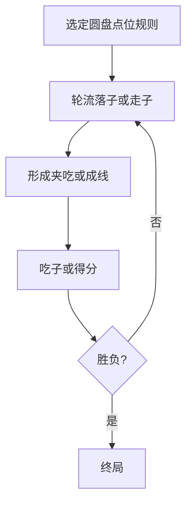

# 04 · 西瓜棋

> 返回 [总览](README.md)

## 一句话

棋盘像剖开的西瓜：圆心放射线 + 圆环，占点连线成势围吃——外形辨识度极高。

## 类型

占点连线 / 区域乡土棋（偏对称，吃法与成三或围点有关，地区口径不一）。

## 棋盘与棋子（常见基线）

- 棋盘：**同心圆 + 放射线** 的交点为落子点（「西瓜瓣」视觉）。
- 双方：子数相近，轮流放子或走子（有的地区先布满再走）。
- 常见目标取向：
  - 连成特定长度/夹吃对方；或
  - 控制圆环与放射线交叉形成的「瓣区」。
- 改造时应先选定一种清晰吃法（建议：**夹吃** 或 **成三/成线**），避免混多套口径。

## 怎么赢

| 取向 | 常见胜条件 |
|---|---|
| 吃子向 | 吃光对方或吃到约定数量 |
| 围困向 | 对方无合法走位 |
| 占点向 | 控制更多交点 / 完成指定连线数 |

产品化建议锁定 **一种** 胜负，另作变体关。

## 图例

俯视示意（`·` 交点，`A`/`B` 已占）：

```text
            ·
         ·  ·  ·
      ·  A  ·  B  ·
         ·  ·  ·
      ·  ·  ·  ·  ·
         B  ·  A
            ·

（外圈、中圈、内圈 + 放射线；上图为示意不是精确点位）
```

夹吃示意（同一弧或同一放射线上）：

```text
夹前:  A · B     →     非法或不可停
夹吃:  A B A     →     中间 B 被吃（若基线采用夹吃）
```



## 基础玩法（改造用建议基线）

1. 双方轮流把子放到空交点（或走相邻交点）。
2. 若在同一圆环弧或同一放射线上形成 **两子夹一子**，吃掉中间子。
3. 无法走子或子数低于阈值者负。

（若采用成线规则，则改成「同线 N 子得分/吃子」，与成三棋区分靠棋盘外形。）

## 玩法扩展

- **视觉旗舰**：西瓜皮、季节果盘皮肤，适合合集封面。
- **关卡**：只开放部分圆环；「只要中圈」专题。
- **热座**：同屏双人，保留乡土传棋感。
- **轻竞技**：短时回合制，适合 H5。

## 全球备注

- 无统一国际标准名；可叫 *Watermelon Board* / 自创品牌，用图说话。
- 优势是 **盘面外形**；劣势是规则口径杂，文档与教程必须极简。
- 适合做合集第二作或「轻量入口」，深度不足时不要硬撑 24 关叙事，可改「挑战题包」。
