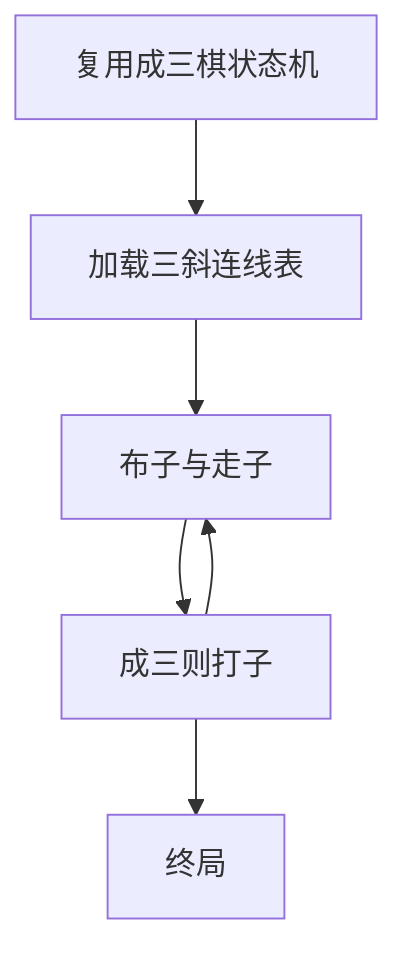

# 05 · 三斜棋

> 返回 [总览](README.md)

## 一句话

北方流行的成三变体：更强调 **斜线成三**，地方口音重，适合当「成三家族」扩展包。

## 类型

对称成三吃子（成三棋地方变体）。

## 棋盘与棋子（常见基线）

- 与 [成三棋](03-成三棋.md) 同族：点线盘 + 布子/走子。
- 差异重点在 **哪些三点算「成三」**：更看重斜向连线，或斜线权重更高。
- 子数、点数因河北 / 山西 / 陕西等说法而异；改造时当作「同一引擎，不同连线表」。

## 怎么赢

同成三棋：打到对方无法成三，或封死对方无棋。

## 图例

强调斜线（`A` 成斜三）：

```text
  A · ·
  · A ·
  · · A     ← 这条斜线算成三，打掉对方一子
```

与「只认横竖」的成三对照：

```text
横三:  A A A · · ·
斜三:  A · ·
       · A ·
       · · A
```



## 基础玩法

1. 规则骨架照成三棋：布子 → 走子 →（可选）飞子。
2. 唯一产品差异：高亮「斜向威胁」，教程第一课就教斜三。
3. 打子、闷棋等细节与选定地区基线对齐后写死。

## 玩法扩展

- **家族 DLC**：成三棋主游戏 + 三斜棋模式切换。
- **关卡**：强制只许斜三得分的谜题。
- **不必做独立品牌**：单独发行辨识度弱，优先挂在成三品牌下。

## 全球备注

- 英语仍可归到 *Morris variants* / *diagonal mills*。
- 竞品风险同成三棋；本身不增加新母题，只增加内容量。
- 改造注意：不要让玩家觉得「和成三棋是两个无关游戏」。
