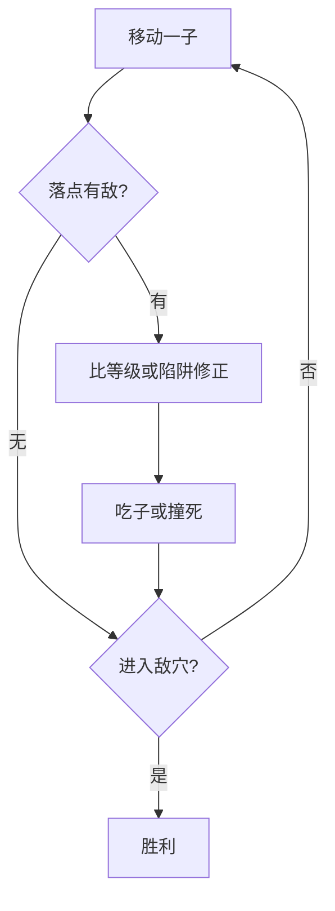

# 06 · 斗兽棋

> 返回 [总览](README.md)

## 一句话

八种动物按等级互相克制，鼠能吃象，再加河流、陷阱与兽穴——童趣版「微型军棋」。

## 类型

对称等级对战（明棋，非暗棋军棋）。

## 棋盘与棋子（常见基线）

- 棋盘：长方形格（常见 7×9），含 **河**、双方 **陷阱**、双方 **兽穴**。
- 每方 8 子：象 > 狮 > 虎 > 豹 > 狼 > 狗 > 猫 > 鼠（鼠可吃象；象不能吃鼠——常见说法）。
- 狮虎可跳河（路上无鼠挡）；鼠可游泳；进入对方陷阱后等级削弱。
- 走法：每回合一格（上下左右），目标是 **进入对方兽穴**。

## 怎么赢

将任一己子走进 **对方兽穴** 即胜（或吃光对方全部子，视变体）。

## 图例

等级简表：

```text
象 > 狮 > 虎 > 豹 > 狼 > 狗 > 猫 > 鼠
鼠 → 可吃象；象 ✕ 鼠
```

盘面示意（`穴` 兽穴，`阱` 陷阱，`~` 河，`.` 空地）：

```text
  穴 阱 . . . 阱 穴     ← 对方
  .  . . . . . .
  .  . ~ ~ ~ . .
  .  . ~ ~ ~ . .
  .  . ~ ~ ~ . .
  .  . . . . . .
  穴 阱 . . . 阱 穴     ← 己方
```

吃子：同格遭遇，高等级吃低等级（陷阱内例外）。



## 基础玩法

1. 开局双方子力对称摆放（或盲摆变体，不推荐首发）。
2. 利用河分割战场，狮虎跳河奇袭，鼠控河。
3. 引诱对方进己方陷阱再反吃；护穴与破穴是残局核心。

## 玩法扩展

- **不要原样复刻红海**：加关卡地形（桥、冻河、迷雾）、拼图式残局。
- **皮肤与叙事**：神话兽、校园兽，不靠「更中国」取胜。
- **热座 / 异步**：适合亲子；联网非必须。
- **简化幼儿版**：只留 4 种动物 + 无河，作教学包。

## 全球备注

- 英语：**Jungle Chess** / **Dou Shou Qi** / **Animal Chess**。
- 克隆极多，原样规则难做出必玩理由；须 **关卡化或独特呈现**。
- 改造注意：等级表与特例（鼠象、跳河）教程要用动画，勿靠长文。
