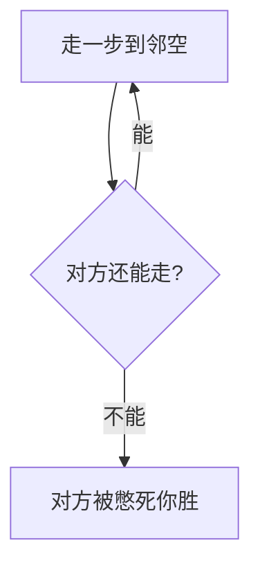

# 07 · 憋死牛

> 返回 [总览](README.md)

## 一句话

田字小盘，各执两子，把对方逼到无路可走——十秒学会的「堵死你」。

## 类型

极简对称逼死（blockade）。

## 棋盘与棋子（常见基线）

- 棋盘：田字 / 小点阵（常见 4 点或「口」字四角+中点等极简形；下文用 2×2 角点示意）。
- 每方 **2 子**。
- 走法：沿线走到相邻空点；不能吃子，只靠占位封锁。
- 谁无法走动谁负（「憋死」）。

## 怎么赢

对方所有己子均无合法移动时，你胜。

## 图例

`A` / `B` 为双方，`·` 为空：

```text
开局示意（四角）:

  A-----B
  |     |
  |     |
  B-----A
```

逼死前后：

```text
将死感:  A 占住唯一出口，B 两子挤在死角无邻空

  A-----B
  |     |
  B    （无空点可去）
```



## 基础玩法

1. 双方轮流移动一子到相邻空点。
2. 用两子配合卡位，缩小对方活动域。
3. 无吃子、无升级，纯空间。

## 玩法扩展

- **病毒向**：超短局、每日一题、表情包皮肤。
- **深度天花板**：原规则撑不住 24 关叙事；扩展应靠：
  - 更大盘（3×3 点、加中心）；
  - 加「障碍」；
  - 三子版 / 限时版。
- **合集彩蛋**：乡土棋馆里的「一分钟一局」，不当旗舰。

## 全球备注

- 可描述为 *tiny blockade / traffic jam for 2 pieces*。
- 适合获客小游戏，不适合单独全球主力产品。
- 改造注意：结局要瞬间可读（高亮「无合法着」）。
