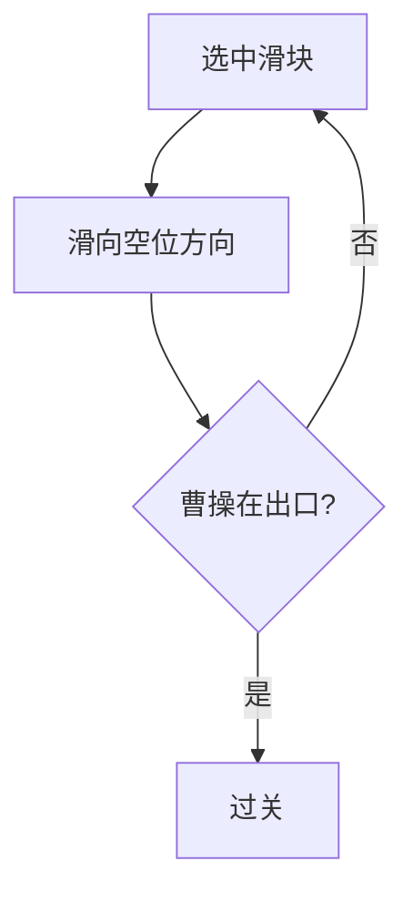

# 08 · 华容道

> 返回 [总览](README.md)

## 一句话

在框里横竖挪滑块，把最大的「曹操」块挪到出口——经典滑块解谜。

## 类型

单人滑块解谜（非对弈）。

## 棋盘与棋子（常见基线）

- 盘：矩形框（常见 4×5 格）。
- 块：不同尺寸矩形（曹操 2×2，横将 1×2，竖将 2×1，卒 1×1）。
- 规则：块只能沿空位平移，不能旋转、不能重叠；目标是把曹操移到下方出口。

## 怎么赢

曹操块完整移到出口位置（通常盘底中间两格宽）。

## 图例

`■` = 曹操，`=` 横将，`H` 竖将，`o` 卒，`·` 空：

```text
经典开局示意:

  H ■ ■ H
  H ■ ■ H
  = · · =
  o H H o
  o · · o
        ↑ 出口在底部中央
```

挪一步示意（空位左移，竖将可下）：

```text
前:  = · · =     后:  · = · =
```



## 基础玩法

1. 点选可动块，沿空位拖动一格或多格（产品可允许一次滑到底）。
2. 规划腾挪顺序，避免把大块卡死。
3. 最少步数或限时为进阶目标。

## 玩法扩展

- **产品模型**：关卡包 / 每日谜题 / 星级（步数），**不是** AI 对弈闯关。
- 扩展内容：更多布局（横刀立马等名局）、主题皮肤、提示逐步高亮。
- 可与孔明棋组成「中国古典解谜」双包，与围猎旗舰分开运营。

## 全球备注

- 英语：**Klotski** / *Huarong Dao*；国际认知度高。
- 竞品：解谜滑块很多；胜在关卡质量与手感。
- 改造注意：触控拖拽要爽；撤销/重来必须有。
