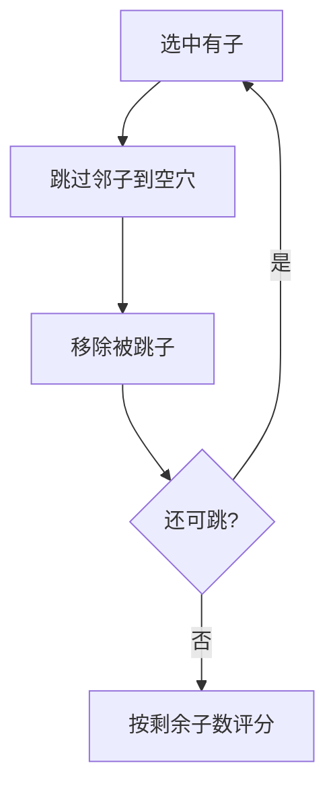

# 09 · 孔明棋

> 返回 [总览](README.md)

## 一句话

钉板跳吃，跳过邻子落到空穴并拿走被跳子，直到尽可能只剩一子——单人收束谜题。

## 类型

单人跳吃收束（Peg Solitaire）。

## 棋盘与棋子（常见基线）

- 棋盘：十字形或三角形钉板（英式十字常见 33 穴；法式等变体不同）。
- 开局：通常只空中心一穴，其余全满；或给定残局。
- 走法：一子跳过 **正交相邻** 的一子落到空穴，被跳子拿走。一般不斜跳（三角板另说）。

## 怎么赢

| 目标 | 说明 |
|---|---|
| 完美 | 盘上只剩 1 子（最好停在中心） |
| 进阶 | 剩子越少越好 / 指定终位 |

## 图例

`O` = 有子，`·` = 空穴：

```text
英式十字开局（中心空）示意:

        O O O
        O O O
  O O O O · O O O O
        O O O
        O O O
```

一跳：

```text
跳前:  O O ·     →     跳后:  · · O
              （中间 O 被移除）
```



## 基础玩法

1. 选择能跳的子，落到空穴，吃掉中间子。
2. 避免过早把空穴「孤岛化」导致无棋。
3. 终局数剩余子；挑战完美清盘。

## 玩法扩展

- **残局包**：从名局中盘开始，降低完整盘挫败感。
- **每日一孔**：短会话；适合解谜线，不当对弈旗舰。
- **外形变体**：三角孔明、钻石盘，作皮肤级内容。
- 与华容道同属「古典解谜」产品线。

## 全球备注

- 英语：**Peg Solitaire** / *Hi-Q*；全球认知成熟。
- 「再玩一局」驱动弱于对弈；靠关卡进度与完美评价续命。
- 改造注意：非法跳要即时反馈；提供悔棋。
