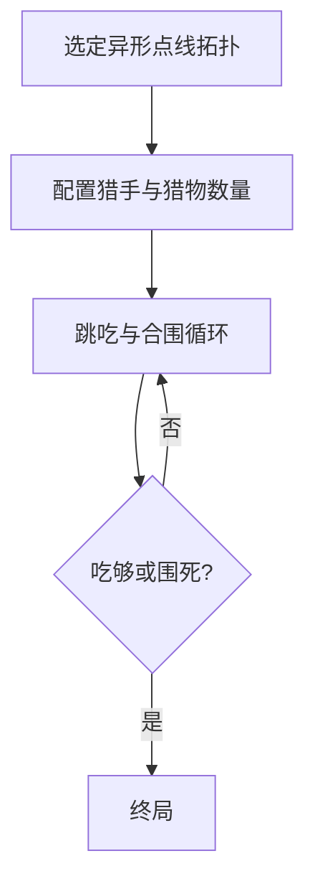

# 10 · 异形围猎（鹿棋等简并）

> 返回 [总览](README.md)

## 一句话

在异形点线图上，少数「猎手」跳吃、多数「猎物」合围——与老虎吃羊同母题，靠 **盘形与故事** 做出稀缺感。

## 类型

非对称围猎变体（蒙古鹿棋、藏式围猎、地方狼羊盘等的合并认知篇，不作考据）。

## 棋盘与棋子（常见基线）

- 棋盘：非正规网格——放射、阶梯、双阵营领地、不规则点线（「鹿角」「山谷」意象）。
- 猎手：1～4 枚，可跳吃。
- 猎物：十余枚，走邻点、不能吃或只围。
- 与 [老虎吃羊](02-老虎吃羊.md)、Fangrush 的差别主要在 **拓扑** 与文化包装，核心仍是 Fox & Geese 族。

## 怎么赢

| 方 | 常见胜条件 |
|---|---|
| 猎手 | 吃到约定数量猎物 |
| 猎物 | 封死猎手所有走/跳 |

## 图例

异形盘示意（`猎` / `物` / `·`）：

```text
          物
         / \
      物--·--物
     /   / \   \
   物--猎--·--物--物
     \   \ /   /
      物--·--物
         \ /
          ·
```

跳吃同老虎吃羊：

```text
猎 物 ·  →  · · 猎
```



## 基础玩法

1. 选定一张异形图，固定开局点。
2. 猎手跳吃扩张空间；猎物填线封跳点。
3. 胜负条件与老虎吃羊对齐，降低学习成本。

## 玩法扩展

- **系列地图 DLC**：同一规则引擎，换拓扑 = 新关章（比新规则便宜）。
- **叙事皮肤**：草原鹿、雪山牦牛、沙漠狐——全球也好懂。
- **不要先做考证向博物馆**：先做好玩的一张盘，文案轻量标注「受民间鹿棋启发」。
- 若已有 Fangrush + 老虎吃羊，本篇更适合当 **地图包**，不当第三套独立规则。

## 全球备注

- 母题英语：**Hunt games** / Fox and Geese family。
- 优势：视觉与故事稀缺；风险：规则若与虎羊无差，玩家会问「为何换皮」。
- 改造注意：拓扑一定要带来 **新战术**（窄桥、双出口、高台跳点），否则不做。
