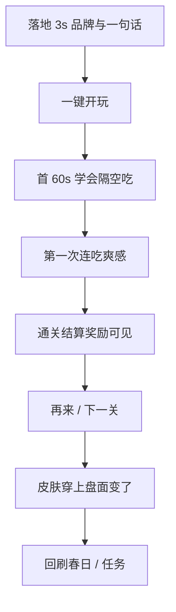

# 02 · 全球对标与玩家漏斗

> 模式借鉴，不抄素材。对标对象：Poki / CrazyGames 头部 HTML5 棋盘与益智；国际跳棋与 Chess 移动端节奏；轻策略闯关的「首关教学 + 短局 + 结算爽」；收集类皮肤的「穿上立刻看见」。

## 成功共性 → 本品达标线

| 成功共性 | 玩家感受 | 本品现状 | 达标线 |
|----------|----------|----------|--------|
| Instant clarity | 3 秒知道我是谁、点哪 | 色圆棋子；首页无 Fangrush 英雄 | 狼/羊剪影 1 秒可辨；首页品牌 + 棋盘主视觉 |
| First 30s win | 首关必会吃、必有爽感 | 无引导；隔空吃易误解；瞬切无反馈 | 春日 1：教会一次隔空吃 + 连吃可见反馈 |
| Readable board | 盘面是「游戏」不是表格 | 线框 + 色点 | 对局真 SVG 棋子 + 主题底；岩石可读 |
| Turn rhythm | 感觉在和「对手」下棋 | AI 微任务瞬移 | 思考窗 + 走子反馈（见 [03](./03-对局时序与反馈标准.md)） |
| Juice on payoff | 吃子/连吃有快感 | 瞬删羊 | 吃子停顿/冲刺感 + 连吃叠层反馈 |
| Fair AI feel | 输得起、不秒杀感 | 无思考感；hard 待校准 | 思考延迟；难度与章节一致 |
| Identity loop | 皮肤是我 | 只换颜色 | 对局真换 SVG；图鉴所见即所得 |
| Session fit | 2–4 分钟一局可再来 | 局长时间合；壳劝退 | 结算强「再来」；广告失败不挡爽 |
| Portal ready | 像上架页不是 MVP | 页脚 MVP；Wolf & Sheep | 去 MVP；Fangrush 一致 |
| Monetize without hate | 广告在自然缝 | 对局中推双倍偏吵 | 激励放结算/关卡缝；失败可跳过 |

## 玩家漏斗（用这个审产品，不只审单页）

**当前断点（审计）**：land（弱）→ teach（无）→ juice（弱）→ skin（假）。  
规则引擎通了，漏斗中段全断——这是冲 L3 的主战场。

## 与施工清单的关系

缺口拆条与勾选 → [`../../MVP任务清单/12-上线体验缺口清单.md`](../../MVP任务清单/12-上线体验缺口清单.md)。
