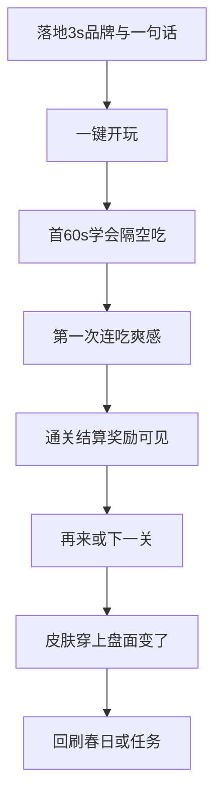

# 01 · 体验标准与商业漏斗

> 收编：上线体验审计、对局品质跃升、独立站上线与商业漏斗标准。  
> **核心规则完成 ≠ 可上架 ≠ 玩家爱玩。我们冲第三层。**

## 1. 深层次原则（防消防式修点）

1. 以**普通玩家上线标准**审整包，不以「规则测通」自满。  
2. **先标准与缺口，再成批施工**；禁止「你指哪改哪」。  
3. 节奏、反馈、首 30 秒、皮肤身份感、广告不伤爽 = 产品核心。  
4. 品牌/文案/视觉与玩法口径一致（Fangrush、隔空吃）；壳层禁止 MVP / 错品牌。

## 2. 三层目标

| 层 | 含义 | 现状判断 |
|----|------|----------|
| L1 可玩 | 规则通、能胜能败 | 大致已达 |
| L2 像上架成品 | 棋盘可信、品牌完整、无 demo 感 | **未达**（感官主战场） |
| L3 爱玩留存 | 愿再开、愿攒皮、漏斗不断 | 依赖 L2 + 难度手感 |

## 3. 全球对标 → 本品达标线

| 成功共性 | 玩家感受 | 达标线 |
|----------|----------|--------|
| Instant clarity | 3 秒知我是谁、点哪 | 狼羊 1 秒可辨；首页 Fangrush + 盘面主视觉 |
| First 30s | 首关会吃、有爽感 | 春日 1 教会隔空吃 + 连吃反馈 |
| Readable board | 盘是游戏不是表格 | 真棋子 + 季节底板 + 可读岩 |
| Turn rhythm | 像在和对手下 | 落子 ~200ms；羊思考 ~600ms；禁微任务冒充思考 |
| Juice on payoff | 吃/连吃有快感 | 路径强调 + 羊消失事件 + HUD |
| Identity loop | 皮肤是我 | 图鉴=对局同一资产；穿上立刻变 |
| Session fit | 2–4 分钟可再来 | 结算强再来；广告失败不挡 |
| Portal ready | 像上架页 | 无 MVP 字样；品牌一致 |
| Monetize without hate | 广告在自然缝 | 激励在结算/关卡缝 |

## 4. 玩家漏斗（验收主轴）

断点优先修：**land / teach / juice / skin**。

## 5. 对局时序（硬默认）

| 节点 | 默认 |
|------|------|
| 玩家落子 / 隔空吃反馈 | **200ms** |
| 连吃之间 | 玩家节奏；每次吃仍 200ms |
| 狼回合结束 → 羊落子 | **600ms** 思考态挡误点；无转圈 spinner |
| 羊落子反馈 | **200ms** 再交还 |
| 禁止 | `queueMicrotask` 同步 AI 冒充思考 |

详见创意侧 [`产品定位和商业成功/03`](../游戏创意/产品定位和商业成功/03-对局时序与反馈标准.md)。

## 6. 七条不可妥协

1. 棋盘是唯一主角（官网首屏与对局皆然）。  
2. 1 秒可辨狼 / 羊 / 岩（约 36px）。  
3. 对比优先于「淡雅发灰」。  
4. 一页一主动作。  
5. 反馈是事件，不是只改数字。  
6. 铬层（顶栏底栏说明）永远轻于棋盘。  
7. 跨页同气质（色板、按钮、棋子同源）。

## 7. 测量（独立站 GA4）

建议事件（实现时命名可调整）：`play_start`、`level_clear`、`play_again`、`skin_equip`、`locale_switch`。  
先看漏斗转化，再看美术主观分。
