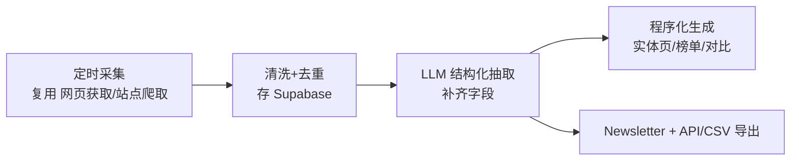
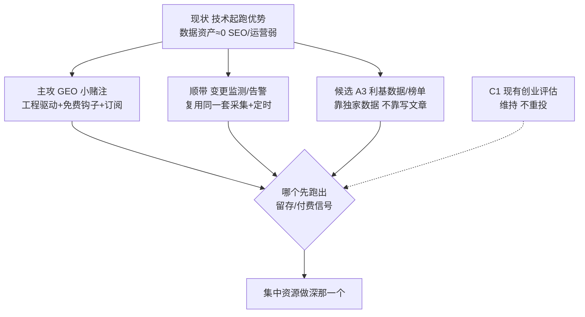

# 业务方向总览与评估

> 用途：把"同一套引擎能复用去做的业务方向"按**你的真实画像**排序，标清哪些更适合你、更容易成功；哪些技术上搞不定或太拥挤，直接劝退；哪些技术好做但 SEO 难推，也如实标出。
> GEO 方向已单独成文，见 [01-GEO-AI可见度](01-GEO-AI可见度.md)。其余方向后续按需各自单独成文。

---

## 一、现实前提（先把话说实）

### 1.1 你的真实画像（评估一切的基准）

- **研发强**：工程/技术实现是你的核心优势，能快速做出完善功能。
- **SEO 弱**：内容分发不是强项。
- **运营弱**：不擅长也不想做重人工运营，倾向"做好产品，靠 SEO/GEO/广告自动找客户"。
- **海外生态熟悉中**：对国外有基础了解但不深。
- **目标是"小钱"**：个体户，不求赚大钱，可持续的小生意即可。

### 1.2 两条必须认清的事实

- **数据资产现在 ≈ 0**：网站没推出、没用户、SEO/GEO 刚起步。"沉淀数据资产"是**未来才可能跑出来的结果**，不是现在的底牌。现在真实底牌只有：技术起跑优势 + 低成本结构 + 速度。
- **GPT 是背景板**：一次性研究/问答 GPT 免费且够用，"比 GPT 聪明"不成立。个体户赚小钱只能靠：**流量卡位（SEO/GEO）+ 产品化/持续监测 + 低价低成本**。

---

## 二、正面回答你的两个担忧

### 2.1 "AI 写的内容，SEO 效果好吗？我担心内容过剩 + GEO 越来越多"

**诚实答案：纯 AI 批量文章的 SEO 效果正在变差，这个担忧是对的。** 原因：

- Google 的 helpful-content 与反垃圾更新，持续打压"大量、同质、无独特价值"的 AI 内容。
- AI Overviews / AI 答案把"信息型"查询的点击直接吃掉——用户看完 AI 摘要就不点了。
- 网上同质内容确实过剩，纯文字型内容红海。

**但这不等于 SEO 死了，而是"能赢的内容变了"**——这恰好把你从"写文章"推向"用技术取胜"：

| 越来越难赢 | 仍然能赢（更适合你） |
|------------|----------------------|
| 纯 AI 生成的 prose 文章 | **工具型页面**（免费小工具本身排名 + 转化） |
| 复述型资讯 | **独家结构化数据/榜单**（GPT 给不出、天天更新） |
| 泛话题内容农场 | **实体长尾**（每个产品/公司一页，靠数据而非文字） |

> 结论：**别做"AI 写文章"的内容农场；要做"工具 + 独家数据"驱动的页面**。前者吃你短板（SEO+内容），后者吃你长处（工程）。

### 2.2 成本担忧（AI 写作、爬取都有少量成本）

- 单份成本很低（采集边际约 $0.01–0.05/份，LLM 按量）；**真正的风险不是单份成本，是"投入产出比"**——即内容/数据做出来有没有流量和转化。
- 应对：**默认走低成本路径 + 用量封顶 + 先小规模验证有没有流量再放量**，不要一上来铺几万页。

---

## 三、评估框架（针对你的画像打分）

每个方向按 6 个维度看，**权重偏向你的实际情况**（技术难度对你阻力小、SEO/运营依赖越低越好）：

- 技术实现（对你）：低=容易
- SEO 依赖：低=好（你 SEO 弱）
- 运营依赖：低=好（你运营弱）
- 竞争拥挤：低=好
- 变现清晰：高=好
- 抗 GPT：高=好

---

## 四、方向排序（按"适合你 + 容易成功"）

### 🥇 主攻小赌注 · GEO / AI 可见度

- **一句话**：帮品牌看清并改善"在 AI 答案里的表现"，持续监测。
- **为何最适合你**：主要是工程活（你强）；产品驱动 + 免费扫描钩子获客（绕开 SEO/运营短板）；订阅变现清晰；抗 GPT（持续监测是 GPT 短板）。
- **最大风险**：赛道快速拥挤（Profound、Peec AI、Otterly.AI 等已入场）——靠垂直细分 + 低价自助切。
- **详见** [01-GEO-AI可见度](01-GEO-AI可见度.md)。

### 🥈 次选 · 变更监测 / 告警（B2）

- **一句话**：盯竞品定价变化、改版、新发布、融资、裁员、口碑异动，变化即告警。
- **谁付费**：市场/产品/销售团队、投资人、做竞调的人。
- **契合度**：技术驱动（你能扛）、订阅复购、抗 GPT（GPT 不做持续追踪）。SEO 依赖中等，运营中等。
- **竞争**：有 Visualping、Wachete、Kompyte 等，但**细分垂类仍有缝**（如"只盯某类 SaaS 的定价页变化"）。
- **结论**：作为**已有引擎的低成本增值**很合适，可与 GEO 共用采集与定时基建。

### 🥉 可做但重度吃 SEO（你短板，需谨慎/降配做法）

> 这几类**技术上你都能做**，但增长引擎是 SEO——正是你弱项，且受"AI 内容过剩 + AI Overviews"冲击。**要做就做"工具/数据驱动"的轻内容版本，不做纯文章农场。**

- **A2 信任/核查站**（`is X legit / scam / safe`）
  - 需求：搜索量大、意图强。技术：低（爬取+证据+规则/LLM 判定）。
  - 竞争：有 Scamadviser、Trustpilot 等大站占词。
  - 变现：**广告 + 联盟为主** + 按次核查 + API。
  - 结论：技术好做，但**要靠 SEO 抢词**，对你偏难；可做成"核查小工具"降低对文章的依赖。
- **A3 利基数据 / 榜单产品**（优惠/工具/资助/职位/趋势）
  - 见下方 §5 专门给技术 + 运营实现思路。
  - 结论：**A 档里最适合你的一个**——因为它靠"独家数据"而非"文章"，吃你的工程长处。
- **A1 程序化 SEO 对比/目录站**（`best X for Y`、`X alternatives`、`X vs Y`）
  - **核心变现就是广告 + 联盟**（你问的对：主要靠展示广告 Mediavine/AdThrive/Ezoic + 联盟佣金），需要**大流量**才有钱。
  - 技术：最容易。但**增长 100% 靠 SEO**，且是内容过剩 + AI Overviews 冲击最狠的区域。
  - 结论：**与你"SEO 弱 + 担忧内容过剩"直接冲突**，收益不确定性最高。**不建议作为主攻**；若做，只做"数据驱动的对比页"（靠真实结构化数据，不靠 AI 堆文字）。

### 🟨 维持不重投

- **C1 现有创业评估 / 竞品研究（StartUpSense）**：作为主线继续，靠 SEO 飞轮 + 旅程无缝差异化；诚实：赛道已挤（Preuve、DimeADozen、Competely）且被 GPT 吞，**别当增长引擎**，跑通现有 PMF 即可。

### ⛔ 劝退 / 直接放弃

| 方向 | 放弃理由 |
|------|----------|
| **投资尽调 lite / 公司深度研究** | 需要领域信任、海外关系、高风险担责；你海外生态不深、个体户扛不住信任与责任门槛。**技术能做，但商业上不适合你。** |
| **通用 AI 内容生成 SaaS**（帮人写文章/AI writer） | 极度拥挤 + 被 GPT/一众工具商品化，无差异、无定价权。 |
| **通用网站/SEO 审计工具**（大而全） | 已被 Ahrefs、Semrush、Screaming Frog、一堆免费工具占死，商品化、无缝可切。 |
| **KYC / 合规风控（正式版）** | 强监管、需资质与责任承担，个体户不碰。 |
| **社媒舆情监听（大而全）** | Brandwatch 等重资源赛道，个体户拼不过；只有极窄垂类才有缝。 |

---

## 五、A3 利基数据/榜单产品 · 技术与运营实现思路

> 单列出来，因为它是 A 档里**最吃你工程长处、最少依赖写文章**的一个。

### 5.1 选什么垂类（成败在选品）

挑同时满足以下条件的垂类，命中越多越好：
- **数据分散但公开**（散落在很多网站，没人聚合）——聚合本身就是价值。
- **数据经常变**（价格/榜单/职位/优惠会更新）——**"新鲜度"就是 GPT 给不了的护城河**。
- **背后有买家**（有联盟佣金、赞助意愿或招聘付费）——才有钱。
- **竞争低**（还没有做得好的聚合站）。
- 例子方向：某垂类 SaaS 优惠/终身单、某类工具的定价与功能矩阵、某细分远程职位、某类资助/加速器、某类趋势榜。

### 5.2 技术实现（复用现有引擎，纯工程活）

- 定时抓取多个源 → 归一化入库（Supabase）→ 去重 → 用 LLM 抽取结构化字段 → 程序化渲染成"每实体一页 + 榜单页" + 每周 newsletter + 轻量 API/导出。
- **价值来自"自动保持新鲜"**，不是文字量。这正好避开"AI 文章 SEO 差"的坑。

### 5.3 运营思路（少人工，适合你）

- **分发**：实体长尾 SEO（靠数据不靠文字）+ **一封每周 newsletter**（聚合更新，低运营高粘性）+ 你懂的社区冷启动。
- **变现**：赞助 listing/位、联盟佣金、付费 API/导出、（若职位类）招聘发布费。
- **运营强度低**：一旦采集管线自动化，主要是"看数据质量 + 发周报"，符合你"重技术、轻运营"的偏好。

---

## 六、给你的总结路线

- **第一优先**：GEO（工程能扛、抗 GPT、变现清晰；风险是竞争，靠细分+低价切）。
- **低成本并行**：变更监测（与 GEO 共用采集/定时基建，几乎零额外成本）。
- **候选**：A3 利基数据/榜单（要做就做数据驱动、非文章驱动）。
- **别碰**：投资尽调、AI 写作 SaaS、大而全审计/舆情、合规风控。
- **一句话心法**：**用你的工程长处做"工具 + 独家数据 + 持续监测"，别去打"写文章拼 SEO"的红海。**
