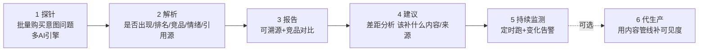
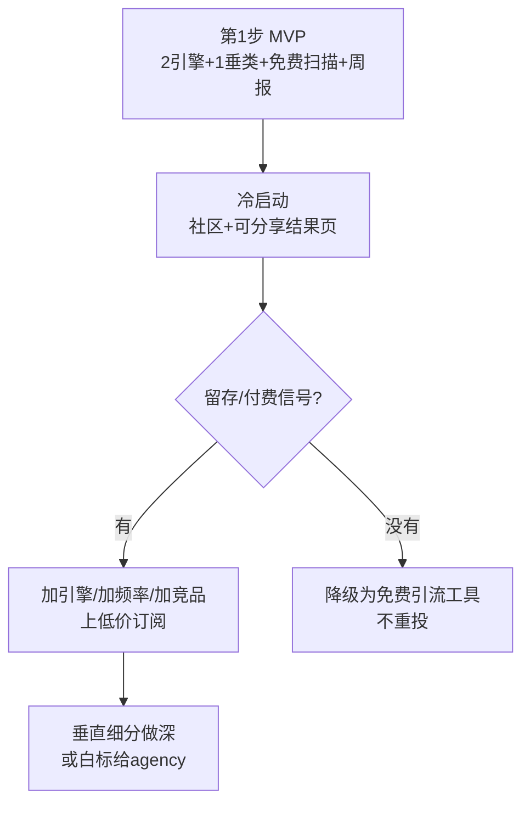

# GEO / AI 可见度 · 方向文档

> 定位：本方向是你**最感兴趣、也最契合"研发强"画像**的产品驱动方向。本文把需求、竞争、产品形态、技术实现、变现、风险、获客、验证路线一次讲清。
> 结论先行：**值得作为主攻小赌注**，但赛道正在快速变拥挤，个体户必须靠"细分 + 低价自助 + 免费扫描钩子"切进去，别正面硬刚已融资的头部。

---

## 0. 一句话

> 帮品牌/产品知道并改善"当用户去问 ChatGPT / Perplexity / Google AI 概览时，我出现了吗、排第几、被谁盖过、AI 引用了谁"——并持续监测。

把"GPT 是我们的对手"翻转成"**我们帮你在 GPT 里被看见**"。

---

## 1. GEO 是什么、为什么是现在

- **SEO**：优化你在 Google 蓝色链接里的排名。
- **GEO（Generative Engine Optimization，也叫 AEO/AI SEO）**：优化你在**生成式 AI 答案**里的出现与口碑。
- **为什么是现在**：
  - 用户越来越多直接问 AI，而不是翻 10 条链接；Google AI Overviews、ChatGPT Search、Perplexity 正在吃走"信息型搜索"的点击。
  - 品牌方由此产生**新版 SEO 焦虑**：我在 AI 答案里到底什么样？我控制不了，也看不见。
  - 这是一个**2024–2026 刚冒出来的新品类**，需求真实、还在教育市场——早期机会与拥挤风险并存。

---

## 2. 用户是谁、为什么付费

| 买单人 | 他要解决的活儿 | 为什么不用免费 GPT 自己查 |
|--------|----------------|---------------------------|
| SaaS 市场/增长团队 | "我们产品在 AI 推荐里有没有被提及、够不够正面" | 要**跨多引擎、批量、按时间追踪**，手动问几句 GPT 不成规模、不可复用 |
| 代运营 / SEO agency | 给客户交"AI 可见度"报告与改善方案 | 需要**可交付的报告 + 白标 + 定期监测**，这是生产力工具 |
| DTC / 电商品牌 | "别人问'best X'时 AI 推的是不是我" | 关系到真实成交，需要**证据 + 竞品对比 + 改善建议** |
| 独立开发者 / 小 SaaS | 低价自助看一眼自己"上榜"没 | 便宜、自助、即时 |

**核心付费理由（GPT 替代不了的）**：①跨引擎批量、②按时间持续监测与告警、③可溯源报告与竞品对比、④"怎么改善"的可执行建议。**GPT 是无状态的，不会替你天天盯、不会给你结构化台账。**

---

## 3. 全球竞争格局（诚实）

这是本方向**最大的风险点**：赛道热、钱多、玩家涌入很快。

| 类型 | 代表玩家 | 特点 |
|------|----------|------|
| 专门 GEO 平台（已融资/较成熟） | Profound、Athena HQ | 面向中大客户，功能全、价格高 |
| 新锐自助工具 | Peec AI、Otterly.AI、Scrunch AI、Goodie、Rankscale、Trakkr | 偏中小客户、自助、订阅，价格从几十刀/月起 |
| 传统 SEO 大厂加功能 | Semrush、Ahrefs（陆续上 AI 可见度模块） | 有流量与客群，随时降维打击 |

**客观判断**：
- **不拥挤是假的**——2025 年起这个词条下工具井喷。
- 但**远未定型**：没有绝对垄断者，多数工具体验粗糙、价格偏贵、覆盖引擎与垂类都不全。
- **个体户能切的缝**：
  1. **垂直细分**：只做某一个行业/某一类产品（如"只做 AI 工具类""只做某国本地商家"），榜单和 prompt 更准。
  2. **低价自助 + 免费扫描**：用一个"免费查你的品牌在 ChatGPT 里怎样"的工具做获客钩子，转低价订阅。
  3. **单点体验做爆**：报告更清楚、建议更可执行、接入更快。
- **不能做的**：正面对标 Profound 做大而全的企业级平台——你没有销售团队和资金。

---

## 4. 产品形态（做什么）

一条最小闭环：

- **探针**：为每个客户/品类维护一组"购买意图" prompt（如 `best X tool`、`X alternatives`、`is X good/legit`、`X vs Y`）。
- **解析**：检测品牌是否被提及、提及位次、同时出现的竞品、情绪正负、AI 引用了哪些来源 URL。
- **报告**：分数 + 竞品对比 + 证据（把 AI 的原始回答与引用源留痕）。
- **建议**：差距分析——AI 常引用但没提到你的来源 = 你要去覆盖的目标（社区、榜单、对比页、维基等）。
- **监测**：定时重跑，出现掉榜/被新竞品盖过时告警。
- **代生产（可选增值）**：直接用你已有的内容/多语言管线，帮客户产出能提升 AI 可见度的内容。

---

## 5. 复用现有引擎（技术实现思路）

这块正是你的优势，且**大部分能力 StartUpSense 已有**。

| 能力 | 现有可复用 | GEO 需新增 |
|------|------------|-----------|
| 多引擎问询 | AI 渠道/模型编排（`ai_channels`/`ai_models`） | 接 Perplexity / Gemini / Bing Copilot；Google AI 概览走 SERP 抓取 |
| 抓取与来源留痕 | 网页获取 + 证据链 | AI 回答里引用 URL 的抽取 |
| 结构化解析 | LLM 结构化输出 | 品牌/竞品实体识别、位次、情绪打分 |
| 定时任务 | 任务队列 / advance | 周期性重跑 + 快照存储（时序） |
| 报告与多语言 | 报告生成 + i18n | GEO 报告模板 |
| 账号/支付 | Supabase + Creem | 订阅计费（按品牌/席位） |

**关键技术要点与坑（要诚实写给自己）**：
- **引擎接入不均**：ChatGPT / Perplexity / Gemini 有 API 相对好办；**Google AI Overviews 没有官方 API**，要靠 SERP 抓取，稳定性与合规是难点。
- **输出不确定**：同一问题多次回答会变，需**多次采样取统计**（出现率而非单次结论），否则数据噪声大。
- **成本可控**：成本 ≈ 引擎数 × prompt 数 × 采样次数 × 频率 × 单价。用"每客户 prompt 数封顶 + 频率分层（免费周更/付费日更）"控成本。
- **时序才是价值**：单次快照 GPT 也能给；**你的护城河是把它变成可追踪的时间序列台账**。

---

## 6. MVP（最小验证，2–4 周量级）

先证明"有人愿意用/愿意付"，再谈做大：

1. **只接 2 个引擎**（如 ChatGPT + Perplexity，API 好接的先上）。
2. **锁 1 个垂类**（建议选你略懂的，如"AI 工具"或"某类 SaaS"）。
3. **一个免费扫描页**：输入品牌名/网址 → 跑一组 prompt → 出一页"你在 AI 里的可见度快照"（出现率、竞品、被引用源）。
4. **一个邮箱订阅**：留邮箱 → 每周自动重跑发报告（这步就是把免费用户转成留存）。
5. 观察：扫描量、留邮箱率、周报打开率、有没有人主动问"能不能付费加频率/加引擎/加品牌"。

---

## 7. 变现模式

| 档 | 卖给谁 | 形态 | 价格锚点（参考海外同类） |
|----|--------|------|--------------------------|
| Free | 获客钩子 | 单品牌、周更、限引擎 | $0 |
| Solo/Starter | 独立开发者、小 SaaS | 单品牌、日更、多引擎、竞品对比 | 低月费（$19–39/月区间自定） |
| Pro | 市场团队 | 多品牌、告警、导出、建议 | 更高月费 |
| Agency/白标 | 代运营 | 多客户、白标报告 | 席位/客户数计费 |

- **本质是订阅（复购）**，比一次性报告更适合"小而稳的现金流"。
- 现阶段**别追求高客单**，先用低价自助跑通留存与口碑。

---

## 8. 对你的契合度（研发强 / SEO 弱 / 运营弱 / 中国个体户面向海外）

| 维度 | 判断 |
|------|------|
| 技术实现 | ✅ 强契合：主要是工程活，正是你的优势 |
| SEO 依赖 | 🟡 中：不像内容站那样重度依赖，但仍要一点内容/词做获客 |
| 运营依赖 | 🟡 中：B2B 要一点获客动作，但可走**产品驱动（PLG）+ 免费工具钩子**，少人工运营 |
| 竞争 | 🔴 拥挤且快：最大风险，必须靠细分与低价切 |
| 抗 GPT | ✅ 好：持续监测是 GPT 的结构性短板 |
| 变现清晰度 | ✅ 好：订阅模型成熟 |

> 一句话：**这是"技术能扛、变现清晰、抗 GPT"的方向，唯一大风险是竞争。** 靠"免费扫描钩子 + 垂直细分 + 低价自助"这套产品驱动打法，恰好绕开你 SEO/运营的短板。

---

## 9. 获客（产品驱动、少运营）

- **免费扫描工具做钩子**：`Check your brand's AI visibility`——本身就是可被搜索/被分享的入口，转订阅。
- **可分享的结果页**：用户扫完得到一张"AI 可见度卡片"，天然愿意晒/发给同事 → 自带传播。
- **在你懂的社区冷启动**：Indie Hackers、Reddit、相关 SaaS 群，先要真实反馈再谈规模。
- **少量 GEO 自身内容**：反正你在做 GEO，把自己的站也优化进 AI 答案，自产自销当样板。

---

## 10. 诚实风险与止损线

- **风险**：①赛道快速拥挤、②AI 引擎接口/ToS 不稳（尤其 Google AI 概览）、③测量噪声大、④英文 B2B 获客对你偏陌生、⑤头部大厂降维。
- **止损线（建议）**：MVP 上线后一个观察期内（如 8–12 周），若免费扫描后**留邮箱率、周报打开、付费问询**都起不来，就**收敛为一个免费工具/引流位**，不再重投。

---

## 11. 小赌注路线图

- 核心心态：**先用最小成本验证需求，别一上来就做大平台**；跑出信号再逐步加引擎、加垂类、加订阅档。
