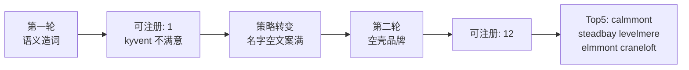

# 02 · 域名查验记录

> 本页记录批量 .com 查验的方法、时间戳、结果汇总，以及入围名的下一步人工查验清单。

---

## 一、查验批次

| 批次 | 数量 | 时间 | 方法 | 可注册 | 已占用 |
|------|------|------|------|--------|--------|
| **主批次 A**（第一轮） | 100 | 2026-07-11 14:58 (+08:00) | WHOIS `whois.verisign-grs.com:43` | **1** | 99 |
| 补充批次 B（第一轮） | 50 | 2026-07-11 15:02 (+08:00) | 同上 | 1 | 49 |
| 补充批次 C（第一轮） | 40 | 2026-07-11 15:04 (+08:00) | 同上（高独特性造词） | 28 | 12 |
| **主批次 D**（第二轮） | 100 | 2026-07-11 15:12 (+08:00) | 同上（沉稳可信空壳品牌） | **2** | 98 |
| 补充批次 E（第二轮） | 50 | 2026-07-11 15:15 (+08:00) | 同上（冷门自然组合） | **10** | 40 |

- 第一轮数据：[data/domain-check-results.json](data/domain-check-results.json)
- 第二轮数据：[data/domain-check-round2.json](data/domain-check-round2.json) / [data/domain-check-round2-supplement.json](data/domain-check-round2-supplement.json)
- 查验脚本：[scripts/check_domains.py](scripts/check_domains.py) · [scripts/check_domains_round2.py](scripts/check_domains_round2.py)

**间隔**：主批次请求间隔 1.2s；失败最多重试 3 次。

**判定规则**：

| WHOIS 响应 | 标记 |
|------------|------|
| `No match for` / `NOT FOUND` | 可注册 |
| 含 `Domain Name:` / `Registrar:` / `Creation Date:` | 已占用 |
| 超时 / 无明确结果 | 待人工确认 |

---

## 二、第二轮可注册短名单（沉稳可信 · 推荐）

策略见 [03-域名命名新思路](03-域名命名新思路.md)。主批次 D + 补充 E 合计 **12 个**可注册：

| 域名 | 词源 | 理由 | 建议 |
|------|------|------|------|
| **calmmont.com** | calm + mont | 静山，沉稳气质最贴 | **首选** |
| **steadbay.com** | stead + bay | 稳湾，可靠 | Top 2 |
| **levelmere.com** | level + mere | 平湖，Linear 式公正 | Top 3 |
| **elmmont.com** | elm + mont | 榆山，短而稳重 | Top 4 |
| **craneloft.com** | crane + loft | 鹤阁，优雅好记 | Top 5 |
| swallowglen.com | swallow + glen | 燕峡，自然 | 备选 |
| ternhollow.com | tern + hollow | 燕谷 | 备选 |
| evenmont.com | even + mont | 平山，均衡 | 备选 |
| sorrelbrook.com | sorrel + brook | 酸模溪，田园 | 略长 |
| ploverfield.com | plover + field | 鸻野 | 略长 |
| stoathill.com | stoat + hill | 白鼬丘 | stoat 略冷门 |
| gorsefield.com | gorse + field | 荆豆野 | gorse 略冷门 |

完整排序与全表见 [04-域名候选清单-第二轮](04-域名候选清单-第二轮.md)。

---

## 三、第一轮可注册短名单（语义贴切 · 已过时）

主批次 100 个候选遵循 [06 命名原则](../geo/06-域名与品牌命名.md)，仅 **1 个** WHOIS 显示可注册：

| 域名 | 词源 | 理由 | 分级 | 建议 |
|------|------|------|------|------|
| **kyvent.com** | 造词 | 短、独特、商标友好 | B | 语义与产品弱相关；若接受「纯品牌造词」可优先购物车确认 |

### 补充批次 B（语义变体）

| 域名 | 词源 | 理由 | 建议 |
|------|------|------|------|
| **recoqa.com** | recommend 变体 | 直指「被推荐」 | 拼写略拗口（qa 结尾），作备选 |

> **结论**：贴切造词 .com 几乎被扫光。要在「好读好拼 + 语义相关 + .com 可注册」三角里同时满足，当前批次无 S 级名字。

---

## 四、补充批次 C（高独特性造词 · 仅供参考）

为验证「更怪拼写是否可得」，额外查了 40 个高独特性造词，**28 个可注册**，例如：

`brqent.com`、`qlyvio.com`、`xyvent.com`、`zepqio.com`、`vylqent.com`、`glyqor.com`、`wryvox.com`、`flynqo.com`、`qlyent.com`、`nlyqor.com`、`kryqio.com`、`vlyxent.com`、`qryvio.com`、`xlyvent.com`、`zyqent.com`、`vryqio.com`、`klyxvo.com`、`qryvent.com`、`zlyvox.com`、`voxlyq.com`、`zyklent.com`、`qryxent.com`、`kryxent.com`、`zlyqora.com`、`vyxqent.com`、`qlyxora.com`、`zryqent.com`、`vlyqox.com`

**不推荐作为主品牌**：难读、难拼、难口述（违反 06「好读好拼」原则），仅作「实在要 .com 且接受极造词」时的备选池。

其中相对稍好（含 `-ora` / `-ent` 后缀）：

- `zlyqora.com`、`qlyxora.com` — 有 -ora 尾缀，但仍难拼
- `xyvent.com`、`xlyvent.com` — 短，但 x 开头不利口述

---

## 五、已占用 · 语义强 · 值得蹲

以下主批次名字已被占用，但语义与产品高度贴切；可设过期提醒或尝试回购：

| 域名 | 中文联想 | 理由 |
|------|----------|------|
| citora.com | 被引用 | AI 引用 = 核心信号 |
| recora.com | 被推荐 | 直指 Get recommended by AI |
| mentio.com | 被提及 | 被 AI 点名 |
| ansio.com | 答案 | 答案引擎语境 |
| rankio.com | 排名 | 排名一目了然 |
| winora.com | 胜出 | 赢下 AI 答案 |
| beacora.com | 信标 | 灯塔隐喻 |
| citeora.com | 引用 | 引用分析 |
| vislio.com | 可见 | 可见度直指 |
| scanly.com | 扫描 | 契合免费扫描钩子 |
| presio.com | 在场 | 品牌存在感 |
| nomio.com | 被提名 | 被 AI 提名 |
| sigora.com | 信号 | 提及信号 |
| brandio.com | 品牌 | 品牌可见度 |
| nexora.com | 下一代 | 现代 SaaS 感 |

---

## 六、下一步人工查验（入围名必做）

对任何决定购物车确认的域名，按 [06 §五](../geo/06-域名与品牌命名.md) 执行：

### 1. 注册商二次确认

- [ ] Namecheap / Cloudflare Registrar 加入购物车，确认可下单价格
- [ ] **查到可注册立即注册** .com，不要拖

### 2. 商标检索

- [ ] [USPTO TESS](https://tmsearch.uspto.gov/) — 类目 42（SaaS/软件）及 35（营销服务）
- [ ] [EUIPO eSearch](https://euipo.europa.eu/eSearch/) — 同类目
- [ ] 重点排除与 Otterly / Profound / Aperture / Scrunch 等同类冲突

### 3. 社媒 handle

- [ ] X (Twitter)：`@品牌名`
- [ ] Instagram / GitHub / LinkedIn
- [ ] 尽量与 .com 一致

### 4. 通用搜索

- [ ] Google 搜品牌名 — 有无知名主体、负面新闻
- [ ] 问 ChatGPT / Perplexity：该词是否已有品牌、有无多语种歧义

### 5. 入围名快速清单（基于第二轮 Top 5）

以 `calmmont.com` 为例：

- [ ] calmmont.com — 注册商确认
- [ ] USPTO / EUIPO 商标（注意 Fairmont 酒店等近似）
- [ ] @calmmont on X / GitHub
- [ ] Google "CalmMont" 负面检索

同步查验：`steadbay.com` `levelmere.com` `elmmont.com` `craneloft.com`

---

## 七、统计与建议（更新）

**诚实建议**：

1. **短期**：优先购物车确认第二轮 Top 5（`calmmont.com` 气质最佳）
2. **若仍不满意**：蹲 §四（第一轮）语义强已占用名，或继续用脚本批量搜更冷门自然组合
3. **长期**：.com 空壳品牌名仍稀缺，但两词自然组合比语义造词有更多空隙

---

> WHOIS 结果仅供参考。第一轮详见 [01-域名候选清单-100.md](01-域名候选清单-100.md)；**第二轮详见 [04-域名候选清单-第二轮.md](04-域名候选清单-第二轮.md)**。
