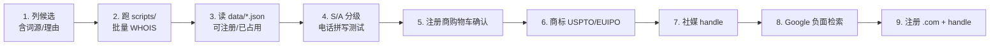

# 08 · 域名寻找经验与工具

> Playbook：两轮找域名实战总结 + 脚本复用指南。定稿：**Levelmere** / levelmere.com。

---

## 一、定稿结论

| 项 | 内容 |
|----|------|
| 品牌 | **Levelmere** |
| 主域 | **levelmere.com** |
| 词源 | level（水平、公正）+ mere（湖；地名尾缀） |
| 读音 | LEVEL-meer |
| 气质 | 沉稳可信（Linear / Basecamp 感） |
| 策略 | **名字空、文案满** — tagline 说清楚产品 |

### 弃选记录（为何不是它们）

| 候选 | 弃选原因 |
|------|----------|
| Visora / Seenly / Ansora | .com 已占用（第一轮 Top3） |
| kyvent.com | 唯一可注册的语义造词，但无义、难建信任 |
| steadbay.com | 与 **sted-bay.com**（诈骗站）谐音；近 **SteadiBay**（摄影市场） |
| calmmont.com 等 | 气质可行，但最终选定 levelmere（level=公正测量弱联想） |

---

## 二、第一轮教训（语义贴切短造词）

**做法**：visible / cite / rank / answer + `-ora` / `-io` / `-ly`，共 100 个。

**结果**：**99/100 已占用**，唯一可注册 `kyvent.com` 气质不佳。

**结论**：GEO 赛道「语义造词 .com」已被扫光；继续在同类词根里卷性价比极低。

详见 [01-域名候选清单-100.md](01-域名候选清单-100.md)、[data/domain-check-results.json](data/domain-check-results.json)。

---

## 三、第二轮策略（名字空、文案满）

**做法**：三路线各 ~35 个，共 100 + 补充 50 冷门自然组合。

| 路线 | 示例方向 |
|------|----------|
| 两词组合 | CedarHarbor、SteadBay、NorthField |
| 更长好读造词 | Westmere、Steadwell、Levelmere |
| 中性品牌词 | Finchwell、Steadio、Anchorly |

**结果**：主批次 2/100 可注册 + 补充 10/50 → 共 12 个；定稿 **levelmere.com**。

**核心转变**：

- 品牌名**不必**复述「AI 可见度 / 排名」
- `.com 可得 + 好读`**优于**语义贴切
- 参考 Stripe、Linear、Otterly：名字负责气质，tagline 负责品类

详见 [03-域名命名新思路.md](03-域名命名新思路.md)、[04-域名候选清单-第二轮.md](04-域名候选清单-第二轮.md)。

---

## 四、踩坑清单

| 坑 | 说明 | 处理 |
|----|------|------|
| WHOIS ≠ 可下单 | `No match` 不保证注册商购物车能买 | 查到后立即购物车确认 |
| 谐音负面站 | steadbay ↔ sted-bay.com 诈骗 | Google 搜品牌名 + 谐音变体 |
| 近音已有品牌 | SteadiBay、Lovemère | 书面区分；商标检索 |
| 怪拼高可得 | qlyvio、brqent 类 28 个可注册 | **不推荐**：难读难拼 |
| 常见两词全占 | NorthField、Brookhaven | 转向冷门自然词组合 |
| WHOIS 限流 | 批量查询被拒 | 间隔 ≥1s，失败重试 |

---

## 五、标准工作流



### 入围后人工查验（Levelmere 示例）

- [ ] levelmere.com — Namecheap / Cloudflare 购物车
- [ ] USPTO / EUIPO「Levelmere」类目 42、35
- [ ] @levelmere on X / GitHub / LinkedIn
- [ ] Google `"Levelmere"` — 无负面主体

---

## 六、脚本复用（开第三轮）

### 环境

- Python 3，无第三方依赖
- 脚本位置：[scripts/](scripts/)

### 运行

```bash
# 在 品牌命名/ 目录下
python scripts/check_domains.py          # 第一轮模板
python scripts/check_domains_round2.py   # 第二轮模板
```

输出：`data/domain-check-results.json` 或 `data/domain-check-round2.json`

### 开新一轮

1. 复制 `check_domains_round2.py` → `check_domains_round3.py`
2. 修改 `CANDIDATES` 列表（每行含 name、route、etymology、reason、zh、syllables、letters、risk）
3. 修改输出文件名（如 `domain-check-round3.json`）
4. 跑脚本，更新新的 `0X-域名候选清单.md`

字段说明见 [scripts/README.md](scripts/README.md)。

### 筛选标准（第二轮起）

| 等级 | 标准 |
|------|------|
| **S** | 可注册 + 电话拼写通过 + 沉稳可信 + 无显著商标冲突 |
| **A** | 可注册 + 好读，略长或气质稍弱 |
| **B** | 可注册但难拼/偏活泼 |
| **淘汰** | 怪拼、功能直述两词、蹭竞品 |

---

## 七、本库索引

| 文件 | 用途 |
|------|------|
| [README.md](README.md) | 本库入口 |
| [01-域名候选清单-100.md](01-域名候选清单-100.md) | 第一轮全表 |
| [02-域名查验记录.md](02-域名查验记录.md) | 批次时间戳与短名单 |
| [03-域名命名新思路.md](03-域名命名新思路.md) | 第二轮策略 |
| [04-域名候选清单-第二轮.md](04-域名候选清单-第二轮.md) | 第二轮全表 + Top |
| [scripts/README.md](scripts/README.md) | 脚本详细说明 |
| [data/](data/) | WHOIS 原始 JSON/CSV |

立项文档（geo）只做索引，完整材料以本文件夹为准。
